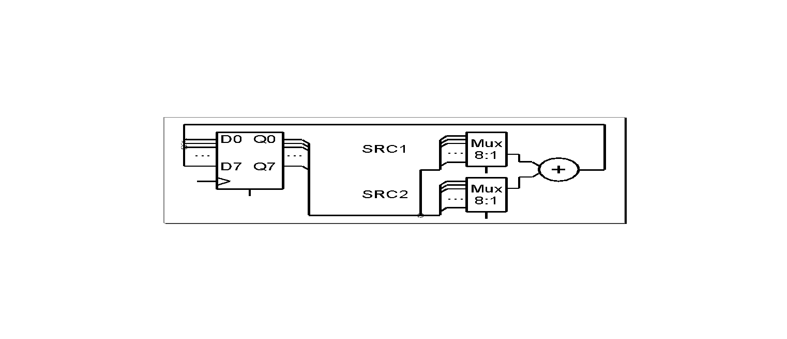
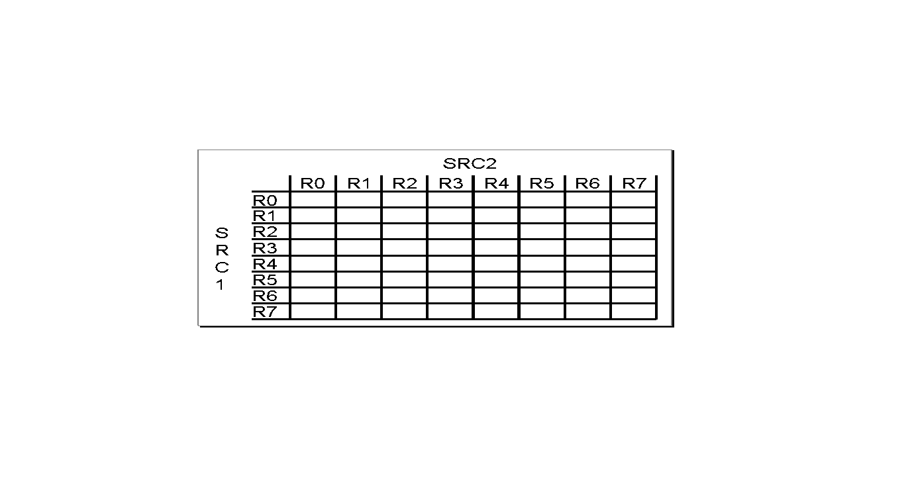
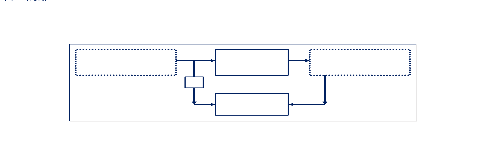

Some people talk about SystemVerilog and UVM like it is the only way to achieve advanced verification.  Simply said it is not.  

For the VHDL community a better path to Advanced VHDL Verification is by using VHDL-2008 and Open Source VHDL Verification Methodology (OSVVM).  One of VHDL-2008 improvements is the inclusion of Property Specification Language (PSL) as VHDL's assertion language.  OSVVM provides the remaining features and capabilities that allow VHDL to rival verification languages (such as SystemVerilog or 'e') using VHDL.

These features include:

* Simplified printing, error reporting, verbosity control, and Affirmations
* Constrained Random tests
* Functional Coverage
* Intelligent Coverage Random tests
* Scoreboards
* Memory Modeling

Like SystemVerilog's UVM, OSVVM is implemented as a library of free, open-source packages.  Using these packages, OSVVM provides a simple methodology to implement these features.

Unlike SystemVerilog, OSVVM is designed to be simple to use and intended to create tests that are also readable by design engineers, software engineers, and system engineers.   Rather than requiring verification specialists (like in SystemVerilog), OSVVM's intent is to facilitate any engineer with VHDL coding experience to do verification.  This is particularly important in the FPGA marketplace where an engineer may do RTL design, verification, and embedded software development for a project.

## Simplified Printing, Error Handling, Verbosity Control, and Affirmations

OSVVM's `TranscriptPkg` and `AlertLogPkg` simplify printing, error handling, verbosity control, and affirmations.

### Simplified Printing

Printing is a fundamental part of a testbench.  VHDL's TEXTIO is verbose.  OSVVM makes printing easy.  Simply call OSVVM's `print` and VHDL-2008's `to_string` to print a `string`, `enum` type, `integer`, `std_logic_vector`, and `time` value.

```vhdl
type   StateType is (S1, S2, S3, S4); 
signal State : StateType;
... 
print("State = "   & to_string(State) &	   -- enum
      ", Count = " & to_string(Count) &	   -- integer
      ", Data = "  & to_hstring(Data) &    -- slv
      " at time "  & to_string(NOW, 1 ns)  -- time
  );
```

TranscriptPkg also provides capability to:

* Print to `OUTPUT`: default
* Print to file: `TranscriptOpen("./results/test1.txt");`
* Print to a file and `OUTPUT`: `SetTranscriptMirror(TRUE);`

These features control all printing in OSVVM.  Hence, all printing done by OSVVM and `print` go to the same location, either `OUTPUT`, the transcript file, or both.  

### Error Handling

For error handling, both VHDL and SystemVerilog have `assert`, however, this leaves counting of errors up to user code.  

OSVVM's alert procedure both signals and counts errors.  Alerts can be level `WARNING`, `ERROR` (default), or `FAILURE`.  The following alerts signal and count an error when indicated in the comments.  

```vhdl
Alert("Illegal State", FAILURE);  -- always err
AlertIf(MaxVal < MinVal, "Parameter Error …");  -- if true
AlertIfDiff("./File1.txt", "./File2.txt");  -- if files differ
```

Alerts produce a formatted output, such as the one below for the first alert above.

```
%% Alert ERROR  In Cpu_1, Illegal State at 5000 ns
```

When using alerts, calling ReportAlerts uses the internal error count values to produce a test completion pass/fail message.  

```vhdl
ReportAlerts; 
```

When there are no errors, a report of the following form is printed:

```
%% DONE  PASSED   Test_UartRx_1  at 100100100 ns 
```

Errors can be counted as either a single count for the entire testbench, or as a separate count for each model and/or error source.  When using a separate count, and a test fails, the output is as follows.  In single count mode, only the first line is printed.

```
%% DONE  FAILED   Test_UartRx_1  Total Error(s) = 7  Failures: 0  Errors: 7  Warnings: 0  at 100100100 ns 
%%    Default                Failures: 0  Errors: 2  Warnings: 0
%%    OSVVM                  Failures: 0  Errors: 0  Warnings: 0
%%    Cpu_1                  Failures: 0  Errors: 5  Warnings: 0
%%      Cpu_1 Data Err       Failures: 0  Errors: 4  Warnings: 0
%%      Cpu_1 Protocol Err   Failures: 0  Errors: 1  Warnings: 0
%%    UartTx_1               Failures: 0  Errors: 0  Warnings: 0
```

Alerts also have numerous additional capabilities including the following: 

* Set a test name: `SetAlertLogName("Test_UartRx_1");`
* Get Error Counts: `TotalErrors := GetAlertCount;`
* Enable or disable errors: `SetAlertEnable(CpuID, WARNING, FALSE);`
* Stop after a specified number of errors: `SetAlertStopCount(ERROR, 20);`

For details on how to create a separate error count for each model and/or error source, see the `AlertLogPkg_user_guide.pdf` in the docs folder of the OSVVM distribution.

### Verbosity Control

Printing can be time consuming and significantly slow down a test.  However, many tests need some "debug" style of printing that can be turned on or off.  Verification languages call this sort of conditional printing verbosity control.  In SystemVerilog, verbosity control is handled using numeric values and any value that is less than the current globally set verbosity control is printed – control on a model level basis is not done.

OSVVM's log procedures provide verbosity control based on an enumerated value.  The values are ALWAYS (default), INFO, DEBUG, and PASSED.  Each level can be enabled or disabled separately based on their name.  Logs can be enabled or disabled either globally or for a specific model and/or source.

Printing with log is similar to using print.  Log level ALWAYS is the default.  ALWAYS is always enabled.  INFO, DEBUG, and PASSED are disabled by default.

```vhdl
Log("Test 1 Starting");
...
Log("Entered Hold State", DEBUG);
```

The output of log contains the following additional formatting.

```
%% Log   ALWAYS  Test 1 Starting at 1770 ns
%% Log   DEBUG   Entered Hold State at 31000 ns
```

Logs also have numerous additional capabilities including the following:

* Enable or disable logs: `SetLogEnable(DEBUG, TRUE);`
* Read log enables from a file: `ReadLogEnables("./Test1_logs.txt");`

### Affirmations

Affirmations combine error handling (alert) with verbosity control (log) to get an alert "ERROR" when a test fails and a log "PASSED" when a test passes.   On the final regression run of a design when all tests are passing, log "PASSED" can be enabled and a test report printed.

Affirmations are intended for self-checking a design.  They are always conditional, and hence, there is only an AffirmIf form.   The following code shows an example call of AffirmIf.

```vhdl
AffirmIf (Data = Expected, 
          "Data: " & to_string(Data) &
          " = Expected: " & to_string(Expected));
```

When an affirmation fails, it uses alert ERROR to print the message and when it passes it uses log PASSED.    Hence, depending on whether the affirmation passed or failed, one of the following messages will be generated (assuming that PASSED is enabled).

```
%% Alert ERROR  In Cpu_1, Data: 5 = Expected: 6 at ... ns
%% Log   PASSED In Cpu_1, Data: 5 = Expected: 5 at ... ns
```

## Constrained Random

Constrained random testing methods are used to quickly generate stimulus to test a design.   Constrained random is ideal for tests that have a large variety of similar items, such as FIFOs, multiple configurations and/or modes, processor instructions, and network packets.  Randomization can be much more thorough than other approaches since stimulus is not ordered.  Randomization can generate a large volume of realistic stimulus (hopping between different modes in a non-sequential fashion) in a timely fashion (to write).

Verification languages such as SystemVerilog require the usage of complex object oriented techniques to implement constrained random tests.   

In OSVVM, constrained random tests use a randomization library to generate random numbers, code patterns to implement constraints, and separate procedure calls to initiate a transaction.  By separating each step, the testbench framework used for constrained random tests can also be used for directed, algorithmic, file based, or a mixture of different tests.  It also means that constrained random tests can be added to your current testbench approach.  

A few basic capabilities of OSVVM's RandomPkg are:

```vhdl
variable RV : RandomPType;
...
-- Randomize a value in an inclusive range, 0 to 15
Data1 := RV.RandInt(Min => 0, Max => 15);
Data2 := RV.RandInt(0, 15, (5,11) );  -- except 5 & 11

-- Randomize a value within the set (1, 2, 3, 5, 7, 11)
Data3 := RV.RandInt( (1,2,3,5,7,11) ); 
Data4 := RV.RandInt((1,2,3,5,7,11), (5,11)); -- except 5 ,11
```

RandomPkg also supports weighted distributions.   By default weighted distributions return a value between 0 and N-1 where N is the number of weights specified.  Each value will be randomly selected approximately (its weight)/(sum of all weights) times.   Hence, in the following example, the value 0 will be generated 7/10 or 70% of the time, 1 will generated 20% of the time, and 2 will be generated 10% of the time.  

```vhdl
Data5 := RV.DistInt( (7, 2, 1) ); 
```

By itself, a randomization library is not constrained random.  In OSVVM, we use the randomization library plus code patterns to create a constrained random test.  The following test generates the first test case 70% of the time (Nominal case), the second 20% of the time (Parity Error), and the final one 10% of the time (Stop Error).  

 
```vhdl
variable RV : RandomPType;
...
StimGen: while TestActive loop    
  case RV.DistInt( (7, 2, 1) ) is
    when 0  =>    -- Nominal case   70% 
      Operation := UARTTB_NO_ERROR; 
      Data := RV.RandSlv(0, 255, Data'length); 
    when 1  =>    -- Parity Error   20%
      Operation := UARTTB_PARITY_ERROR; 
      Data := RV.RandSlv(0, 255, Data'length); 
    when  2 =>    -- Stop Error     10% 
  end case;

  UartRxScoreboard.Push( (Data, Operation) ); 
  UartSend(UartTxRec, Data, Operation); 
  ... 
```

Keep in mind that randomization is not for everything.  Hence, you need a testbench approach that is flexible and allows mixing directed, algorithmic, file based, constrained random, and intelligent coverage techniques. 

This is only one pattern.  You will find other patterns in SynthWorks' Advanced VHDL Testbench and Verification classes.   

## Functional Coverage

Functional coverage is user written code that observes execution of the test plan.  As such it tracks requirements, features, and boundary conditions, and records what is observed by a test.   When functional coverage reaches 100%, then all tests in the test plan have been exercised and testing is done.

Functional coverage is particularly important for randomized tests as there is no other way to reliably identify what the test actually accomplished.  In addition, with directed testing, as the design size grows, are you sure that your test actually hits all of the boundary conditions without actually measuring that they were hit?

With verification languages such as SystemVerilog, functional coverage is a declarative item in the language syntax.   

With OSVVM, functional coverage is a implemented using a protected type and procedure (method) calls.  Interestingly this is an advantage.  Rather than creating new language syntax to build a coverage model, OSVVM relies on the constructs (if, loop, …) that already exist for sequential code (aka a process).   Hence, after learning a couple of new procedure calls, you use the same language syntax that you are already familiar with.

Functional coverage can be categorized as either item (aka point) coverage or cross coverage.  Item coverage examines values within a single object.  Cross coverage examines the relationships between different objects.  

As a simple example, lets use cross coverage to verify that each register has been used with each input of the ALU shown in the diagram below.  



The cross coverage for this example is the 8 registers of SRC1 crossed with the 8 registers of SRC2 which results in a matrix of 8 x 8 bins.  



The steps for modeling functional coverage are the same whether doing item or cross coverage.  We must declare, model, interact, accumulate, and report coverage.

The code below tersely walks us through the steps.  The shared variable, `ACov`, declares the coverage object.   The call to AddCross creates the cross coverage model.  Its two parameters of `GenBin(0,7)` create descriptors to generate 8 bin values: 0, 1, 2, 3, 4, 5, 6, 7.  `AddCross` uses these parameters to create the 8x8 cross product shown in the picture above.  `IsCovered` is used to exit the loop when all items in the coverage model are covered (have been encountered).   Each register is selected using uniform randomization (`RandInt`).  Since the inputs are independent of each other, this produces similar results to any other constrained random test generation method.  The transaction procedure, `DoAluOp`, applies the stimulus.   `ICover` accumulates the coverage.  `WriteBin` reports the coverage.    

```vhdl
architecture Test2 of tb is
  shared variable ACov : CovPType;    -- Declare 
begin
  TestProc : process 
    variable RV : RandomPType;
    variable Src1, Src2 : integer;
  begin
    -- create coverage model
    ACov.AddCross( GenBin(0,7), GenBin(0,7) ); 
    while not ACov.IsCovered loop     -- Done?
      Src1 := RV.RandInt(0, 7);      -- Randomize 
      Src2 := RV.RandInt(0, 7); 
      DoAluOp(TRec, Src1, Src2);    -- Transaction
      ACov.ICover( (Src1, Src2) );  -- Accumulate
    end loop;

    ACov.WriteBin;                  -- Report 
    EndStatus(. . . );   
  end process;
```

This was a very quick walk through of Functional Coverage basics.  See the references at the end of this article for more details.   

## Intelligent Coverage Test Randomization

All constrained random testing, whether in VHDL or in SystemVerilog, use uniform randomization as a basis.   The problem with uniform randomization is that it is uniform over long periods of time.  Over a short interval, uniform randomization has a significant amount of repeat.  Mathematically to cover (encounter) each value it takes on the order of O(n*log n).  

For testing we prefer that all test cases are encountered with a minimal number of test cases run.  Due to the repeat of uniform randomization, to get N test cases run, we need to run N * log N vectors.  For 64 test cases, log N is 4.14.  The example in the functional coverage section takes 315 iterations (with a particular set of seeds).  This is almost 5x too many iterations.  Hence, the "log N" factor can significantly slow down tests.  

SystemVerilog + UVM solves this problem with either coverage driven randomization or intelligent test bench tools.  Both of these are an additional investment.  In SystemVerilog, coverage driven randomization is a step done after simulation that is targeted at paring down the vector set by selecting tests and seeds that help your coverage converge faster.   Intelligent testbench tools use additional input methods beyond SystemVerilog to help generate stimulus.  

OSVVM provides a simplified intelligent testbench capability in its Intelligent Coverage Test randomization.  The concept is very simple.  When you do any form of randomization, you need to write functional coverage to determine what the test actually does.  Hence, rather than writing constraints to do constrained random testing, instead do a random walk across coverage holes.   

OSVVM randomizes across functional coverage holes using the method RandCovPoint.  Hence, we can create an intelligent Coverage random test of the ALU simply by replacing the calls to RandInt in the example from the functional coverage section with a call to `RandCovPoint`.   This is shown below.

```vhdl
architecture Test2 of tb is
  shared variable ACov : CovPType;    -- Declare 
begin
  TestProc : process 
    variable RV : RandomPType;
    variable Src1, Src2 : integer;
  begin
    -- create coverage model
    ACov.AddCross( GenBin(0,7), GenBin(0,7) ); 
    while not ACov.IsCovered loop        -- Done?
      (Src1, Src2) := ACov.RandCovPoint; -- Randomize 
      DoAluOp(TRec, Src1, Src2);         -- Transaction
      ACov.ICover( (Src1, Src2) );       -- Accumulate
    end loop;
    ACov.WriteBin;                       -- Report 
    EndStatus(...);   
  end process;   
```

## Scoreboards

A scoreboard is a data structure used for self-checking in an environment where inputs are closely related to outputs, such as in data transmission (serial ports, networking, ...).   

Internal to a scoreboard there is a FIFO for holding values and a data checker.  The use model is simple.  When the testbench stimulus generation process generates a transaction, it first sends the transaction (via push) to the scoreboard and then sends the transaction to the DUT.   As a result of the push operation, the scoreboard stores the transaction value in the scoreboard.  When the testbench checking process receives a transaction, it sends that value to the scoreboard (via check) to be checked.  Internally the scoreboard pops the top value off the FIFO and compares it to the value sent via check using AffirmIf from the AlertLogPkg.  

Pictorially scoreboard operations are as shown in the following block diagram.



From a VHDL code perspective, this is as follows.  

```vhdl
architecture Uart_Test1 of TestCtrl is 
  shared variable SB : ScoreboardPType; 
  ... 
begin
  GenerateProc : process
  begin
    SetAlertLogName("UART_Test1"); 
    SB.SetAlertLogId("UART_SB", TB_ID); 
    SB.Push(X"10"); 
    UartSend(UartTxRec, X"10");
    ... 
    SB.Push(X"FF"); 
    UartSend(UartTxRec, X"FF");
    TestDone <= TRUE; 
    wait; 
  end process GenerateProc; 
  CheckProc : process
    variable RcvD : std_logic_vector(7 downto 0);
  begin
    while not TestDone loop 
      UartGet(UartRxRec, RcvD); 
      SB.Check(RcvD); 
      wait for UART_BAUD_PERIOD;
    end loop; 
    ReportAlerts;     
  end process CheckProc; 
end architecture UART_Test1;
```

Note that while the test generation process generates numerous values using either directed (shown) or random methods, the checking side is just a simple loop.   Hence, the big advantage of using a scoreboard is that the checking side remains simple and has no need to know what the test generation side is doing.  

The `ScoreboardGenericPkg` uses type and subprogram generics.  Be sure to reference the [ScoreboardGenericPkg_user_guide.pdf](https://github.com/OSVVM/OSVVM/blob/master/doc/ScoreboardPkg_user_guide.pdf) for usage details.  

## Memory Modeling

Memory models when implemented using simple array types can consume a significant amount of memory in your workstation and slow a simulation down significantly.   Most tests do not use the entire memory, and hence, there is no need to allocate storage for all of it.  

OSVVM's `MemoryPkg` uses a sparse data structure and only allocates a block of storage when it is written to. This uses the same strategy that cache memory does – most accesses to memory are local to a particular region.   Allocating memory this way reduces the amount of memory used during a simulation and can result in significant speed up of simulations.  

While modeling memory with an array is inefficient, it is also easy.  Fortunately, modeling memory with `MemoryPkg` is both efficient and easy.   A call to `MemInit` creates the initial memory structure.  A call to `MemWrite` writes to a memory location.  A call to `MemoryRead` reads a memory location.  The following example uses these to create a simple static RAM without any timing.   Note that the size of memory is determined by the size of the `Address` and `Data` that are mapped to the entity (supported by the language, but not commonly by synthesis tools).

```vhdl
library ieee;
use ieee.std_logic_1164.all;
use ieee.numeric_std.all;
entity SRAM is
  port (
    Address  : in     std_logic_vector; 
    Data     : inout  std_logic_vector;
    nCE      : in     std_logic;
    nOE      : in     std_logic; 
    nWE      : in     std_logic 
  );
end SRAM; 
architecture model of SRAM is
  shared variable ptRam : MemoryPType; 
  signal WriteEnable, ReadEnable : std_logic; 
begin
  ptRam.MemInit (
      AddrWidth   => Address'length, 
      DataWidth  = > Data'length
  ); 
  WriteEnable <= not nWE and not nCE; 
  RamWriteProc : process 
  begin
    wait until falling_edge(WriteEnable);
    ptRam.MemWrite(Address, Data); 
  end process RamWriteProc; 
  ReadEnable <= not nCE and not nOE;
  ReadProc : process
  begin
    wait on Address, ReadEnable; 
    case ReadEnable is
      when '1' =>      Data <= ptRam.MemRead(Address);
      when '0' =>      Data <= (Data'range => 'Z'); 
      when others =>   Data <= (Data'range => 'X'); 
    end case; 
  end process ReadProc; 
end model;
```

## Assertions, PSL, and VHDL-2008

IEEE standard 1850, Property Specification Language (PSL) has a notation that is customized to a number of languages, including VHDL.   VHDL-2008 choose PSL as its assertion language and integrated it directly into the language.

All of PSL can be used within a VHDL design and/or testbench.  PSL properties are VHDL declarations.  Assert and cover are VHDL concurrent statements.  PSL design units `VUNIT`, `VPROP`, and `VMODE` are VHDL design units and can be compiled into the VHDL library.  

Note that for many vendors, usage of PSL requires an additional license above a regular VHDL license.

## Summary

Too many verification languages have made verification code readable only by a specialized verification team.  This is an unfortunate consequence of using the wrong abstractions.   SystemVerilog and UVM are complicated enough that some rely on tools to help put the required pieces in the correct place to make the environment work.

With OSVVM, we expect verification to be a simple process of writing code.  With a small amount of explanation, that code should be readable to some degree by the entire team:  RTL hardware, verification, software, and system engineering.  

With VHDL-2008 and OSVVM, we can have advanced capability and readability.   Don't take my word for it, if you are already using VHDL, give it a try – after all, OSVVM is a free library that already works on many popular VHDL simulators and can be added piecewise to your current VHDL testbench.  

Currently OSVVM runs well on Aldec RiveraPro and ActiveHDL, Mentor QuestaSim and ModelSim, and GHDL (open source) - ie: we test using the current version of these simulators.  

Here I have provided a small taste of OSVVM.   Want to learn more?  See "Going Further & References" below.  

## Going Further & References

The fastest way to learn OSVVM is to take SynthWorks' Advanced VHDL Testbenches and Verification class.  SynthWorks developed OSVVM and supports it as a open source project.  Please support SynthWorks by buying training from us or one of our partners.  In UK and Scandinavia regions we offer this class through FirstEDA.  In Germany and other European regions, we offer this class through PLC2.  

If you would prefer to self learn, there are further blog posts at: <http://www.synthworks.com/blog/osvvm>.

There are also blog posts and a user forum at <http://www.osvvm.org>.  

In addition, in the docs directory of the OSVVM release you will find an extensive user guide for most of the packages.      

Note that the user guides are intended to inform you of the details of what is in the packages, however, the class goes further by teaching you about the intended usage of the packages.  

## Getting OSVVM

OSVVM can be downloaded from either <http://www.osvvm.org> or <https://github.com/JimLewis/OSVVM>. 

