[xprt_only]

The BlockDiagram- and StateMachine views are a very useful way to explore and understand HDL designs, but sometimes that just doesn't cut it.
The diagrams can be too complex and crowded to understand a design. For this reason, the diagrams can't always be directly used in documentation. To solve this challenge you can make use of the Graphics Configuration Language.

# The Language
The Graphics Configuration Language is a plain text file containing declarations and configurations, which when interpreted, result in **grouping**, **filtering** and **coloring** in the diagram.
You can see it in action in the images below:

This BlockDiagram  
  
Turns into:  
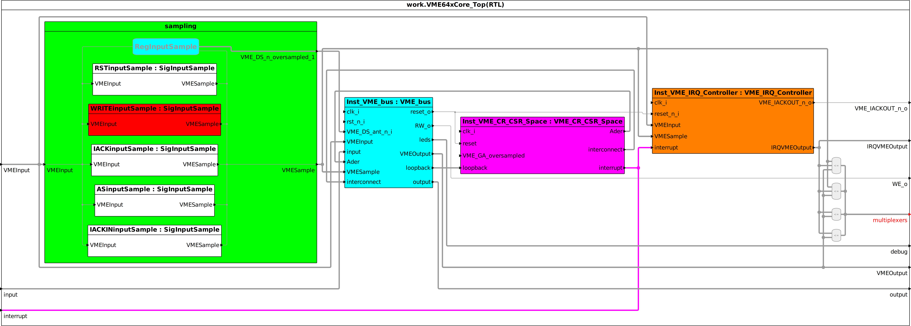  

This StateMachine  
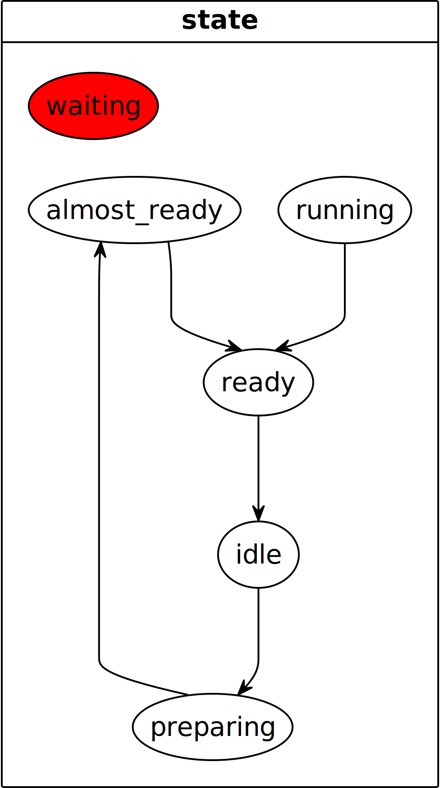  
Turns into:  
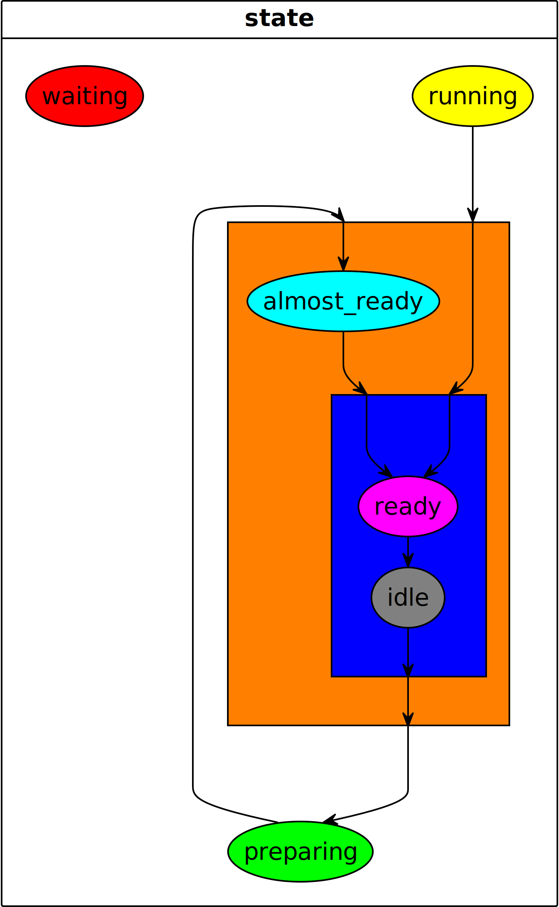  

A plain text format was chosen over a buttons and menus for several reasons:

* It can easily be managed with your **version control** system because files can easily be compared and merged.
* It's easy to debug by yourself, unlike proprietary formats or UIs.
* We can support you using all of our well-known features such as auto-complete, validations, formatting,...
* It's lightweight and can be used as the basis for the UI implementation.

## Getting started
To get started, choose a design with a BlockDiagram or StateMachine you want to simplify.

Create a new Graphics Configuration file by going to **File > New > Other > Graphics Configuration > Graphics Configuration File**.
You can also press the Sigasi button on the top right of the BlockDiagram or StateMachine view.

From there, you can declare groups and configure your diagram, check it in to version control and share it with your colleagues.
Auto-complete (**Ctrl+Space**) helps you write most of the code while formatting (**Shift+Ctrl+F**) helps you to keep your file clean.
If you're interested in the language's exact syntax, you can find it [here](../tech/graphics.ebnf.html).

## Features
The Graphics Configuration features:

* Grouping
* Hiding
* Reassignment hiding
* Block collapsing
* Coloring
* Regex matching

Note that in the BlockDiagram you can group blocks and wires while in the StateMachine you can only group states.

Graphics Configuration Editor features:

* Auto-complete (**Ctrl+Space**)
* Formatting (**Shift+Ctrl+F**)
* Quick outline (**Ctrl+O**)
* Show in BlockDiagram/StateMachine (**Alt+Shift+W**)
* Navigate to declaration (**Ctrl+click** or **F3** on identifier)
* Double-click on a diagram element to navigate to it in the code
* Hovering to show more information

## Graphics Configuration for BlockDiagrams

You can express which diagram you want to filter in the first line of the file by writing `diagram fullyQualifiedName`. The fully qualified name in VHDL is always `library.entity.architecture`. In SystemVerilog this is `work.module`.  
E.g. if you want to filter the diagram for the architecture `RTL` implementing the entity `ent` in the `work` library, you use the following line as the first line: `diagram work.VME64xCore_Top.RTL`.

The file is read from bottom to top. You start with the above definition of the diagram, then within that you can hide reassignments, create groups and finally, create configurations for ports, blocks and edges.

### Hiding reassignments
When using a lot of reassignments or when you're indexing vectors, you can get a *skyscraper* effect in the generated block diagrams.
By using `reassignments hide` you can draw through the assignment blocks making the diagram a lot simpler.  

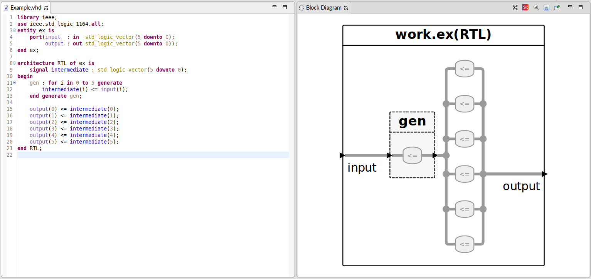  
*Skyscraper*

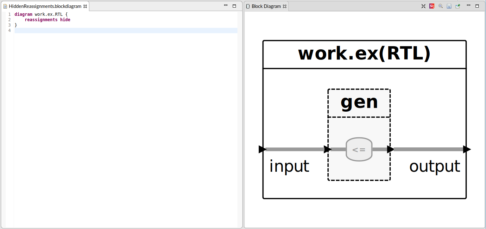  
*Hidden reassignments*  
  
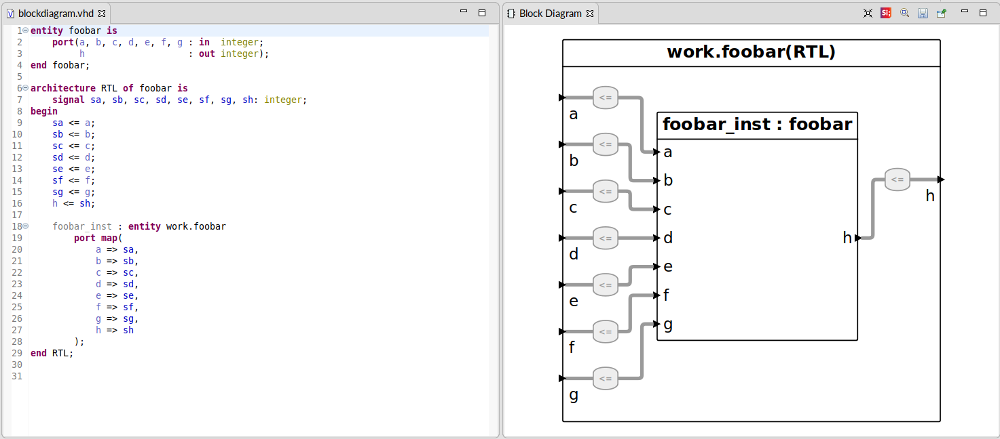  
*Multiple reassignments*  

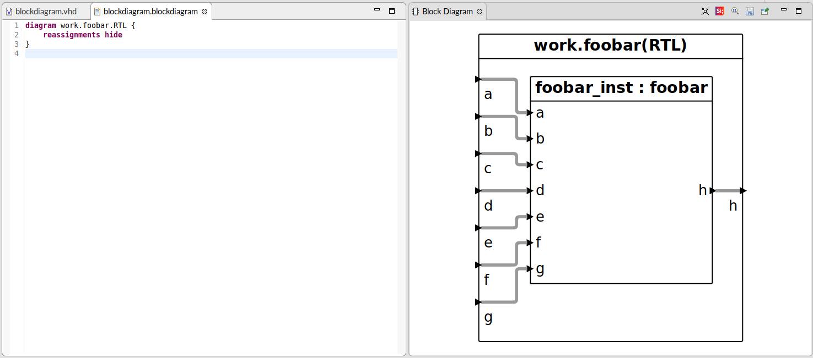  
*Hidden reassignments*  

### Grouping
After hiding the reassignments you can define groups of edges or blocks.
The syntax for a group is as follows:  
`def Type group ID (Identifiers)`  
Where `Type` is `block` or `wire`, `ID` is the new name of the group and `Identifiers` is a comma separated list of existing `ID`s (Graphics Configuration, VHDL or SystemVerilog) or a regex.

The syntax for a regex is `regex"regex_pattern"`. This uses [Java regexes](https://docs.oracle.com/javase/8/docs/api/java/util/regex/Pattern.html), you can also find a cheat sheet [here](http://files.zeroturnaround.com/pdf/zt_regular-expressions-cheat-sheet.pdf).
You can also check what the regex matches by hovering over the query.

E.g. if you want to group block2 and block3 you can add either of the following lines:  
`group block middle regex"block[23]"`  
`group block middle (block2, block3)`  

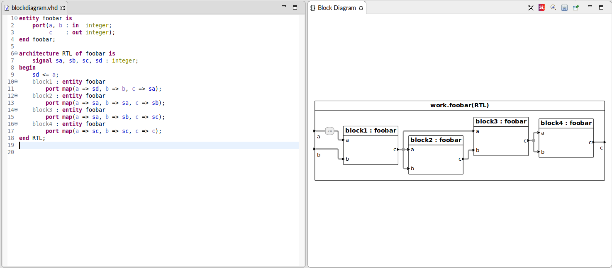  
*Ungrouped*

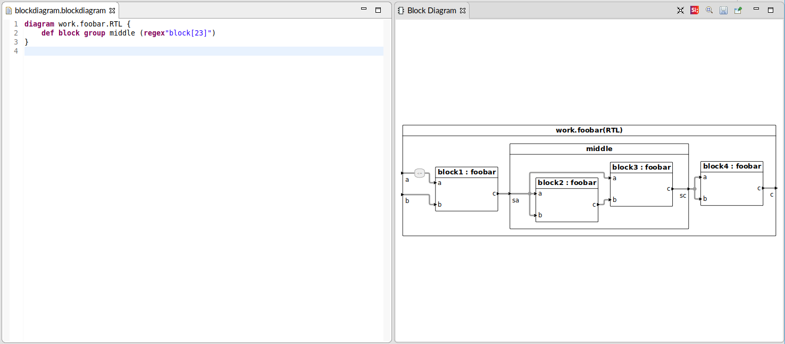  
*Grouped*  

The same can be done for wires by using `wire` instead of `block`.  
Ports can be grouped by grouping the wires attached to the ports into a bus.

### Configuration
The syntax for a configuration block is as follows:  
`Type Identifiers { ConfigurationItem* }`  
Where `Type` is `block, wire` or `port`.

The syntax for a `ConfigurationItem` is as follows:  
`hide | collapse | color GraphicsColor | reassignments hide`  
You can discover which colors are available [here](../tech/graphics.ebnf.html#GraphicsColor) or through the autocomplete.

E.g. we can color a block, called `middle`, green and hide its internals:  
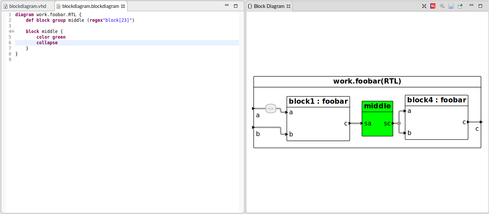  
*Colored and collapsed group*  

Configurations are not cascading (unlike CSS).
Coloring the `middle` block green does not turn all its internal blocks green as well.

Note that the language can not see everything: it can not see blocks, wires or ports that are within another block.  
E.g. we can't type `block block3 { color red }` as `block3` is part of the block `middle`.
To access a block within a block, we have to nest configurations.
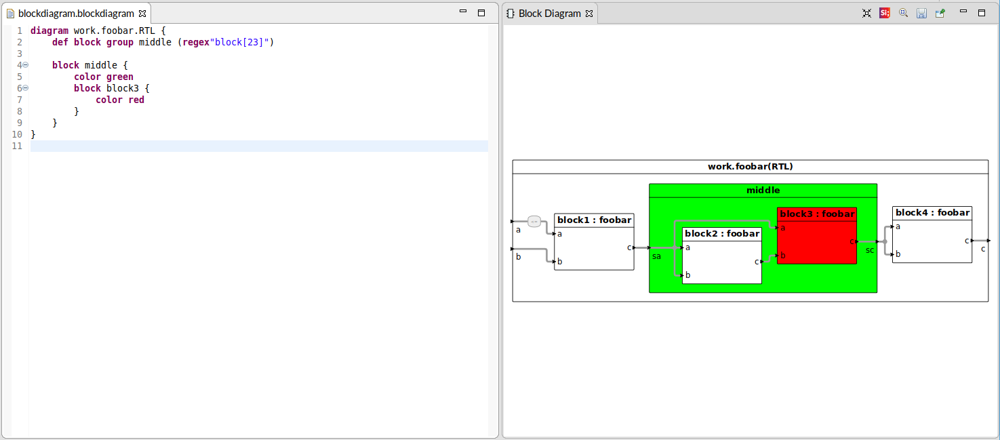  
*Nested configuration*  

Another use case would be to hide (unconnected) ports by using `port a { hide }`.
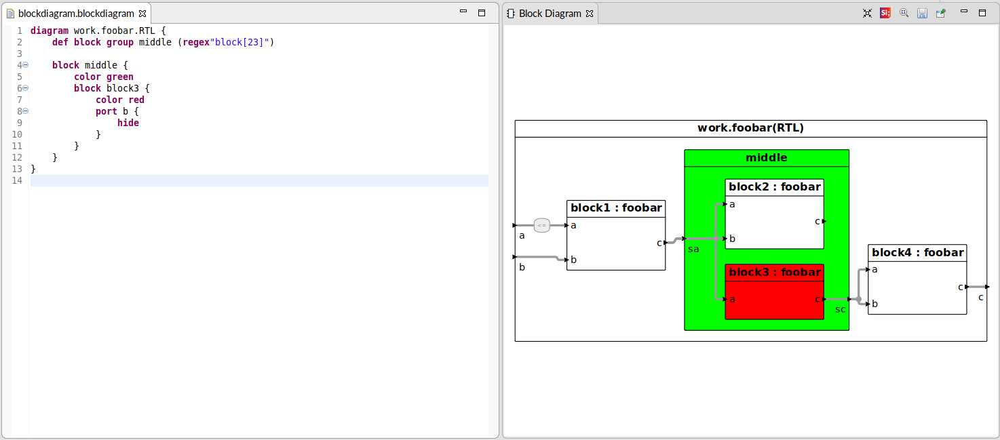  
*Hidden port*  

Note that when you hide a block or port, the edges that are connected to them will also be hidden.

It is also possible to hide reassignments in configurations, as you saw in the above *skyscraper* example, the reassignment in the generate block was not hidden.
You can do so as follows:  
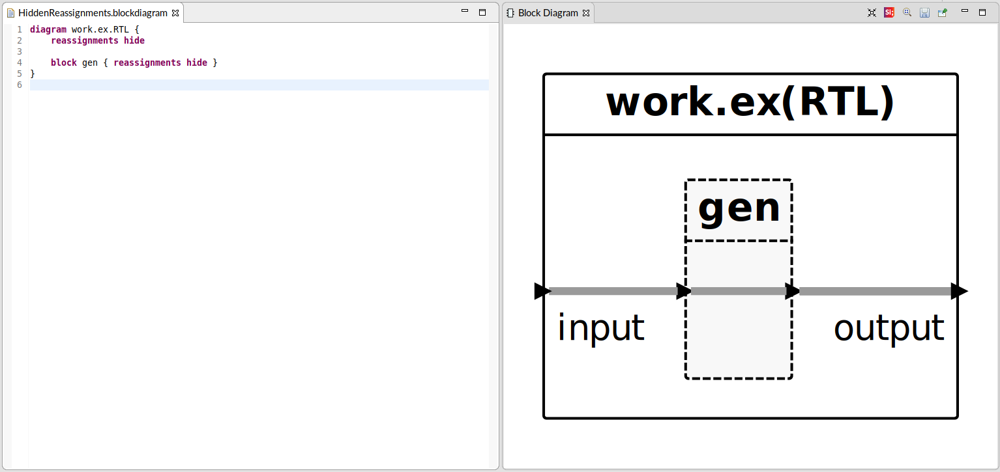  
*Hidden reassignment in generate*  

## Graphics Configuration for StateMachines

StateMachines are configured in the same way as the above BlockDiagrams, except the only `Type` that can be used is `state`.
The header is also slightly different, the syntax is as follows:  
`statemachine architecture : state_variable`.

For an example you can check out `4_state_machines.vhd` (in our VHDL Tutorial) with [this](../tech/using-graphics-configuration/4_state_machines.statemachine) filter file.

