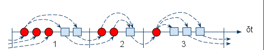
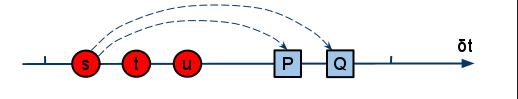
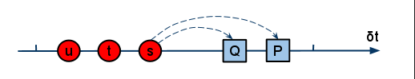
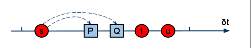
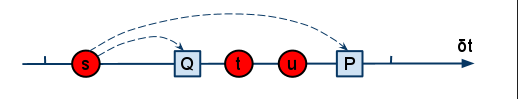

## How VHDL preserves determinism

In this post, I would like to talk about VHDL’s crown jewel: how it preserves determinism in a concurrent language. Here is a figure of how it works:

What you see is a simplified example of VHDL’s delta cycle algorithm in action. Delta cycles are an HDL concept used to order events that occur in zero physical time. The red circles refer to signal value updates. The blue squares are process evaluations.

A delta cycle starts with a number of signal value updates. A signal value update may trigger a number of processes. In the  second phase of the delta cycle, these processes are evaluated. In these processes, signals assignments may occur that schedule value updates in the next delta cycle. And so on.

Let us now zoom in on a single delta cycle:

The delta cycle starts with value updates of signals s, t, and u. The signals were assigned to by independent processes in a previous delta cycle. Signal s triggers two processes P and Q, that also use the value of signals t and u.

As signal updates are conceptually concurrent events, the order of the updates is undefined. The same holds for process evaluations. Therefore, another valid possibility is as follows:

It is easy to see that the result at the end of the delta cycle will be the same as before. Processes P and Q always see the same signal values. The point of the delta cycle algorithm is that signal value updates and process evaluations are kept in separate sets. The signal set is always handled completely before the process set. The order within each set is not relevant for the result. In other words, the result is deterministic even though the execution order within each set is not.

## What about Verilog?

Let’s now come back to the subject of the previous post: the case of Verilog.  The two situations above are possible, in addition to many others. For example:

Or even:

What you see is that in Verilog, value update events may validly appear before or after process evaluations. In other words, in terms of event ordering, all bets are off. Well, at least causality is preserved :-). Depending on execution order, the processes will see different values. Therefore, the result is non-deterministic.

## The fundamental difference

I believe that delta cycle event ordering is the most important difference between VHDL and Verilog. Let’s investigate where it comes from. In VHDL, you cannot use ordinary variables to communicate between processes. VHDL has special objects for that purpose: <em>signals</em>. Signals accomplish two things: the value update event is delayed to a future delta cycle, and it is held in a dedicated set that is processed atomically. In this way, determinism is achieved, as demonstrated in the first two examples.

In contrast, Verilog doesn’t have anything like signals.  The procedural thing that holds value is (confusingly) called a <em>reg</em>.  Regs are used both for computation inside processes and for communication between them. What Verilog does have is two types of procedural assignment: blocking, which is much like ordinary variable assignment, and nonblocking, which delays the value update to a future delta cycle. Using blocking assignments for communication is conceptually unsafe, as values are updated immediately. But nonblocking assignments don’t solve the problem either. They merely influence the delta cycle in which an event becomes active. Once active, they just behave like other events. **The fundamental difference is that Verilog does not handle value update events and process evaluation events in separate phases.**

As discussed in my previous blog post ([/opinion/jan/verilogs-major-flaw]), nonblocking assignments are still an improvement. In a purely synchronous design that uses nonblocking assignments for communication, there are only two types of delta cycles: one in which a single clock event triggers all processes, and a second with value update events only. For this special case, the result is deterministic. But that’s also why I called nonblocking assignments a half-baked solution: they solve the problem for an important case, but not in general. Beyond the synchronous design paradigm, like in test benches and high-level models, you are basically on your own.

## Conclusion

VHDL’s delta cycle algorithm is its crown jewel. It gives you built-in determinism. Let us treasure it - Verilog doesn't have anything like it. At the same time, you will agree with me that there is nothing  too complicated about the concept. It seems like a zero-cost solution for an important problem. So why then didn’t Verilog do it in a similar way? Perhaps the Verilog language designers had a good reason that we are not aware of yet. That will be the topic of a future post.

## P.S.
For completeness, let me add that VHDL has a few exotic nondeterministic corners also, such as shared variables, file-based IO, and asymmetric resolution functions.  However, this is not an issue in practice. During my whole VHDL career, I have never felt the need to use anything else than signals for communication. In contrast, whenever I pick up Verilog, the whole blocking/nonblocking issue invariably comes back. For example, even for synchronous design where a safe solution is available, it is very easy to find highly-regarded reference texts that use blocking assignments for communication. (Verilog designers, don’t do it like that!)

<em>This article is part of Jan's blog about his personal views on HDL design. 
Thanks to Jonathan Bromley for helping me to gain the insights that I try
to explain in this post.</em>