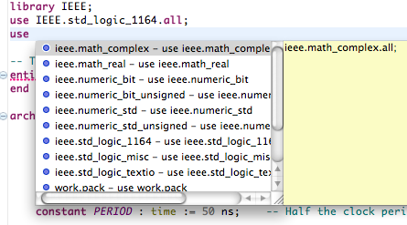
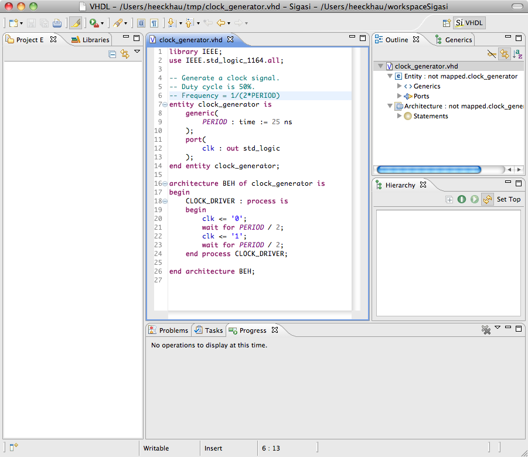
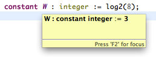

In the Sigasi 2.14 we reworked an important part of our internal
compiler which results in in better **accuracy**, better
**autocompletes** and a lot of **bugfixes**.

Improved internal compiler
--------------------------

For this release we put a lot of effort in improving the internal VHDL
compiler. Specifically, the compiler now analyses *expressions* more
accurately. This results in better autocompletes, occurrence
highlighting, search, rename, and more.

Thanks to this improvement we can offer accurate autocompletes for *use
clauses*, *records*, *library clauses*, *protected types*, *access
types*, …

External files
--------------

We simplified the way we deal with [/manual/opening#files-command-line] VHDL files. These are individual files that are not part of a Sigasi project. Before Sigasi 2.14 we openend external files in a special *“External Files”-project*, which was a bit of an awkward workaround. In Sigasi 2.14 we now simply open external files without a project, just like you would expect from a “simple” editor (like Emacs, Vi, Notepad++, Ultraedit,…).

Other new and noteworthy improvements
-------------------------------------

-   The standalone version is now built on Eclipse 3.8 (and Xtext 4.2.1)
    instead of Eclipse 3.7.
-   Better linting and “hyperlinks” for state machines, encoded as case
    statements over a record field
-   Added option to add extra command line options to vcom and vsim
-   Support for splitted use clauses
    (`use work.mypackage; use mypackage.something;`)
-   Autocomplete template for `std_logic_vector` ranges
-   Evaluate log2 function calls in hovers and hierarchy

 

Bugfixes
--------

-   ticket 2461 : Make Sigasi keyboard shortcuts configurable
-   ticket 2478 : Improve mechanism to differentiate between Aldec and Modelsim vsim
-   ticket 2480 : Show architecture name of instances in outline
-   ticket 2400 : Show error marker when incorrect record fields are used
-   ticket 2359 : Signal name that conflicts port name is not flagged as error
-   ticket 2431 : Autcomplete inside generate statements
-   ticket 2436 : Priority of autocompletes
-   ticket 2325 : Record constant in generic map wrongly scoped
-   ticket 2513 : Quartus integration plugin should also be included in
    the Eclipse plugin update site

Download/Update
---------------

If you have Sigasi 2 installed, you can . You can also .
