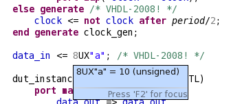
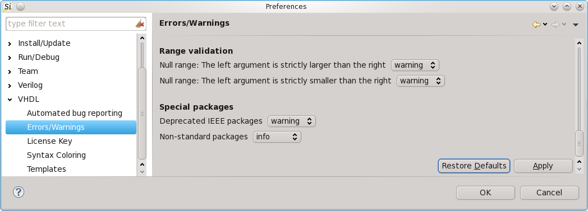
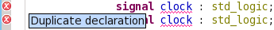
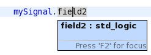
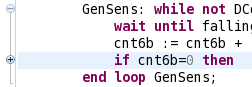

It’s been over two months since our last release, but we think this new release is worth the wait. We have a ton of new features, which many of you have been waiting for. We present better code folding (for if and case statements), better hovers (for records), better autocompletes, and much more. But perhaps the most important improvement is: VHDL 2008.

VHDL-2002 and VHDL-2008 support
-------------------------------

This release brings support for VHDL **2002** and **2008** to Sigasi 2: protected types, simplified sensitivity list, condition operators, external names block comments, …

Note that the new VHDL 2008 STD and IEEE libraries are not included yet.

Configurable severity for lintings
----------------------------------

The severity of Sigasi’s type time linting checks are now configurable.
Go to **Window \> Preferences \> VHDL \> Errors / Warnings**.

Other new and noteworthy improvements
-------------------------------------

-   **Occurrence highlighting** is now enabled by default
-   Detect **duplicate declarations**
    
-   Two additional cheat cheats to help you configure **Xilinx** and **Altera libraries** in Sigasi (**Help \> Cheat Sheets… \> Sigasi**)
-   Better **autocomplete** for instantiations (ticket:1777 and ticket:1850): autocompletes used to work only when you were typing the `entity` keyword. Now, autocomplete also works if you trigger it while you are typing the entity name.
-   Better **autocomplete** for signal assignments (ticket:1894)
-   Hover: Show datatype of **record fields** (ticket:1780)
    
-   **Code folding** for if and loop statements
	

*Because the internal cache format has changed in this release, your projects will be cleaned automatically after this update.*

### Bugfixes

-   ticket 1787: Fixed a problem with stale error markers.
-   ticket 1883: Fixed vertical alignment for alias declarations
-   ticket 1868: Parse error for attributes
-   ticket 1812: Correctly handle Flexnet environment variable separators
-   ticket 1758: Incorrect warning for type conversions in port maps
-   ticket 1814: Incorrect warning for buffered ports in port maps
-   several issues reported via the automatic bugreporter (thanks)

Download/Update
---------------

If you have Sigasi 2 installed, you can . You can also .
