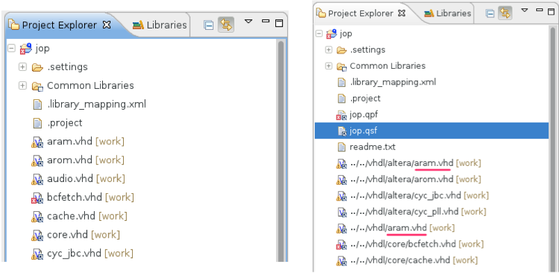
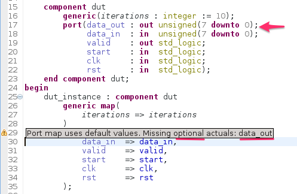
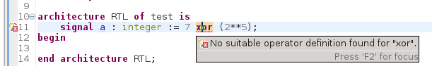

The Sigasi 2.25 release brings an improved Quartus II integration, a linter rule for new VHDL instantiations, and lots of bug fixes

## Quartus integration

This release brings support for Quartus II 14 and simplifies the filenames in Sigasi. If all HDL files in your project have unique names, the importer uses the file name withouth paths. Only if you have duplicate file names, the complete path will be used.

We have also fixed a bug for Quartus II projects that use VHDL libraries (ticket 3049)

## Check for missing optional associations in port and generic maps

In VHDL ports and generics can have default values. So it is legal to omit these in the port map or generic map in instantiations. Since this is often a source of errors that are difficult to find, we developed a linting check for this.

"Read about this in the user manual":/manual/incomplete-port-maps-and-generic-maps

## Other new and noteworthy improvements

Sigasi now more strictly checks the use of operators ("+", "*", "-", ...). This helps you to catch typical typos a lot faster.

## Bugfixes

* the minimal and maximal compatible version of the Xtext dependency is now explicitly set (Currently Xtext 2.7.2)
* ticket 2979 : Zoom buttons in FSM view are broken
* ticket 2984 : Scoping error with records in blocks
* ticket 2990 : Quick Fix for enum literals fails when case expression is between parenthesis
* ticket 3021 : Formatter adds unexpected whitespace when 'respect newlines' is enabled
* ticket 3024 : Scoping bug for 'not' on boolean array
* ticket 3027 : Scoping issue with aggregates in VHDL 2008
* ticket 3032 : Problem in hover of initial value aggregates 
* ticket 3050 : Scoping problem with overloaded conversion functions
* ticket 3055 : Make "A process must either have a sensitivity list or contain one or more wait statements" linting configurable
* ticket 3058 : Better autocomplete for access types of records

## Download/Update

If you have Sigasi 2 installed, you can [update_sigasi]. You can also [download_latest].
