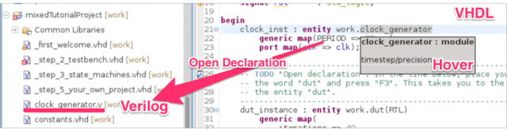
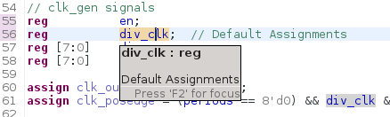
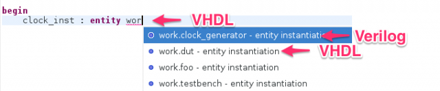
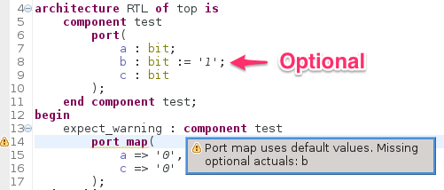

The Sigasi 2.26 release brings better *Verilog* and *Mixed language* support, an extra *linting* and bug fixes.

## Improved Verilog and Mixed language support 
\[Sigasi Premium Desktop and Sigasi Premium Doc\]

We significantly improved the Verilog and Mixed language support in Sigasi 2.26. 

* All ports and generics/parameters in module instantiations are now linked. This enables *hovers*, *'open declaration'* and *search*.

* Better hovers in Verilog

* Autoindent for Verilog

* VHDL Autocomplete now offers entity instantiation templates for Verilog modules too

## Check for missing optional port and generic association in instantiations 
\[VHDL; Sigasi Premium Desktop and Premium Doc\]

In instantiations you only have to specify input *ports* without a default value; output ports and input ports with a default value are *optional*. The same is true for *generics* with a default value. This is a common source of design errors and this type of bug is often tricky to spot. Therefore we implemented a new type-time design check to warn about missing optional associations in instantiations.

## Other new and noteworthy improvements

* We extended our import scripts to import *Xilinx ISE* and *Mentor Graphics HDL Designer* projects: "More info":/content/importing-xilinx-ise-project-sigasi
* Automatically try to check out a *Premium Doc* license when a *Premium Doc* feature is activated \[Premium\]
* The offline update site now also contains the Premium features \[Premium\]

## Bugfixes

* ticket 3064 : "Error in state machine analysis":/forum/wrong-statemachine-warning-0
* ticket 3066 : Scoping error in when clause
* ticket 3067 : Scoping error for access types
* ticket 3087 : Scoping bug in unconstrained VHDL 2008 types
* ticket 3101 : Add support for Vivado 2014.3.1
* ticket 3177 : Sensitivity list quickfix does not work with uppercase keywords

## Download/Update

If you have Sigasi 2 installed, you can . You can also .
