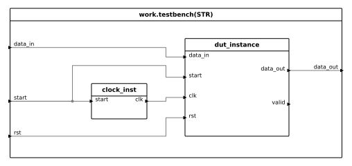
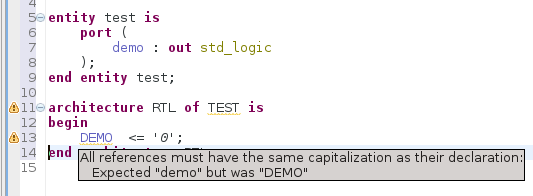
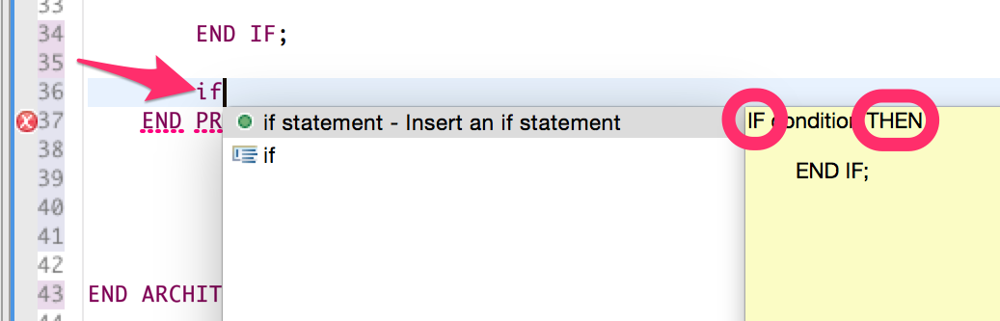
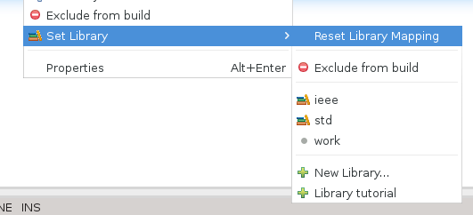
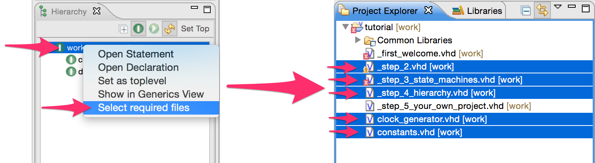

Sigasi 2.30 brings **improved graphics** with **SVG export**, new **rule
checks** and more.

## Improved graphics and SVG export \[VHDL, Premium Doc\]

In Sigasi 2.30 we improved the automatic layout of state machines,
changed the colors of the block diagrams and added support for SVG
export to both views.

### State Machine View

We improved the automatic layout of the state machine view. Edges now
have bend points, which minimize crossing edges and overlapping labels.

")

### Block Diagram View

Based on user feedback we simplified the layout of the Block Diagram and
settled for a minimalistic color scheme.

Most views in Sigasi update automatically while you type. However, in
order to avoid a the distraction of the moving or flickering Block
Diagram, we have decide to let the Block Diagram View update only after
you save a your file.

### SVG Export

Both state machines and block diagrams can now be exported to [scalable vector graphics (SVG)](https://en.wikipedia.org/wiki/Scalable_Vector_Graphics) This enables you to use high quality images to your (printed) documentation.
It also allows you to do some post-processing of the graphical properties.

[Example file](/releasenotes/2.30/example.svg)

## New Rule checks \[VHDL, Premium Desktop\]

### Check capitalization

Although VHDL is not case sensitive, it is recommend to always use the same capitalization when referring to the same declaration. For this reason Sigasi now warns when the capitalization of a reference differs from the capitalization of the declaration. Because external libraries can have different code styles, Sigasi only flags references in the same library as its declaration.

You can change the severity of this check via **Preferences \> Sigasi \> VHDL \> Errors/Warnings**.

### Check for positional associations in instantiations

Most VHDL designers prefer named associations in port and generic maps in instantiations. This makes it a lot easier to spot wrong connections. Sigasi now warns when positional associations are used.

You can change the severity of this check via **Preferences \> Sigasi \> VHDL \> Errors/Warnings**.

## Other new and noteworthy improvements

-   Sigasi now highlights all **SystemVerilog keywords** as keywords
-   The **Help \> Sigasi** menu now has an option to release/checkout a Sigasi floating license
-   All Sigasi **autocomplete templates** now respect **upper case
    keywords** formatting setting 
    
-   Extra command line parameters for Linux RCP to avoid crash during hovers on Red Hat Linux
-   Improved library mapping menu:
    
-   Ask to add Verilog Support when a Verilog file is opened in a VHDL project (and vice versa)
-   Added action to the hierarchy view to select all files in the selected hierarchy subtree, in the project explorer \[Premium Desktop\]
    
-   Updated Xtext dependency to [Xtext
    2.8.4](https://projects.eclipse.org/projects/modeling.tmf.xtext/releases/2.8.4)
-   Updated [Marker Manager](http://www.markermanager.com)

## Bugfixes

-   ticket 3264 : Data type analysis: multiply integer and real is valid
-   ticket 3327 : Unexpected type error in mixed instantiation
-   ticket 3334 : Scoping bug in generic in component declaration/instantiation
-   ticket 3346 : Clear Verilog cache after Sigasi update
-   ticket 3349 : Dependencies not correct when (VHDL 2008) context are used
-   And fixed multiple corner cases in the Verilog parser

## Download/Update

If you have Sigasi 2 installed, you can . You can also .
