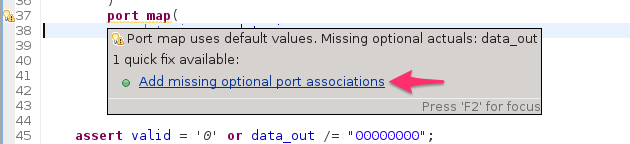
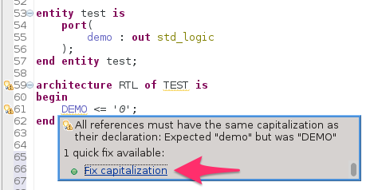
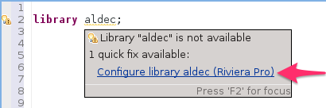
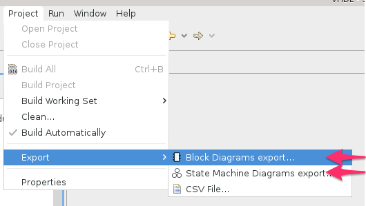
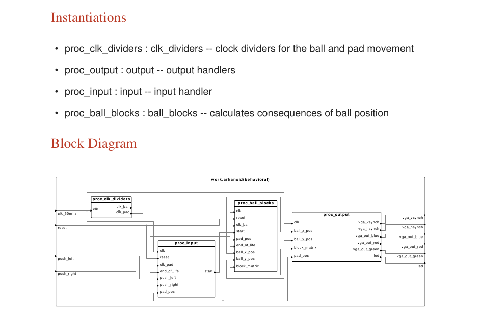

Sigasi 2.31 brings 3 **new Quickfixes**, improved **export for graphics** and more.

New Quick Fixes
---------------

Sigasi 2.31 brings three new Quickfixes that will make your life easier

### Add missing associations in port and generic maps

When you add new generics or ports to an entity declaration, you can now use the **Add missing (optional) generic/port association** quickfix to add missing generic or port mappings to an existing instantiation.

### Quickfix capitalization of identifiers \[Premium Desktop\]

In [sigasi-2.30] we introduced a new style check to verify a consistent use of uppercase and lowercase letters in VHDL identifiers. This release brings a quickfix to automatically change the capitalization of an identifier to match its declaration. 

### Quickfix Aldec library 

If you have Aldec Riviera PRO installed and you use the `Aldec` library, you can now use the Aldec library quickfix to automatically add the Aldec library to your Sigasi project.

Export all diagrams \[VHDL, Premium Desktop\]
---------------------------------------------

We added a convenient Export Wizard to export all block or statemachine diagrams of your project. This makes it easy to use Sigasi diagrams other applications.

Sigasi 2.31 now adds block diagrams to the PDF Documentation export.

Other new and noteworthy improvements
-------------------------------------

-   Reduce the vertical space between ports in the Block Diagram view.
-   Don't *close* single quotes in Verilog.
-   Increase java dependency to minimum Java 7

Bugfixes
--------

- ticket 3260 : Missing connection in Block Diagram when intermediate signal is used
- ticket 3343 : Duplicate transitions in the FSM view
- ticket 3397 : Only first (of multiple) state machines is layouted
- ticket 3402 : Scoping bug: `min` function confused with `min` time unit
- ticket 3407 : Keywords inside identifiers converted to lower case?
- ticket 3411 : Duplicate connections in Block Diagram View
- ticket 3416 : Incorrect error for "Type conversion with type alias"
- ticket 3425 : PDF export fails when Sigasi is installed in location with a `+` symbol
- ticket 3426 : Export SVG should escape text (e.g. `<=`)
- ticket 3437 : Autoindent in Verilog must respect the tabs/spaces setting

## Download/Update

If you have Sigasi 2 installed, you can . You can also .
