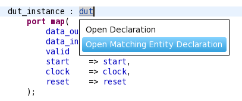
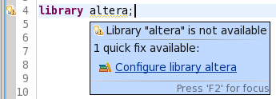
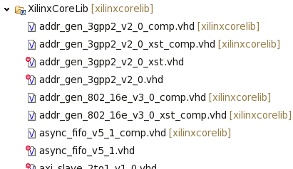
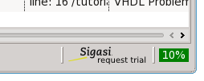
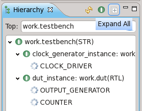
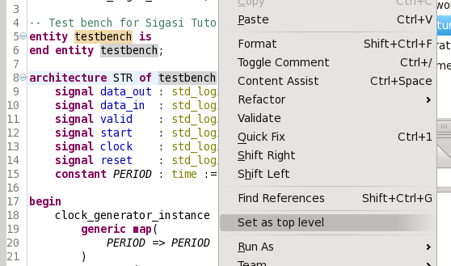

Sigasi 2.5 brings two great new features: **navigation from components
to the matching entity** and **automatically configure Altera and Xilinx
libraries**. We also added usability improvements and bugfixes.

Open matching entity
--------------------

In Sigasi 2.5 it is you can navigate from a **component declaration** or
**instantiation** to the **matching entity**. With *Matching entity*, we
mean: a visible entity declaration with the same name.

There are three ways to navigate to the matching entity:

1.  **Shift + F3** keyboard shortcut: move your cursor to the component
    name and press **Shift + F3**
2.  **Control-mouse**: hold the **Control** (**Command** on Mac) button
    and move your mouse pointer to the component name. A menu will
    appear that allows you to select the matching entity declaration.
    
3.  **Context menu**: Right click the component name and select **Open
    matching entity**
    ")

This also works for **generics** and **ports** wherever they are used.

Note that **search** and **rename** of components is not part of this
release. Expect this in one of the next releases.

Quickfix to add Xilinx and Altera libraries
-------------------------------------------

It now becomes very easy to add Altera or Xilinx to your projects.
Simply trigger the quickfix on the library warning marker.
Sigasi will ask for your Altera or Xilinx installation folder
automatically add and map the necessary files.

Note that for the **Xilinx** libraries we only map the packages with the
component declarations. By default all entity and architecture
declarations are not mapped (excluded). This significantly reduces the
time for a clean build. If you use direct entity instantiations, you can
easily map the entities you need.

You can change the Altera Quartus and Xilinx ISE installation path
settings at **Window \> Preferences \> VHDL \> Toolchains**.

Other new and noteworthy improvements
-------------------------------------

-   **Information Box** in the **Educational Edition** and **Starter
    Edition**: A small image box provides a tip and a link to the
    website. *Click* or *hover* for more information.

-   **Expand all** nodes action in the hierarchy view

-   **Set as Top Level** action in editor, outline and hierarchy context
    menu: right-click the name of the entity (or architecture, or
    configuration) and select **Set As Top Level**.

-   **Code folding** inside generate statements

### Bugfixes

-   ticket 2062 : \[Hierarchy] unresolved instantiation if entity and
    component are declared in a different VHDL library
-   ticket 2094 : \[Hierarchy] hierarchy view gracefully degrades when
    *automatic build* is disabled
-   ticket 2078 : \[Vcom] Automatically set VHDL mode (–93, –2002, –2008)
    in external compiler
-   ticket 2095 : \[Vcom] Deal with path variables correctly
-   ticket 2111 : Create new files with an absolute path on the command
    line
-   Fix an issue with new keywords that were introduced in VHDL 2002 and 2008: *protected*, *force*, *release*. There were problems with files that used these words as regular identifiers in *VHDL 93 mode*.

Download/Update
---------------

If you have Sigasi 2 installed, you can . You can also .
