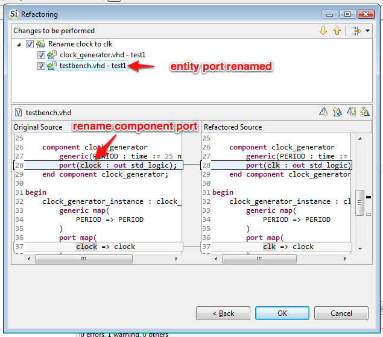
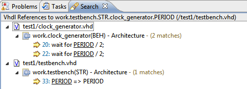
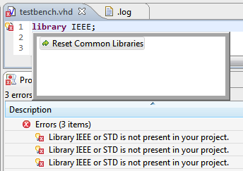

We are happy to present you Sigasi 2.6. This release brings tighter
integration between components and entities. Two important features,
**Search** and **Rename**, now take the component/entity-relationship
into account. Another highlight is that Sigasi 2.6 is now fully
compatible with the newly released [**Eclipse Juno** (4.2)](http://www.eclipse.org/juno)
As usual we also worked on several other improvements and bugfixes.

Components and their matching enties
------------------------------------

Since Sigasi 2.5 you can **navigate** from a **component declaration**
or **instantiation** to the **matching entity**. Sigasi 2.6 now brings
support for **search** (`Find references`) and **rename**.

If you rename an entity (or one of its **ports** or **generics**), the
matching component declarations and instantiations will also be renamed.
And if you search for reference to an entity declarations, the matching
component declarations and instantiations will also show up in the
search view.

Improvements to the standalone version
--------------------------------------

-   Sigasi is now configured so you can more flexibly install other
    plugins (e.g. newer versions of EMF, …)
-   We had to use a forked version of the Xtext plugin for a while, but
    now we are back to the official Xtext 2.3.1 release. This will
    increase stability and compatibility with other Eclipse plugins.
    Thanks for all the help from the people at
    [Itemis](http://www.itemis.com)!
-   Buy default, we now refresh all files in the workspace when they are
    changed outside of Sigasi. (You can modify this option is at
    **Window \> Preferences \> General \> Workspace \> Refresh using
    native hooks or polling**)

Other new and noteworthy improvements
-------------------------------------

-   Usability improvements to the Search View
    
-   Sigasi is now tested and ready for Eclipse Juno (4.2)
-   Improvements to library mapping performance
-   Better a error messages and quickfix when the standard libraries are
    missing in a project
    
-   Support component declaration autocomplete, even when the matching
    entity has declaration errors
-   Avoid confusion between **vcom** and **sigasi** problem markers.
    Prefix vcom problems with `Vcom :`
-   If you use the starter edition, we no don’t count the statements in
    Altera libraries. This means your own project can still be a full
    200 statements before you fall back to baseline mode.

### Bugfixes

-   ticket 2106 : enable autocomplete inside generate statements
-   ticket 2114 : better auto-formatting for unary minus
-   ticket 2152 : correctly resolve FlexNet exceptions
-   ticket 2169 : corrected title of the Xilinx ISE Setup dialog
-   ticket 2159 : better formatting for arrays
-   ticket 2151 : resolved scoping errors in protected types
-   ticket 2196 : fixed unresolved error in hierarchy when component
    instantiation and matching entity are in a different library than
    the component declaration.

Download/Update
---------------

If you have Sigasi 2 installed, you can . You can also .
