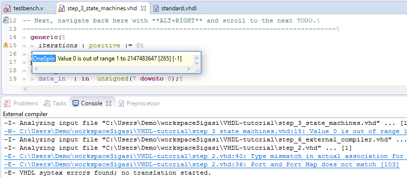
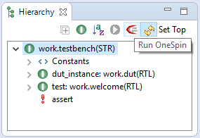
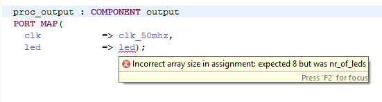
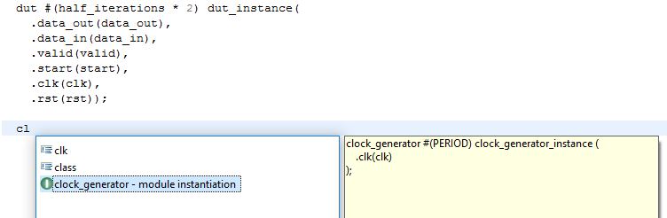
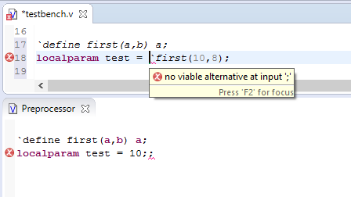
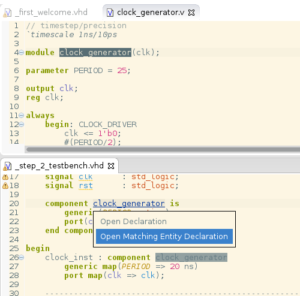
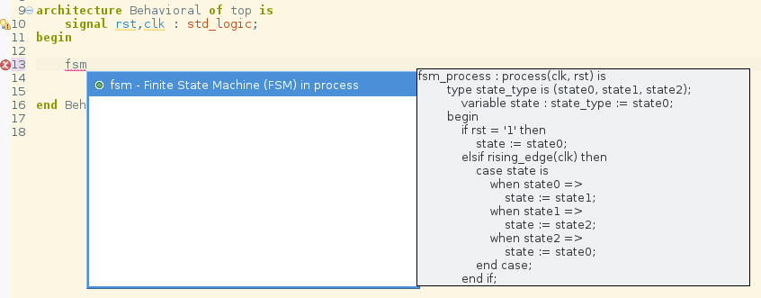
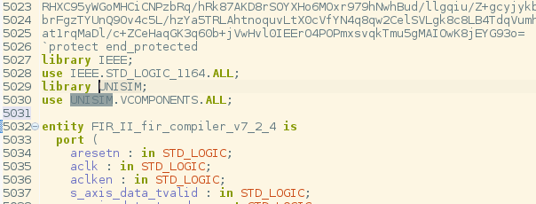

The Sigasi Studio 3.1 brings OneSpin integration, Verilog improvements and more.

If you have not yet updated your **Flexnet license daemon** after the Sigasi Studio 3 update, you need to do this before you update to Sigasi Studio 3.1. You can find the download details in "[/manual/license-key#License server setup]".

## OneSpin integration

The Sigasi/OneSpin integration makes is easy to run basic formal verification checks on your Sigasi projects. Without extra configuration, you can see if your code is ready a formal analysis with OneSpin.

If the (VHDL or Verilog) code still has problems, these problems will appear in the editor as problem markers. This is similar to the existing [Riviera Pro and ModelSim integration][/manual/tools].

To enable OneSpin, make sure the `$ONESPINROOT` environment variable is set. Next select **OneSpin** in the **Sigasi > Toolchains** Preference page. \[[Full documentation][/manual/onespin]\].



If the OneSpin toolchain is enabled and if you have set a *top level* (VHDL only), you can run the **OneSpin Consistency Checks** on your hierarchy. 



Running the OneSpin Consistency Checks can be a long process. You can abort it by clicking the stop button in the Progress View.

## Check vector width in port maps
[vhdl_only], [xl_only]

Sigasi Studio now also checks the vector width in instantiation port maps:
 


Just like the [*width check* in instantiations][/manual/linting#vector-width], this check calculates with generic values **symbolically** (and does not work with elaborated generic constants).

## Verilog improvements

* Sigasi 3.1 brings **autocomplete templates** for Module Instantiations in Verilog.  

* The Preprocessor View now also displays error markers. This helps to better understand problems with Verilog macros.  

* The hover now shows the value `parameters` and `localparams`  

* In mixed language projects, you can now also navigate from Module instantiations in VHDL code to the corresponding Verilog code when component declarations are used.  
  

## Other new and noteworthy improvements

* Improved License error messages (e.g. *all licenses are in use*)
* Initial support for **type generics** in **packages** \[VHDL 2008]
* An autocomplete template for **Finite State Machines**  
  
* The Xtext framework was updated to version 2.9.2

## Bug fixes

- ticket 3333 : Unexpected *unwritten* warning when alias for procedure is used
- ticket 3475 : Skip encrypted VHDL code (```protect begin_protected`` → ```protect end_protected``)

- ticket 3535 : Unexpected dead code warning
- ticket 3543 : Unreported errors in vector width check 
- ticket 3549 : Skip protected regions in Verilog
- ticket 3559 : Unexpected error on Verilog generate statement
- ticket 3560 : Unexpected external compiler commands when files are edited during external compilation

## How to update?

If you have Sigasi Studio 3 installed, you can [update][update_sigasi] or [download a fresh install of the latest version][download_latest].
