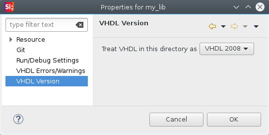
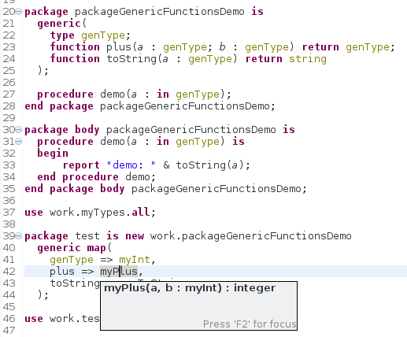
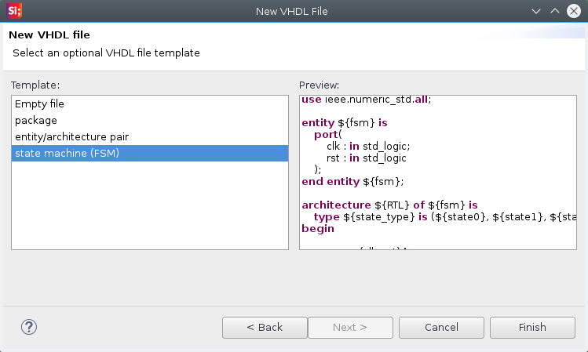

The summer holiday was very productive at Sigasi. We did get some time to enjoy the weather and take some time off. And on top of that, we prepared the Sigasi Studio 3.2 release.
In Sigasi Studio 3.2, you can run on an **updated Eclipse platform**, set the **VHDL or Verilog versions** on a per-file basis, run **ALINT elaboration** checks, have better **SystemVerilog support** and much more.

## Eclipse Neon

Sigasi Studio 3.2 is build on top of the newly released [Eclipse Neon](https://eclipse.org/neon/) platform. This brings a number of nice enhancements:

- Support for **high-DPI** monitors. ("Resolution-based auto-scaling") Everything scales correctly now on high-resolution screens.
- **Word wrap** in text editors: The workbench toolbar now contains a Toggle Word Wrap button  (Shortcut: Alt+Shift+Y).  
       
- Easy **zoom in text editors**: You can now use *Zoom In* (**Ctrl++** or **Ctrl+=**) and *Zoom Out* (**Ctrl+-**) commands to increase and decrease the font size.
- **Automatic Save of dirty editors**: Sigasi Studio now has an option to automatically save your editors when there is *no activity* for a certain amount of time. This option is disabled by default, but you can enable it on the new *autosave preference page* (**Preferences > General > Editors > Autosave**). You can also set the autosave interval here.
- **Hide the window toolbars**: You can use the "Toggle visibility of the window toolbars" command (via Quick Access: **Ctrl+3**) to hide all currently visible toolbars of the current window. Executing the command again reveals these toolbars again. This allows you to maximize the space available for editors and views.
- **Full Screen Mode**: You can toggle the full Screen mode via the shortcut **Alt+F11** or menu **Window > Appearance > Toggle Full Screen**.
- If you now open a file type that is not registered in Sigasi Studio, a dialog will ask you which editor to use. You can select a built-in editor or choose an external program.
- [More enhancements](https://www.eclipse.org/eclipse/news/4.6/platform.php)

## Configure language version per file/project/workspace

You can configure the language version on a more fine grained level than one version for the entire workpace. You can override the language version per project, folder or file. \[[documentation][/manual/config#configure-version]\]

This makes it a possible to use a VHDL 2008 library in a VHDL 93 design. If you use VHDL, your project needs the IEEE libraries for the *most recent VHDL version you use*. 

## Aldec ALINT elaboration checks


Sigasi Studio can run Aldec ALINT elaboration checks. If you select ALINT as external compiler (**Preferences > Sigasi > Toolchains**) and select a top-level in the [Hierarchy View](/manual/views#hierarchy-view), a new ALINT button  will be enabled. Clicking this button will run a headless ALINT elaboration check. All ALINT elaboration problems will appear as markers in the problems view and in the associated editors.   

## SystemVerilog improvements

We further extended our SystemVerilog support:

- Fixed some corner cases with the Preprocessor
- Skip encrypted regions in SystemVerilog
- The external compiler integration now reuses the configured Project's include paths and language version
- Verilog modules can now be set as toplevel: this enables you to launch an [external simulation][/manual/tools#launch-simulator] from Sigasi Studio
- We add more Verilog autocomplete templates
- Syntax support for more SystemVerilog expressions
- Syntax support for SystemVerilog Assertions
- Allow Verilog hovers in the Sigasi Studio Starter Edition, on file-by-file basis (without license)

## Other new and noteworthy improvements

- ticket 3636 : Open architectures in Block diagram view
  
- ticket 3546 : Support Generic Functions in packages (VHDL 2008) \[[Example VHDL file](3.2/package_generic_functions.vhdl)\]
  
- ticket 3644 : Add New VHDL File Wizard template for FSMs
  
- ticket 3534 : The quickfix for "Add missing port/generic" respects the original uppercase letters of the declaration instead of using all lower case letters.
- ticket 3637 : The library no longer monitors the workspace to update its configuration when files are deleted. The library configuration file is now only 'sanitized' and written when the library mapping is changed because of a user action.
- ticket 3633 : The 'Sigasi Solarized' theme is not longer the default theme. It is still available and can be selected via **Preferences > General > Appearance > Theme**.
- ticket 3618 : We updated to Xtext `2.10.0`

## Bug fixes

- ticket 3555 : Improve syntax highlighting for numbers in VHDL, supporting  numbers with an exponent.  
  
- ticket 3605 : Quartus II project importer takes SystemVerilog files into account.
- ticket 3602 : Autocomplete does not correctly replace existing text when `Anywhere` context is used on Windows
- ticket 3611 : Incorrect Verilog syntax error

## How to update?

If you have Sigasi Studio 3 installed, you can  or [download a fresh install of the latest version].
