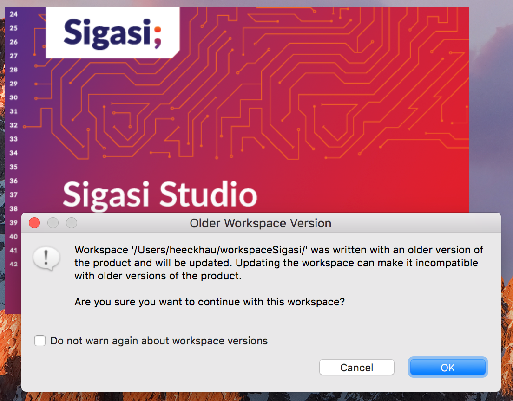

Sigasi Studio 3.6 introduces powerful methodologies with customizable *Block Diagrams* and *State Machine Diagrams* with *Graphics Configuration* files.
Read below to find all new and noteworthy changes.

# Graphics Configuration \[[xl_doc]]

The [BlockDiagram][/manual/views#block] and [StateMachine][/manual/views#fsm] Views are very useful ways to **explore** and **understand** HDL designs. But sometimes this just doesn't cut it. The diagrams are **too complex** and **crowded** to understand a design. They contain too much detail to see the big picture.
**Sigasi Studio's Graphics Configuration files** are a new solution for this challenge.

With Graphics Configuration files you can customize the content of the graphical views in a **predictable** and **reproducible** way. Because the files have a **simple and clear syntax**, they can easily be **shared (and merged)** in a Version Control System. They can also naturally **evolve** and always **stay in sync with the original VHDL source files**.

The animation below shows different **Block Diagram** Graphics Configurations applied to the same VHDL source file.

The animation below shows different **State Machine** Graphics Configurations applied to the same VHDL source file.

Please find more details and tips on getting started in "[/tech/using-graphics-configuration]".  
The syntax of the Graphics Configuration files is explained in "[/tech/graphics.ebnf]".

# Improved Dependencies Viewer

Sigasi Studio's [dependencies view](/manual/views#dependencies) has a new skin. Its visuals are now in line with Block Diagram and Statemachine Views.  

# Extra external tools

Sigasi Studio 3.6 enables two extra external tools in your workflow: [ALINT-PRO](https://www.aldec.com/en/products/functional_verification/alint-pro) and [Xilinx Vivado XSIM](https://www.xilinx.com/products/design-tools/vivado/simulator.html)

## ALINT-PRO

ALINT-PRO 2017.07 introduced a new command line option that makes ALINT-PRO a powerful extension to Sigasi Studio's type time linting: `elabflatmode`.
**Flat elaboration mode** is a new processing type in ALINT-PRO designed specially for fast background linting. Design units are being parsed, elaborated, synthesized and linted at block-level, without crossing the boundaries between design units.

## Xilinx Vivado XSIM

By popular demand, we have also added the Xilinx Vivado simulator as external compiler in Sigasi Studio.

[Manual page][/manual/vivado]

# SystemVerilog improvements

* Improved outline
* Configure project wide defines:  
You can configure definitions that are set before other (System)Verilog files in the project are processed.
  
The code in the **Initial preprocessor definitions** field is preprocessed before all other (System)Verilog code in your project. This allows you to, for example, set global defines without an explicit `include` statement.

* Selection behavior in preprocessor code:  
Double clicking in preprocessor code now selects individual words instead of the entire definition. Note that you can still select the entire definition by double clicking on the`` ` ``character.

# Sigasi Studio standalone version now build on Eclipse Oxygen (4.7)

Sigasi Studio 3.6 is build on top of the newly released [Eclipse Oxygen](https://eclipse.org/oxygen/) platform. This brings a number of UI and other improvements. You can find all new and noteworthy changes in Eclipse Oxygen on the [Eclipse website](http://www.eclipse.org/eclipse/news/4.7/)

If you open an existing workspace after the update to Sigasi Studio 3.6, you might see a warning about updating your workspace. You can safely confirm the update by clicking **OK**.  

# Other new and noteworthy improvements

* Better library mapping menu (easier to undo "exclude from build")
* We updated the bundled Java Runtime Environment (JRE) to 8u144 (Note that this only applies to a fresh download of the stand-alone version. The JRE is not updated via the embedded update mechanism)
* The CSV file export now uses *relative paths* for linked files too
* We added a [quickFix for VUnit libraries][/tech/vunit-quickfix]

* Block Diagram: `buffer` ports are now displayed as output ports
* Block Diagram: visual distinction between `input` and `inout` ports
* We added a new quickfix to correct the capitalization of all references in the entire VHDL source file.  

* We simplified the [EULA][/eula]
* New linting check: redundant `= true` or `= false` in boolean expressions

# Bug fixes

- ticket 3959 : \[(System)Verilog] parse error: `import` between module name and parameters
- ticket 3969 : \[(System)Verilog] Verilog autocomplete breaks on the input ``defin`
- ticket 3739 : \[Block Diagram] Connection with conversion function not shown in block diagram
- ticket 3832 : \[Block Diagram] Concatenated signals in port not shown
- ticket 3849 : Workaround for ModelSim when project path contains spaces
- ticket 3861 : \[VHDL] Incorrect error when `range` attribute has an index
- ticket 3928 : Dependencies view and "export csv" should not mix dependencies of independent projects
- ticket 3930 : \[VHDL] Avoid exceptions in formatter with preserve newlines
- ticket 3932 : \[VHDL] Comments before `when` keyword get indented too much
- ticket 3935 : Fix missing icons in Libraries View
- ticket 3946 : \[VHDL] Attribute `subtype` and `base` should be available on all types
- ticket 3948 : \[VHDL] Indentation failure when formatting
- ticket 3955 : \[VHDL] Sort associations as declared removes uppercase characters
- ticket 3956 : \[(System)Verilog] Fix grammar issue with delay control
- ticket 3961 : \[VHDL] Formatting crashes when *Non breaking spaces* are used
- ticket 3967 : External compiler does not compile all files when builds are canceled in between.
- ticket 3968 : \[VHDL] Fix formatting issue in `case` statement quick fix
- ticket 3979 : \[VHDL] `report` statement is not being formatted
- ticket 3980 : \[VHDL] Formatting issue with package instantiations
- ticket 3986 : \[VHDL] If there is only one `when` clause in a `case` statement, formatting does not format `end case` or `when` clause
- ticket 3992 : \[(System)Verilog] Exception when clicking hyperlink on ``includes`

## How to update?

If you have Sigasi Studio 3 installed, you can [update][update_sigasi] or [download a fresh install of the latest version][download_latest].

# Sigasi 3.6.1 point release

On October 4th we released Sigasi Studio 3.6.1. This release fixes an issue when launching ModelSim simulations and adds a *"pin view"* button to the **State Machine View**. The Sigasi Studio 3.6.1 release contains some minor bug fixes too.

Thanks for all bug reports and enabling Talkback.

# Sigasi 3.6.2 point release

On October 19th we released Sigasi Studio 3.6.2. This release fixes a few important Sigasi Studio issues:

* Avoid that the vector width linting analysis goes into an infinite loop for any VHDL code
* Fixed PDF documentation export when project has excluded VHDL files
* Fixed refresh issues in the graphical views

 