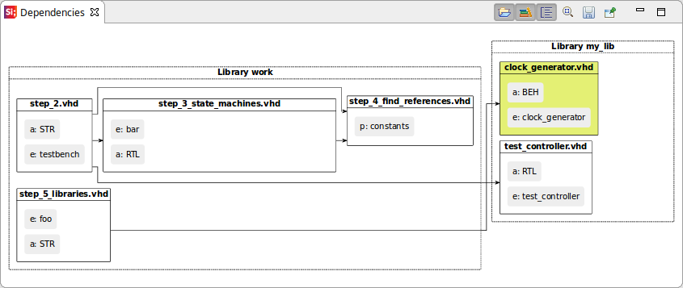
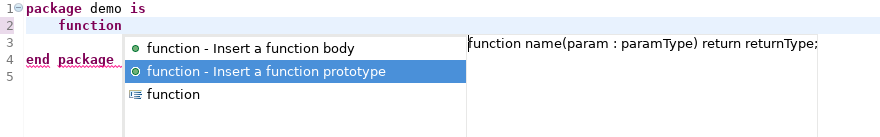

Sigasi Studio 3.8 brings support for **Markdown in Comments** and for **Multiline trailing comments**.
We also improved the **Documentation Generation** and the **Dependencies View**.
Read below to find more new and noteworthy changes.

# Documentation and hover improvements

## Markdown markup in comments

VHDL and SystemVerilog comments are now processed with a [Markdown processor](https://en.wikipedia.org/wiki/Markdown). This allows to add markup (e.g. bold, code, paragraphs, hyperlinks,...) to comments. This results in nicer hovers and documentation.



In hovers the complete Markdown syntax is supported. For PDF documentation generation following features are supported:

* paragraphs (add and empty comment line to break paragraphs)
* line breaks (by adding two trailing spaces)
* *emphasis* (`*emphasis*`)
* **strong** (`**strong**`)
* lists
* tables
* external links and email addresses (`<http://www.sigasi.com>`, `[Sigasi](http://www.sigasi.com)` and `<sales@sigasi.com>`)

## Multiline trailing comments

Sigasi Studio has a few simple rules to [associate comments with HDL declarations][/manual/documentation#Comment Association]. In version 3.8 we have refined and extended the association rules to support multiple single line trailing comments.



*Empty lines* between comments now break the comment blocks. This provides a convenient way to *un-associate* comments from declarations. You can add an *empty **comment** line* to combine comments with multiple paragraphs.



We have also updated the **Formatter** and **[Structural select][/screencasts/structured-select]** to respect (and fix) comments according to the new association rules.



Note that the comment association rules are identical for both (System)Verilog and VHDL.

[Complete comment association documentation][/manual/documentation#Comment Association]

## PDF documentation update

We also did significant improvements to the documentation export:

* **Support for (System)Verilog modules**: The documentation now also documents (System)Verilog modules.
* **Top Level only export**: In the export wizard you can now select either a **Project** or just a **top level**. Selecting a **top level** will only add the documentation of design units that are part of the selected hierarchy.

* **State machines**: If architectures contain state machines, these will be included in the documentation

* **Result folder**: The generated `DocBook` and `PDF` files are now written in the `sigasi-doc` folder (and no longer in the root of your project).
* **Diagram paths**: Diagrams are now generated in `sigasi-doc/blockdiagrams` and `sigasi-doc/statemachines`.
* **Duplicate design units**: If your project contains duplicate design units, documentation export is not possible. We now show a clear dialog instead of a cryptic message in the console view.

# Dependencies Viewer (Mixed language)

The *Dependencies Viewer* can now also show the libraries in which files are built and it can show the
design units within the files.
Use the new icons to enable or disable the features of the Dependencies Viewer:

*  Show all files in project
*  Show libraries
*  Show design units

# Other new and noteworthy improvements

* We implemented the last missing VHDL 2008 features in Sigasi Studio: functions with generic parameters
* Quickfix for c-style equals  

* Improved autocomplete priorities (`records > conversion functions`)
* Allow (System)Verilog Preprocessor settings dialog to globally include files

* Updated Eclipse in standalone version to Eclipse 4.7.2
* Added VHDL autocomplete template for `function` prototypes (useful in packages)

* Add parameter to `procedure body` autocomplete template
* \[XL] Added extra linting check for file header comments: check that header comment matches a pattern

* \[XL] Added extra linting check for file names: check that the primary unit names in the file are part of the file name. Note that this check is **ignored** by default. You can enable it in the VHDL **Errors/Warnings** preference page (**Style Validation > Filename must contain primary name**)  


# Bug fixes

- ticket 4099 : Wrong error message in pop-up when all licenses are in use
- ticket 4138 and 4019 : Rename refactoring `StackOverflowError`
- ticket 4184 : \[VHDL] Duplicate design unit markers occur multiple times
- ticket 4160 : \[VHDL] Sort associations mangles up bit string literals (`10x"12"` becomes `"12"10x`)
- ticket 3813 : Rename in autocompletes steals enter keystroke from QF
- ticket 4070 : \[VHDL] Undo is incorrect after rename refactoring with format on save
- ticket 4046 : Block Diagram: Entity instantiation without ports is displayed as unknown
- ticket 4036 : Vivado integration is missing VHDL (2008) version parameter
- ticket 4037 : \[VHDL] incorrect duplicates declaration error for vhdl 2008 package instantiations
- ticket 4102 : \[VHDL] Check for missing procedure implementation in protected types
- ticket 4049 : \[(System)Verilog] `global` not accepted as package name
- ticket 4048 : \[(System)Verilog] Imports with `global` keyword are not recognized
- ticket 4120 : \[VHDL] Alias for package
- ticket 4185 : \[VHDL 2008] allow local package instantiations in processes
- ticket 4194 : \[(System)Verilog] Missing Questa `vlog` errors in the Problems View
- ticket 4219 : Issue launching `xsim` simulation

# How to update?

If you have Sigasi Studio 3 installed, you can  or .
