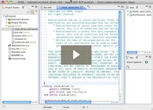

Most VHDL files in any organization start with the same few lines: a copyright header and the same few library and use clauses. It's a pain if you have to go look for another file and <a href="http://en.wikipedia.org/wiki/Copy_and_paste_programming">copy and paste</a> the header. 

Instead, it is a lot easier if you just define a template for your copyright header and for your default library and use clauses. You can then insert these templates by typing "copyright" or "libraries" then and pressing CTRL+space.

You can create your own templates by going to the preferences <strong>Window > Preferences</strong> and then <strong>Sigasi (VHDL) > Templates</strong>. Click <strong>New...</strong> and fill in the template dialog. You can also insert variables such as ${year} or ${user}, which expand to the current year and the user name, respectively.

