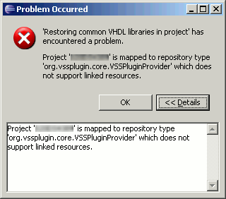

Sigasi has incompatibilities with the [Visual Source Safe plugin](http://vssplugin.sourceforge.net/). The VSS plugin blocks an Eclipse framework feature that Sigasi needs to run. Sigasi uses Eclipse's Linked resource mechanism to add the common VHDL libraries to your project (`std` and `ieee`). But VSS does not support Linked resources —The last update of the VSS plugin was in 2007 for Eclipse 3.3— and it inhibits Sigasi from creating these links.

As a result, if you use Sigasi together with VSS, Sigasi can not add the `std` and `ieee` libraries to your project.

**Workaround**: Sigasi allows you to use your own custom `std` and `ieee` libraries. You can use this feature to manually add the `std` and `ieee` files.

