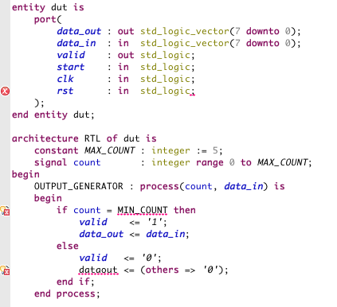

Ideally, if you make three mistakes in VHDL, you want to see three error markers. Here is a small example.



A traditional VHDL compiler gives only one error message. You will have to fix this error and start the compiler again before you can find the next error. This takes extra time and you need all of your time you to work on complex design problems that you are dealing with.
```
$ vcom -work work -93 /media/psf/Home/workspaceSigasi/recovering_parser_demo/dut.vhd
Model Technology ModelSim ALTERA vcom 10.0c Compiler 2011.09 Sep 21 2011
-- Loading package STANDARD
-- Loading package TEXTIO
-- Loading package std_logic_1164
-- Compiling entity dut
** Error: /media/psf/Home/workspaceSigasi/recovering_parser_demo/dut.vhd(12): near ")": expecting IDENTIFIER
```