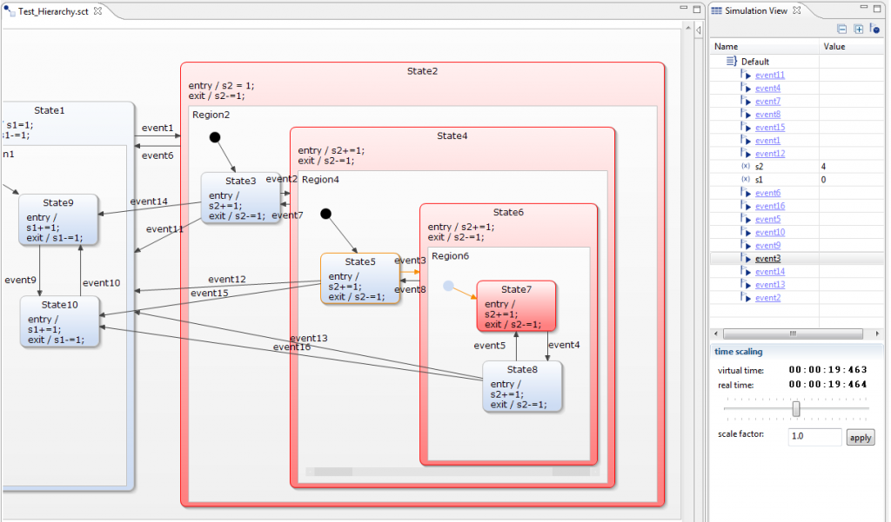

Last month I was introduced to [Yakindu](http://www.yakindu.org), an open-source-toolkit for model-driven development of embedded systems. One component of the Yakindu toolkit supports the graphical development of finite-state machines: the **Yakindu Statechart Tools (SCT)**. Although I'm personally rather skeptical to graphical development tools and prefer textual entry with visualization, the Yakindu Statechart Tools seemed really powerful. For example, SCT supports hierarchical states, parallel states, ... So it was worth giving it a try for VHDL design.

Together with [Axel Terfloth](http://blogs.itemis.de/terfloth) from the Yakindu project, Sigasi prototyped a VHDL generator for SCT statecharts that we both will demonstrate at [Embededded World 2012](http://www.embedded-world.de) (Hall 4 Stands 109 (Sigasi) and 408 (Itemis)). Please visit us to see a demo of this prototype.

We used [Xtend](http://www.eclipse.org/xtend) to generate VHDL-code from the statecharts. The Xtend-Yakindu combination did not work out-of-the-box. Yakindu currenlty only works with an older version of Xtext (version 2.01.). So you need to download an older version of Xtend too. Here are some of the required steps to get started developing with Yakindu: 

1. Download [Eclipse for RCP and RAP Developers](http://www.eclipse.org/downloads) (These containt the PDE plugins)
2. Download Xtend 2.0.1 as an offlline update site from <http://www.eclipse.org/modeling/tmf/downloads/>
3. Start Eclilpse and install Xtend from the offline update site
4. Install Yakindu from <http://updates.yakindu.com/indigo/milestones>
