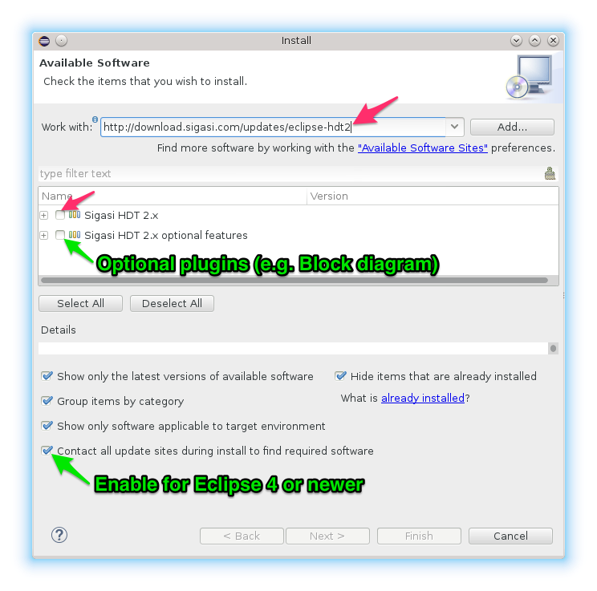

Distribution and flavours
-------------------------

Sigasi is distributed online. It is available in two versions: as a
stand-alone application or as a plugin inside a standard Eclipse
installation. Your license gives you the right to use either version, at
any time, at your discretion. Therefore, your first task is to decide
which version suits your requirements, based on the description below.
Depending on the chosen version, you should then follow the
corresponding installation instructions.

### Sigasi App

The stand-alone application has the following characteristics:

-   Recommended if you are not using Eclipse yet
-   Installation is trivial: just unzip!
-   Everything is included in a single download
-   Well balanced set of features
-   Optimized for VHDL and Verilog development
-   Complete freedom to add and configure plugins

### Sigasi Eclipse plugin

The Eclipse plugin has the following characteristics:

-   Recommended if you are using Eclipse already
-   Easily plugged in into your existing Eclipse platform
-   Complete freedom to add and configure plugins
-   Over one thousand eclipse plugins choose from
-   Support for C, C++, Tcl and other languages
-   Support for many version control systems

Installation of Sigasi App
--------------------------

To download and install Sigasi as a stand-alone application, follow the
online [Installation
Instructions](http://www.sigasi.com/download).

After downloading, choose or create a folder where you want to install
the software, and unpack the archive there. The archive contains a
single top-level folder called `sigasi`. Inside the folder there is an
application startup file, also called `sigasi`. Start the application by
executing this startup file.

Installation of Sigasi Eclipse Plugin
-------------------------------------

To download and install Sigasi as an Eclipse Plugin, follow the [Sigasi as Eclipse VHDL Plugin installation instructions](http://www.sigasi.com/install-eclipse-vhdl-plugin).

{: style="float:right"}

### Prerequisites: Eclipse

* You need to have at least <a href="http://www.eclipse.org">Eclipse</a> version 4.2, nicknamed <em>Juno</em>.
* If you don't have Eclipse installed yet, the C/C++ flavor would be good place to start. Just** download** ([Windows 64 bit](http://www.eclipse.org/downloads/download.php?file=/technology/epp/downloads/release/mars/1/eclipse-cpp-mars-1-win32-x86_64.zip)/[Linux 64 bit](http://www.eclipse.org/downloads/download.php?file=/technology/epp/downloads/release/mars/1/eclipse-cpp-mars-1-linux-gtk-x86_64.tar.gz)/[Other versions](http://www.eclipse.org/downloads/packages/eclipse-ide-cc-developers/mars1)), **unzip** and **start**.
* We recommend you also increase the heap size for Eclipse ([/faq#how-do-i-increase-the-heap-size-for-eclipse]).

Note that we do not support Eclipse 3 any more. ([System Requirements](/faq.html#what-are-the-system-requirements))

### Install the VHDL Eclipse Plugin

After starting Eclipse:

1. Click **Help > Install New Software…**
2. In the **Work with:** field enter **http://download.sigasi.com/updates/studio
** and press **enter**.
3. Check the checkbox next to **Sigasi 3**
4. We recommend to install the optional features too.
5. [todo] **On Eclipse 4.x** (Juno, Kepler, ...) make sure you **Enable** the checkbox **Contact all update sites during install to find required software**.
   
6. Click the **Next** button.
7. The following steps are pretty self-explaining.</a>
8. There will be a security warning about two unsigned Google plugins. Press **OK** to continue the installation.</a>

Licensing
---------

For small projects, all features of Sigasi can be used without a
license. You can monitor the relative size of your VHDL and Verilog
projects in the right corner of the status bar:

The relative size is shown as a percentage. For projects larger than
100%, the size indication area turns red and Sigasi 2.0 falls back to a
base-line modus (which is still more powerful than any other editor). To
enable full Sigasi support for such projects, you need a valid license.
The license key can be filled in under **Window > Preferences > Sigasi > License Key**.

Configuration
-------------

Sigasi stores its projects on the file system in one or more
*workspaces*.

When you start the tool for the first time, it will propose to create a
workspace for you:

Although you can work with multiple workspaces, we recommend to use a
single workspace for all your projects.

Software updates
=================

Sigasi has an automated update system. When updates are available, you
are notified by a pop-up window called **Updates Available** in the
bottom right corner:

If you want to install the updates, click anywhere in the pop-up window.
After a few seconds, a new window will appear with further instructions.

The updates can be postponed by closing the pop-up. You can perform the
updates at any time by clicking the
-icon in the status bar
at the bottom of the screen.

Consult the [trouble#ts-updates] if the update
does not start automatically.
