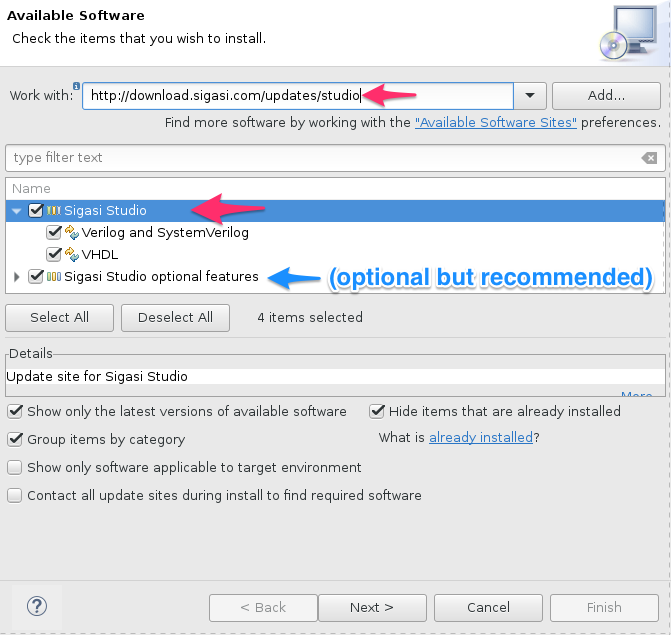
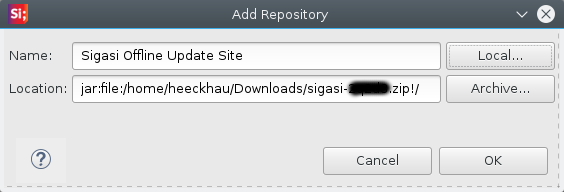

## Distribution and flavours

Sigasi is distributed online. It is available in two versions: as a
stand-alone application or as a plugin inside a standard Eclipse
installation. Your license gives you the right to use either version, at
any time, at your discretion. Therefore, your first task is to decide
which version suits your requirements, based on the description below.
Depending on the chosen version, you should then follow the
corresponding installation instructions.

### Sigasi App

The stand-alone application has the following characteristics:

-   Recommended if you are not using Eclipse yet
-   Installation is trivial: just unzip!
-   Everything is included in a single download
-   Well balanced set of features
-   Optimized for VHDL and Verilog development
-   Complete freedom to add and configure plugins

### Sigasi Eclipse plugin

The Eclipse plugin has the following characteristics:

-   Recommended if you are using Eclipse already
-   Easily plugged in into your existing Eclipse platform
-   Complete freedom to add and configure plugins
-   Over one thousand eclipse plugins choose from
-   Support for C, C++, Tcl and other languages
-   Support for many version control systems

## Installation of Sigasi App

To download and install Sigasi as a stand-alone application, follow the
online [Installation
Instructions](http://www.sigasi.com/download).

After downloading, choose or create a folder where you want to install
the software, and unpack the archive there. The archive contains a
single top-level folder called `sigasi`. Inside the folder there is an
application startup file, also called `sigasi`. Start the application by
executing this startup file.

## Installation of Sigasi Eclipse Plugin

### Prerequisites: Eclipse

{: style="float:right"}
* You need to have at least <a href="http://www.eclipse.org">Eclipse</a> version 4.2, nicknamed <em>Juno</em>.
* If you don't have Eclipse installed yet, the C/C++ flavor would be good place to start. Just** download** ([Windows 64 bit][latest-eclipse-cpp-windows64]/[Linux 64 bit][latest-eclipse-cpp-linux64]/[Other versions][latest-eclipse-cpp]), **unzip** and **start**.
* We recommend you also increase the heap size for Eclipse ([/faq#how-do-i-increase-the-heap-size-for-eclipse]).

_Note that we do **not** support Eclipse 3 any more._ ([System Requirements][/faq#what-are-the-system-requirements])

[latest-eclipse-cpp-windows64]: http://www.eclipse.org/downloads/download.php?file=/technology/epp/downloads/release/mars/1/eclipse-cpp-mars-1-win32-x86_64.zip
[latest-eclipse-cpp-linux64]: http://www.eclipse.org/downloads/download.php?file=/technology/epp/downloads/release/mars/1/eclipse-cpp-mars-1-linux-gtk-x86_64.tar.gz
[latest-eclipse-cpp]: http://www.eclipse.org/downloads/packages/eclipse-ide-cc-developers/mars1

### Install the Eclipse Plugin {: #eclipse-plugin}

After starting Eclipse:

1. Click **Help > Install New Software…**
2. In the **Work with:** field enter **http://download.sigasi.com/updates/studio** and press **enter**.
3. Check the checkbox next to **Sigasi Studio**
4. We recommend to install the optional features too.
   
5. Click the **Next** button.
6. The following steps are pretty self-explaining.

### Installing the offline update site (Sigasi Studio XL)

Installing the offline update site is very similar to installing from the [main update site][#eclipse-plugin], but _step 2_ is replaced with these steps:

1. Download the offline update site from the link you received from your sales representative.
2. In the **Install** Wizard, click **Add...**
3. Click **Archive...**, browse to the zip file you downloaded, and confirm with **OK**.
   

Next, continue with step 3. in the [general eclipse installation instructions][#eclipse-plugin].

## Licensing

The license key can be filled in under **Window > Preferences > Sigasi > License Key**.

More details can be found in [/manual/license-key]

## Configuration

Sigasi stores its projects on the file system in one or more
*workspaces*.

When you start the tool for the first time, it will propose to create a
workspace for you:

Although you can work with multiple workspaces, we recommend to use a
single workspace for all your projects.

## Software updates

Sigasi has an automated update system. When updates are available, you
are notified by a pop-up window called **Updates Available** in the
bottom right corner:

If you want to install the updates, click anywhere in the pop-up window.
After a few seconds, a new window will appear with further instructions.

The updates can be postponed by closing the pop-up. You can perform the
updates at any time by clicking the
-icon in the status bar
at the bottom of the screen.

It is good practice to first create a backup of your installation folder before running an update. This can be done by simply compressing the `eclipse` or the `sigasi` folder in an archive (zip file)

### Sigasi App
If you run Sigasi as a **standalone application**, the automated update system will periodically check for [/manual/setup#software-updates].

### Sigasi Eclipse plugin

If you run Sigasi as an **Eclipse plugin**, you may need to check for updates manually, by clicking **Help > Check for Updates**.

You can enable automatic updates by opening this preference page : **Install/Update > Automatic Updates**. Next enable **Automatically find new updates and notify me**. Feel free to modify any of the available options.

### Firewalls and Proxies

If the updates are not automatically fetched from the Sigasi update server you are probably behind a firewall or proxy server. You can configure Sigasi Studio’s proxy settings in **Window > Preferences > General > Network connections**. If you can not add a firewall exception for our update site, the fall back solution is to download the complete application from our website. You can completely replace your old installation; all settings are stored in your workspace (the default is
`workspaceSigasi` in your home directory).
