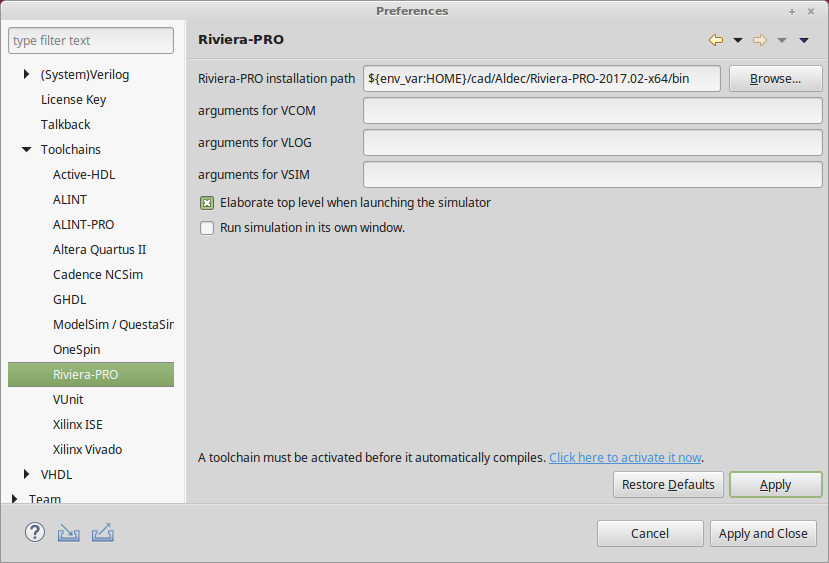

Sigasi Studio supports a number of ways to work with external tools such as
simulators. Different techniques offer varying degrees of flexibility
and automation.

Most people will want to set up their [/manual/tools#External Compilers]
so that Sigasi Studio can use them to compile and start simulations.

Another way to compile your project is to export your project to a CSV (comma separated values) list
of all the files in your project, in the correct compilation order.
Learn more about how to [/manual/tools#Export] your project's file list.

The third, and more advanced way of working with compilers or simulators
is to use the standard Eclipse mechanisms of *builders* and *external
tools*.

By [/manual/tools#Creating a builder],
you can arrange for an external tool to be run automatically when a
Sigasi Studio project is rebuilt. By default, this happens each time you save a
file. [/manual/tools#External Tools Configuration]
allow you to call any program or script from within the Sigasi Studio GUI. You
have to write and maintain the scripts yourself, but you have complete
flexibility as to what is in the scripts.

# External Compilers

If you have a simulator or lint tool installed, you can use this for two
purposes:

1. [/manual/tools#Save-time Compilation]: Compile and
    check your files each time you save. Any errors or warnings will
    show up in the file, on the line number of the problrem
2. [/manual/tools#Launch Simulator]: Start the
    simulator in its own window, ready to run a simulation.

Learn about [which external compilers are supported](#list-of-toolchains)
and how to [/manual/tools#Configure external compiler].

## Launch simulator

If an external compiler is enabled, you can also start a simulation from
Sigasi Studio. You can start a simulation by first selecting your *top level*
in the [/manual/views#hierarchy] view. Next click the
**Simulate** button  in the hierarchy
view to launch the simulator gui with an elaborated design ready for
simulation. Sigasi Studio opens a new console for each simulation launch. You
can terminate a simulation by clicking the **Stop** icon
.

When you launch a simulation, Sigasi Studio opens a new console in the [Console View][views#console-view]
You can switch between different consoles by clicking the -icon.


## Configure external compiler

You can configure the external compiler settings by clicking **Window \>
Preferences \> Sigasi \> Toolchains**. There is a sub-page for each
supported toolchain. Before you can enable a toolchain on the main page,
you must specify its installation path. Clicking **Restore Defaults** on
a Toolchain page will automatically fill in the installation path if
your toolchain is installed on a default location. After you press
**Apply**, you can select your toolchain on the **Sigasi \> Toolchains**
page.


For some toolchains you can specify extra command line arguments. Note
that these preference pages support [Eclipse
Variables](https://help.eclipse.org/oxygen/topic/org.eclipse.platform.doc.user/concepts/concepts-exttools.htm)
which allow you to more easily share settings in a team.



## List of toolchains

By “toolchains”, we mean any tool or set of tools that processes VHDL or
Verilog code, and that is supported by Sigasi Studio. At this time, external
compiler include simulators and lint tools, but in the future it could
also include synthesis tools.

For each toolchain Sigasi Studio can support any combination of the following:

* [/manual/tools#Save-time compilation]
* [/manual/tools#Launch Simulator]
* [/manual/linting#Quick Fix for third party libraries]
* [/manual/tools#Open a Quartus II Project in Sigasi Studio]

Currently the following external compilers are supported:

| Toolchain               | save-time compilation | start simulation         |
| ----------------------- | --------------------- | -------------------------|
| Aldec Riviera-PRO       | true                  | true                     |
| Aldec Active-HDL        | true                  | false                    |
| Aldec ALINT             | true                  | (run elaboration checks) |
| Aldec ALINT-PRO         | true                  | false                    |
| Altera Quartus II       | false                 | false                    |
| ModelSim / QuestaSim    | true                  | true                     |
| Xilinx ISE              | true                  | true                     |
| [Xilinx Vivado][vivado] | true                  | true                     |
| Cadence Incisive        | true                  | false                    |
| [OneSpin]               | true                  | (run elaboration checks) |
| GHDL                    | true                  | true                     |

## Save-time compilation

Sigasi Studio can use an external VHDL or Verilog compiler for additional code validation. At this time, Sigasi Studio supports:

* `vcom` / `vlog` / `vsim` style compilers. These compilers include Aldec Riviera-PRO and from Mentor Graphics ModelSim and QuestaSim.
* `isim` compiler from Xilinx.
* `ncsim` compiler from Cadence Incisive.

Catching bugs earlier is cheaper than catching them late. Traditionally,
the first errors are found when the hardware designer decides to run a
simulation. At this time, the simulator’s compiler tool will detect
errors and fail. At Sigasi we think that this is too late. Problems
should be detected as soon as possible.

Sigasi Studio adds two extra layers of error detection to catch problems
earlier. First, there is the **type-time** error detector. As soon as
the designer writes an error, it is marked in the text much like a spell
checker in a word processor. Second, as soon as you **save** a file,
Sigasi Studio calls the external compiler for further analysis. All errors that
the external compiler finds are marked inside your file, so that you can
find and fix them easily. Sigasi Studio intelligently controls the external
compiler incrementally and only recompiles design files that need
recompilation.

All output from external compilers is logged in Sigasi Studio’s console view
for your convenience. Paths to your design files are automatically
converted to hyperlinks to ease naviation.


The table below lists some examples of VHDL errors that are detected in
Sigasi Studio at type time, at save time and with the external compiler
integration.

| Check              | Type time | Save time | Save time compile |
|--------------------|-----------|-----------|-------------------|
| Syntax errors      | yes       | yes       | yes               |
| Undeclared signals | yes       | yes       | yes               |
| Multiple files     | no        | yes       | yes               |
| Data type mismatch | no        | no        | yes               |
| Multiple drivers   | no        | no        | yes               |

## Libraries

Libraries are fully supported. But note that Sigasi Studio does not send Common
Libraries to the external compiler for compilation. These libraries are
expected to be pre-compiled. Contact [support@sigasi.com](mailto:support@sigasi.com) if you want to
add more libraries to this list.

If your project root contains a `modelsim.ini` file , Sigasi Studio will add this
file to the `vcom` command with `-modelsimini`. This allows you to
configure custom settings for Mentor’s `vcom`.

# External Tools Configuration

Select **Run \> External tools \> External Tools Configurations** to get
started, or use the  icon.

To create a new configuration, first select
 **Program**, then click
 .

Enter all necessary information to start your external tool:

* **Name**: The name for this configuration.
* **Location**: The location of the executable. You can browse for programs and scripts in your workspace or programs on your file system.
* **Working Directory**: The working directory for your program.
* **Arguments**: The arguments, if any, to your program.

You can test your tool configuration with the **Run** button.

The following example screenshot shows how to set up configuration to
run a `simulate.sh` script from within Sigasi Studio.


The following example screenshot shows how to set up a configuration to
run `make clean` on a Linux machine.


To run the external tool just select the configuration from the dropdown
menu on the -icon. You can rerun the
last configuration by simply clicking
.

## Creating a Builder

An external tool configuration as described in the previous section
makes it easy to run an external tool, but you still have to do so
explicitly. For some programs, such as the `make` utility, it makes
sense instead to do this automatically upon a change in your project.
This functionality can be accomplished by a builder. We will show how to
create a builder for a Modelsim Makefile as an example.

To create a builder, right-click your project and select **Properties \>
Builders**.

Click **New…** and the builder configuration window will pop up:


You will be asked to select a configuration type:
select  **Program**.

Next, configure the builder in a configuration window pop up window:

* **Name**: The name of your builder, e.g. `ModelSim`.
* **Location**: The location of the program, e.g. `/usr/bin/make`.
* **Working Directory**: The working directory for your program. For example, click **Browse Workspace…** and select the root folder of your project.
* **Arguments**: The arguments to your program, e.g.  `--makefile=Makefile.vsim all`.


With the default settings the ModelSim Makefile will only be run during
a manual build or after a “Clean”. To make sure Sigasi Studio runs `make`
every time you save a change to a file, click the **Build Options** tab
and check the **During auto builds** checkbox.


After configuration, the new builder will appear in the builder list.


When you close the builder configuration dialog windows, the new builder
will automatically be run. In our example of a Modelsim Makefile,
Modelsim’s messages will appear in the console view.


For the specific case of Modelsim, warnings and error messages in the
console are made clickable. When you click a message, the corresponding
location will automatically be opened in the Editor view.

You can add as many extra builders as you want. This can be useful for
additional linting tools or code generators.

# Altera Quartus II integration

If you are using Altera Quartus II 12.1 , you can use Sigasi Studio as
preferred HDL editor.

If you use the Sigasi Studio/ Altera Quartus II integration, you can
easily open VHDL files by double clicking on them in Quartus II. Sigasi
Studio will be aware of the entire Quartus II project, so that you can
perform project-wide searches and navigation actions in Sigasi Studio.
Furthermore, if you add or remove files in the Quartus II project, these
changes are automatically applied in Sigasi Studio.

*Note:* If you want to set up a project independent of Altera Quartus
II, please read the documentation on [/manual/projectsetup].

## Setting the preferred editor

To open a Quartus Project in Sigasi Studio, you first have to configure Sigasi
Studio as preferred editor in [/manual/opening#Altera Quartus II].

## Open a Quartus II Project in Sigasi Studio

After you have configured Sigasi Studio to be the preferred editor in
Quartus II, you can open files by double clicking on them in Quartus II.

Sigasi Studio will import entire Quartus II project and your file will open
in the Sigasi Studio editor view. If you make changes to your Quartus II
project (like adding or removing files), these changes are reflected in
Sigasi Studio as well.

The first time you import your project, it may take a few minutes. After
that, you can leave Sigasi Studio open and double-click other files in
Quartus II to open them in the Sigasi Studio editor view.

If your Quartus II Project File (**.QPF file**) contains a reference to a
file that does not exist, Sigasi Studio will show an icon for that file with
the *broken link* icon  .

## Quartus II Preferences

The first time you import a Quartus II project, Sigasi Studio will ask for the
Quartus II installation location. Sigasi Studio needs this path to find the
Quartus II libraries. You can change the Quartus II installation
location by selecting **Window \> Preferences \> Sigasi \> Toolchains**.

## Add files to your Quartus II project in Sigasi Studio

To add a file to your Quartus II project, you can use the default **New
VHDL file** wizard of Sigasi Studio (**File \> New \> VHDL File**).


Note that Quartus II does not automatically update its UI after you add
files to your project. In order to update the files list, you should run
a work flow action in Quartus II, like starting a compilation.

# Xilinx integration

## Setting the preferred editor

To open the Sigasi Studio editor from Xilinx, you first have to configure Sigasi Studio as preferred editor in [/manual/opening#Xilinx Vivado] or [/manual/opening#Xilinx ISE].

## Importing Xilinx Projects in Sigasi Studio

## Vivado

The process of importing a Xilinx Vivado project is explained in [/tech/generating-sigasi-project-vivado-project]

## ISE

The process of importing a Xilinx ISE project is explained in [/tech/importing-xilinx-ise-project-sigasi]

## Xilinx Preferences

## Vivado

You can change the Xilinx Vivado installation location by selecting **Window > Preferences > Sigasi > Toolchains > Xilinx Vivado**.
Sigasi Studio needs this path to find the Xilinx Vivado libraries.

## ISE

You can change the Xilinx ISE installation location by selecting **Window > Preferences > Sigasi > Toolchains > Xilinx ISE**.
Sigasi Studio needs this path to find the Xilinx Vivado libraries and to run the ISim compiler and simulator.

# Export

You can export a list of all VHDL files in your project, sorted in the correct compilation order.
You can use your own simple scripts to manipulate such list and run any EDA tool, including simulators, synthesis and linter tools.

To export a comma separated value (CSV) list of files in your project, right-click your project and select **Export**. In the **Sigasi** category, select **CSV File**. As a result, you get a file named `compilation_order.csv`, which lists the VHDL files in your project in a valid compile order.

Example (for the tutorial project):

```text
work, dut.vhd
work, clock_generator.vhd
work, testbench.vhd
```

This file will use relative paths, except when the file is on a different drive (on Windows).

## Auto-export

You can also configure Sigasi Studio to **auto-export** this CSV file, every time the dependencies change.

Right click on the project you want to auto-export in the Project Explorer, and select **Properties** and **VHDL auto export**.


If you do not set a fixed top level name (i.e. empty *top level name* in the property page), Sigasi Studio will use the current top level in the [Hierarchy View][views#hierarchy] as input. Note that this only works if the top level belongs to the selected project.

This information is stored in `.settings/com.sigasi.hdt.vhdl.ui.prefs` in your project.
