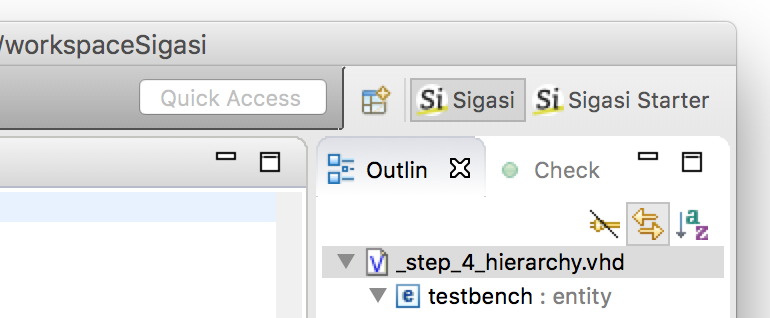

# The Sigasi Studio perspectives

Sigasi Studio is built upon the Eclipse platform, which permits to use multiple languages within a single environment. The user interface can be customized for a particular language. In Eclipse terminology, this customized user interface is called a **perspective**. The *icon* and *name* of the current perspective is highlighted in the upper right corner.

Sigasi Studio provides a **Sigasi** perspectives to work with both **VHDL** and **Verilog** files.

If you use the standalone version of Sigasi Studio, this perspective is the default. If you use the Eclipse plugin, another perspective may be open instead. You can select the Sigasi perspectives by clicking the button  next the perspective icon. A window pops up in which you can select the perspective.

# Quick Access

The Sigasi Studio toolbar contains a widget called **Quick Access**. This widget allows you to quickly find open editors, available perspectives, views, preferences, wizards, commands, etc. Simply start typing the name of the item you wish to invoke.
