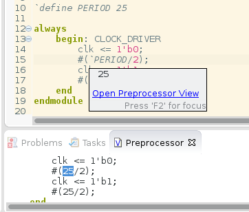
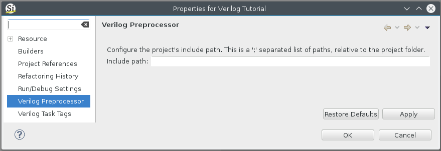

In addition to the powerful features of an Eclipse editor, the Verilog
editor that comes with Sigasi supports a number of advanced editing
features which are specifically useful for Verilog editing. These are
described in this chapter.

# Type-time Syntax error reporting

Sigasi Studio marks Verilog syntax errors while you type.

These markers can be [disabled](#disable-errors).

# Verilog version

You can configure the Verilog version (Verilog or SystemVerilog) via **Window > Preferences**, **Sigasi > Verilog** and **Verilog version**.

## Disable Error Markers

_Note that Sigasi Studio does not cover the entire SystemVerilog grammar yet. So if you are using _'unsupported'_ syntax, you will see lots of incorrect [syntax error markers](#type-time-syntax-error-reporting). You can disable these error markers by pressing **Ctrl-3** and typing `Toggle Verilog error markers`._

# Smart Indentation {#smartindent}

When you press enter, Sigasi automatically adjusts the indentation of
current and the new line. Depending on the content of the preceding
line, Sigasi will automatically increase or decrease the indentation
level. E.g. an extra indent after a `module` and remove an indent for
the matching `endmodule`.

You can enable/disable this feature via **Window \> Preferences \>
Sigasi \> Verilog** by toggling the **“Enter adjusts indentation on
current and next line”** setting.

**Tabs vs. spaces:** This features inserts tabs characters or spaces,
according to your preferences. 

See also:

* [tabs-and-spaces].
* Screencast : [/screencasts/verilog-smart-indent]

# Verilog Preprocessing/Macros

When you hover over a Verilog preprocessor directive (e.g. `include ...`), Sigasi presents you the preprocessed text. This hover also shows you, at the bottom, a convenient link to open the [views#Preprocessor View].

In the [views#Preprocessor View], you can preview the expanded version of your preprocessed Verilog source files.

You can configure the include paths of your Verilog projects in the Verilog Preprocessor Property page. You can open this page by right clicking your Verilog project and selecting **Properties > Verilog Preprocessor**.

You can specify multiple include paths by separating them with a `;`. All paths are relative to the project folder.
