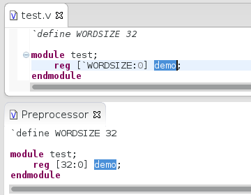

When you open a project in Sigasi HDT, a number of views are presented
in the user interface. Here is a typical screenshot, with the views
highlighted.

The views provide alternative ways to access the information in a
project. They permit efficient navigation, inspection and editing.
 
This chapter lists and explains the most important views in Sigasi. Some views are not covered here, more specifically some views that are either inherited from Eclipse, or views that are provided by third-party plugins. Please refer to the Eclipse documentation or to the specific plugin documentation for further information on those views.

# Project Explorer View {#explorer}

This view shows the directory structure of all files in all projects.
You can use it to navigate to a particular file in your project and
select it. When you double click on a file, the file opens in the Editor
view. If you right-click a file, you see the *context menu* which offers
extra commands.

You can customize the behavior of the **Project Explorer** view in ways
that can be particularly handy for large projects. For example, if you
click the **Link with Editor** icon
 , the Project Explorer
will be linked to the Editor view. Now, the active file in the editor
view will always be selected in the Project Explorer.

You can apply filters to choose which files are shown. Select the icon
**View Menu**  and then
**Customize view**. You can then select a filter whose matching files
will be hidden in the view. For example, you can filter out all non-VHDL
or non-Verilog files.

# Editor View

The Editor view shows the content of files, and allows you to edit
files. It is a tabbed view so that multiple files can be open for
editing simultaneously. The currently selected file is the active file.

# Outline view {#outline}

The Outline view displays the contents of the active file, in terms of
the HDL objects that it contains.

You can sort the elements in the outline alphabetically, by enabling the
**sort** button .

You can also filter all concurrent signal assignments from the outline
by enabling the **Hide Signal Assignments** button
.
Double-click in the Outline view to navigate to the corresponding
location in the editor.

If you enable the **Link with Editor** icon
 and you click an
element in the outline view, the corresponding code will be selected in
the editor.

# Hierarchy view {#hierarchy}
[vhdl]

The Hierarchy view shows the VHDL design hierarchy starting at a
selected top level object. To choose a top level, open a file and
right-click on an architecture (or entity or configuration). Then click
**Set as Top Level**. Alternatively you can click the **Set Top** button
in the hierarchy view to open a hierarchy top level selection dialog.
You can use the filter field to quickly search for a certain top level.

The hierarchy view automatically refreshes itself when you save your
design files. If you have a really large design this could slow you
down. You can turn the automatic refresh on and off by toggling the
**refresh** button .

The hierarchy view also shows the **generic and constants values** of components in the hierarchy.
The internal compiler computes the generics and constants, even if they are passed down through the hierarchy, and even if arithmetic operations are used to define new values. If the value cannot be computed for some reason, the
Hierarchy View will report the value to be _unknown_.

When you **double-click** an object in the hierarchy, the Editor view is updated accordingly, possibly by displaying the contents of a different file.

Use the **instantiations** filter , to hide everything except instantiations and structural statements are shown.

You can **launch a simulation** with the  button, if you first set up an [tools#Launch simulator].

The Hierarchy View also offers an action **Select required files**, which selects all design files that are part of the current hierarchy, in the project explorer. This allows you to easily perform the same action on all files in the hierarchy. E.g. team commands, ... [premium]

# Problems view {#problems}

The Problems view shows problems (errors and warnings) related to your
code. These problems were reported either by the internal compiler or by
an external compiler tool. 
You can navigate to the source of the problem by double clicking on a
given problem. Problems can be sorted by clicking the column headers.
The content of this view can be customized via the **View Menu**
 . Possible customizations are
*scope* (workspace, project, selection), *type*, maximum number of
problems, …

# Libraries view {#libraries}

[vhdl]

The libraries view shows the library mapping of the design units in all
projects. You can use it to navigate to a particular design unit in your
project. When you double click on a file, the file opens in the Editor
view. If you right-click a file, you see the *context menu* which offers
extra commands for [libraries#libraries-mapping].

If you enable the **Link with Editor** button
, the Library view will
be linked to the Editor view. Now, active file in the editor view will
always be selected in the Library view.

# Tasks View {#tasks}

It is common practice to add **TODO** and **FIXME** comments in your
code. Sigasi automatically scans your comments for TODO and FIXME tags
and clearly highlights these comments with **Task Tags**. You can get a
nice overview of all task markers in your workspace in the **Task View**
(**Windows \> Show View \> Tasks**).

You can configure extra tags in the Task Tag preference page:
**Preferences \> Sigasi \> VHDL \> Task Tags**

# Block Diagram View {#block}

[premium]

The **Block Diagram View** displays a graphical (block diagram) view
of all architectures and its instantiations in your current VHDL editor.

This viewer **automatically updates** when you **save** your code and
gives a convenient way to visually inspect and navigate your code, even
when your code is still unfinished or broken.

You can open the block diagram view by right clicking in the editor and
selecting **Show In \> Block Diagram**. Alternatively you can open the
view via **Window \> View \> Other… \> VHDL \> Block Diagram**.

You can also **double click blocks**, **ports** or **wires** to navigate
to the corresponding VHDL code. If you want to *go into* a block, you
have to **select** it, right click and click **open entity
declaration**.

You can export the block diagram view to an image with the save
 button. Both **SVG** and **PNG** are supported. Choose a the \*.svg filename for SVG export or a \*.png filename for PNG export.

You can also export **all** *block diagrams of an entire project* at once: Click **Project > Export... > Sigasi > Block Diagrams export** and select your project. All SVGs will be created in **diagrams/blockdiagrams/** in your project. 

<b>Note:</b> If you are using the Sigasi Eclipse plugin, you need to
<a href="http://www.sigasi.com/install-eclipse-vhdl-plugin">explicitly
select the Block Diagram View during installation</a>.

# State Machine View {#fsm}

[doc]

The **State Machine View** displays a graphical (bubble diagram) view of all state machines in your current VHDL editor. This viewer automatically updates while you are editing your code and gives a convenient way to visually inspect and navigate your code, even when your code is still unfinished or broken.

You can open the state machine view by right clicking in the editor and selecting **Show In > State Machines**. Alternatively you can open the view via **Window > View > Other... > VHDL > State Machines**.

If you have more that one state machine in your file, you switch between machines by clicking the tabs. Each tab is named after the signal/variable that represents the state machine's state.

If you have documented your state transitions (i.e. the assignments), the comments will be added as text to the transitions in the view. 

You can also **double-click nodes** or **transitions** to navigate to the corresponding VHDL code.

With the  button, you can toggle the display of edge labels. These labels show the code comments of the transition statements.
You also have to option to **Zoom In**, **Zoom Out** or **Zoom to Fit**.

You can export the state machine view to an image with the save  button. Both **SVG** and **PNG** are supported. Choose a the \*.svg filename for SVG export or a \*.png filename for PNG export.

You can also export **all** *state machines of an entire project* at once: Click **Project > Export... > Sigasi > State Machine Diagrams export** and select your project. All SVGs will be created in **diagrams/statemachines/** in your project. 

You can watch a screencast at [http://www.sigasi.com/screencast/vhdl-state-machine-diagram](http://www.sigasi.com/screencast/vhdl-state-machine-diagram)

# Dependencies View {#dependencies}

[premium]

[todo]

# Documentation View {#documentation}

The **Documentation view** gives you a live preview of the automatic
documentation Sigasi can generate for your project.

## Export Documentation

[doc]

You can export documentation for the entire project to **pdf** by
clicking the save icon or via the **Export…** menu.
Since Sigasi 2.27 this export also saves the DocBook source code, if you
have a Premium Doc license. This enables you to customize the pdf
generation flow to your liking.

All errors are logged to the console view.

Users without a Premium Doc License can also export a (watermarked) pdf.

<!-- # Preprocessor View {#preprocessor} [todo] -->

# Net Search View {#netsearch}

[premium]

With **Net search**, you can you to find *loads* and *drivers* of a net.
A *net* is defined as a signal or port and all other signals and ports
that are directly connected to it. The *loads* are where you read the
value of the net and the drivers are where you write to this net.

To find the entire net of a signal or port, place your cursor on the
identifier and right-click. Now select **Find Net**. Alternatively, you
can press **CTRL+SHIFT+H**. 

The **Net Search** view will appear. For big designs, it might take a
while before the results appear.

From the **Net Search** view, you can navigate to the VHDL code by
double-clicking the search results.

# Preprocessor view

[verilog]

In the preprocessor view you can preview the expanded text of Verilog macros. This view automatically synchronizes with the active editor.