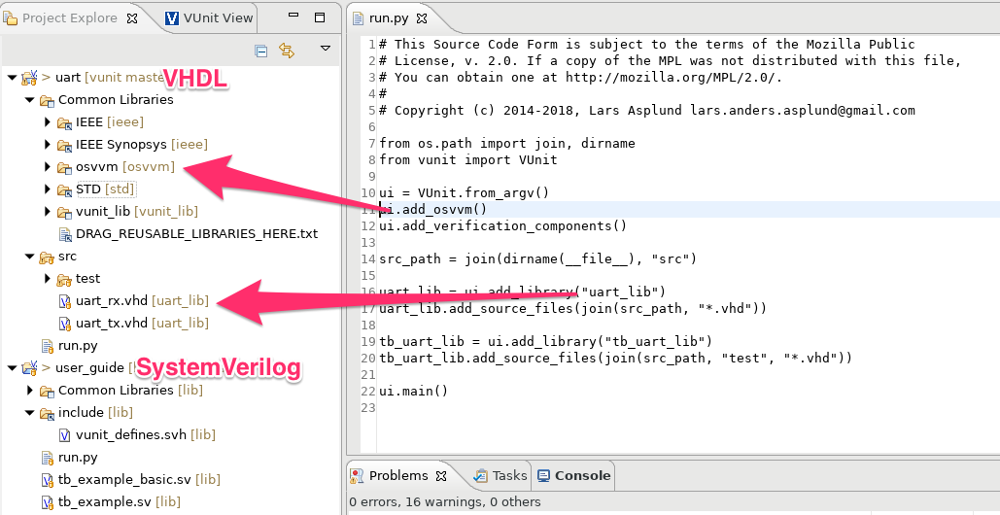
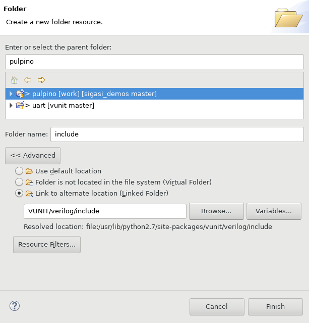
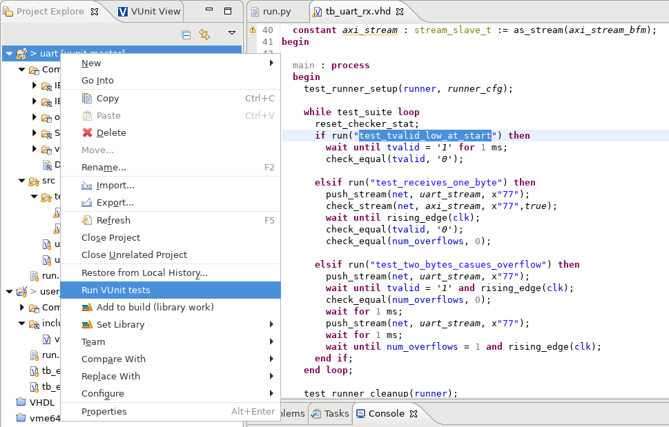
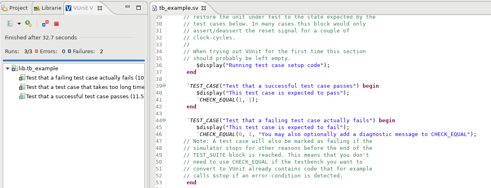
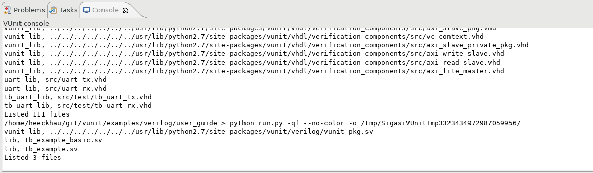

[VUnit](https://vunit.github.io/) is an open source **unit testing framework** for VHDL and SystemVerilog. VUnit helps you to *write* tests more easily and *run* them frequently.

Sigasi Studio can help you manage VUnit projects and enables you to *run* and *inspect test results* straight from the IDE.

When you import a VUnit project or add VUnit support to an existing project, Sigasi Studio runs VUnit in the background and automatically adds the correct libraries to your project. It also shows error markers in the VUnit script (`run.py`) if anything goes wrong.

# VUnit project setup in Sigasi Studio

## Import VUnit Project

To import an existing VUnit project, click **File > Import... > Sigasi > Import a VUnit project**. Next, select the VUnit script (`run.py`) and the location for the Sigasi Project.

## Add VUnit support to an existing Sigasi project

You can also add VUnit support to an existing project: Right click your project and select  **Configure > Add VUnit support**. Next, select and exiting `run.py` script or make Sigasi create an example script.

## SystemVerilog

For SystemVerilog project you need to manually add the VUnit include files to your projects:
* Right click your project, select **New > Folder > Advanced > Link to alternate location** and add `VUNIT/verilog/include` as location.
* Use the quick-fix on the failing `` `include "vunit_defines.svh"`` to add the include folder to the include paths.

# Run VUnit Tests

There are multiple ways to run VUnit tests in Sigasi Studio:

* Right click your project and select **Run VUnit tests** to run *all tests in your project*.
* Right click one or more HDL files and select **Run VUnit tests** to run *all tests in the selected files*.
* Right click in the Sigasi editor and select **Run VUnit tests** to run *all tests in the active editor*.
* Right click in the VUnit test name (the string in the `run` function call) and select **Run VUnit test** to *run this single test only*.
* Rerun the tests in the VUnit view

# Inspect VUnit Test Results

When you run VUnit tests in Sigasi Studio, the VUnit view is opened. This view presents a convenient way to inspect the test results

You can also open the *Console View* to inspect the entire VUnit output.
