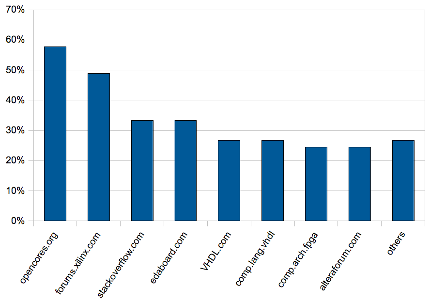

Two weeks ago, we started a survey among our student users, about social media networks. Today, I'm presenting some of the results from this poll.

But first, we randomly picked a winner from the participants. Shafqat from the <a href="http://www.kth.se">Royal Institute of Technology, Sweden</a> will receive a BeMicro SDK development board, with an Altera Cyclone IV FPGA. Congrats, Shafqat and have fun!

So, on to the survey results. As usual, we don't claim any relevance whatsoever. To quote <a href="http://slashdot.org/pollBooth.pl">Slashdot</a>: 

> This whole thing is wildly inaccurate. \[...\] If you're using these numbers to do anything important, you're insane.</em>" 

Don't you think that Mainstream Journalists should have disclaimers like this when they publish survey results or social science studies?

That said, the winner is... [Facebook](http://on.fb.me/sigasi). What else is new? 80% of the participating students are on Facebook. About half uses <a href="http://www.LinkedIn.com">LinkedIn</a>, and less than 30% is on <a href="http://www.twitter.com/sigasi">Twitter</a>. In the <a href="http://en.wikipedia.org/wiki/Long_Tail">long tail</a>, there is one site that I was not aware of: <a href="http://www.studivz.net/">StudiVZ</a>, which claims to be Germany's biggest social network. Since we have many users and customers in Germany, it shouldn't be a surprise that StudiVZ shows up in our polls. 

Social bookmarking is a lot less popular than social networking. Even the most popular social bookmarking site, <a href="http://www.StumbleUpon.com">StumbleUpon</a>, got less than a quarter of the votes. Ten percent go to <a href="http://www.delicious.com">Delicious</a> and <a href="http://www.digg.com">Digg</a> each.

As for the FPGA and VHDL related websites: Opencores gets frequent visits from almost 60% of the students. The Xilinx forum (49%) is almost double as popular as the Altera forum (25%). The other results are in the graph below.

Was that what you had expected, or did these results surprise you? Tell me in the comments below. Or Tweet, or post on our <a href="http://on.fb.me/sigasi">Facebook page</a>.
