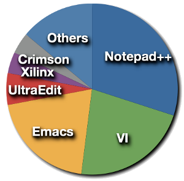

In a small poll on the Sigasi website, 220 people responded to the question: <strong>Which editor do/did you use before you heard about Sigasi?</strong> We know that there is no reason to think that this test was representative of the entire VHDL development community, but the results are nevertheless interesting.  

{: style="float:right"}
Unlike we had expected, the two ever present Unix editors, VI / VIm and Emacs / XEmacs (and their respective families) did not contest for the first place. In fact, the winner outran both VI and Emacs by far: <a href="https://sourceforge.net/projects/notepad-plus/">Notepad++</a> got 30% of the votes. VI and Emacs almost tied for the second and third place: 22% and 20% respectively. All three of the top most popular VHDL editors are <a href="http://en.wikipedia.org/wiki/Free_and_open_source_software">Free/Open Source software</a>.

Next in line were <a href="http://www.ultraedit.com/">UltraEdit</a>, with a mere 6%, the <a href="http://www.xilinx.com/tools/logic.htm">Xilinx ISE</a> editor (4%) and <a href="http://www.crimsoneditor.com/">Crimson</a> (4%). In the two-percent-or-less list we find the editors that come with the commercial EDA tools <a href="http://www.altera.com/products/software/quartus-ii/subscription-edition/qts-se-index.html">Quartus</a>, <a href="http://www.aldec.com/activehdl/">ActiveHDL</a> and <a href="http://www.mentor.com/products/fpga/hdl_design/hdl_designer_series/">HDL Designer</a>. Some free editors at the bottom of the list include <a href="http://www.jedit.org/">Jedit</a>, <a href="http://www.nedit.org/">Nedit</a> and <a href="http://www.kde.org/applications/utilities/kwrite/">Kwrite</a>. Some of the correspondents filled in <a href="http://www.nano-editor.org/">nano</a>, which we hope was a joke.

In conclusion, before they knew Sigasi, three quarters of our respondents uses free software for their VHDL editor. The 4-decade old editors VI and Emacs might have the most vocal following among VHDL designers, but Notepad++ is by far the most popular VHDL editor around. 

If anybody knows of other surveys, that might be more accurate, we'd love to hear about them!