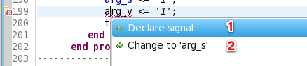
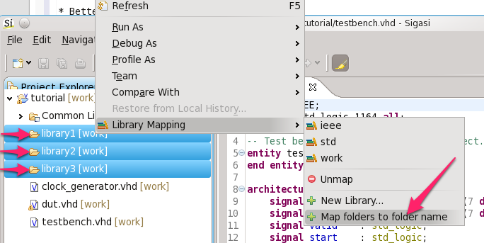

Sigasi 2.11 brings an extra **intelligent autocomplete** for **case
statements**, a set of **usability improvements** and **bug fixes**.

Context based autocomplete for case statements (State Machines)
---------------------------------------------------------------

The cleanest way to write simple state machines is to use a state
variable (or signal) with an enumeration type. This allows you to use
descriptive names for your states, which results in self documenting
code. To encourage, and make this style easier, we added a context based
autocomplete for case statements. If you type `case` and there is a
variable or signal with an enumeration type in scope, a template is
offered with when clauses for each enumeration literal.

[See this in action (screencast)](http://www.sigasi.com/screencast/writing-finite-state-machines)

Usability improvements
----------------------

-   Better ordering of quick fixes for undeclared signals and variables:
    A number of users reported that “Declare signal” would be a better
    default for undeclared signals than changing the name to a similarly
    named signal. So we changed it.

-   Extra library mapping action: **Map folders to folder name**. If you
    have a well organized project, every library has its own folder. To
    help you configure your project in Sigasi as fast as possible we
    added an extra library mapping action when you select
    multiple folders. This new action maps each selected folder to a
    library with the same name as the folder.

-   The top level dialog now show the architecture name

-   If you mistakenly use a signal assignment operator for a variable
    (or vice versa), you can now use the **Fix assignment operator quick
    fix** to swiftly correct your mistake.

Bugfixes
--------

-   ticket 2287 : `vlib` executable in exported Makefile is now configurable
-   ticket 2361 : autocomplete for entity instantiations from another library

Download/Update
---------------

If you have Sigasi 2 installed, you can [update_sigasi]. You can also [download_latest].
