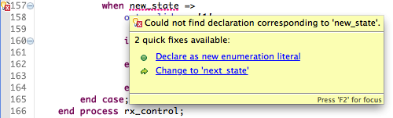
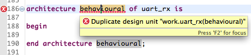
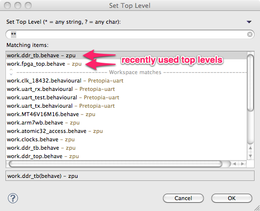

In the Sigasi 2.15 release we introduce: **working with state
machines**, **faster compilation** and **save-time compilation for
Verilog**. We also developed new *linting checks* and other
enhancements.

Writing state machines
----------------------

We added two extra Quick Fixes to make it easier to create finite state
machines in VHDL. You can now simply use a new state name (an
enumeration literal) in the “when” clause of your state machine without
first adding it to the state enumeration datatype. A Quick Fix will
automatically add the new literal to the VHDL enum type.

This also works the other way around. If you add a new enum literal to
an state type declaration, your case statements will be broken. There
will be a Quick Fix to add the missing “when” clause.

Verilog: Save-time compilation
------------------------------

In Sigasi 2.15, you can now add **Verilog support** to a project. This
enables save-time compilation of your Verilog files with *Riviera Pro,
ModelSim, QuestaSim and Isim*. Just like Sigasi Pro for VHDL, the
Verilog support is freely available for small projects.

Faster external compilation
---------------------------

Some people were not using the external compiler integration because it
was too slow. This is really a shame, because getting feedback from your
compiler fast really helps you write better code.

So: we have improved the speed of the external VHDL compiler integration
a lot! Instead of calling the external compiler for one file at a time,
Sigasi Pro now calls the external compiler for a bunch of files at the
same time. This way, your build process will be a lot faster.
If the bulk compilation fails, the whole compilation process restarts
but this time compiling one file at a time. This way, we can make sure
that every file gets checked and you get the best possible set of error
markers.

Starter edition: simpler rules
------------------------------

We simplified the way we decide if your project is small. Instead of counting the number of
statements, we just measure the file size of HDL (VHDL and Verilog)
files in your projects. If the total size is less than 32 kB, the
Starter Edition will have all features of
Sigasi Pro enabled. This is usually slightly more than the old criterium
of 200 statements.

For people who have a license for Sigasi Pro, an evaluation license, or
an Educational license, nothing changes.

Check for duplicate design unit names
-------------------------------------

In VHDL, you cannot have two design units (packages, entities,
architectures or configurations) with the same name. Most tools will not
flag this, and it is not always clear which version they actually use.
You might end up debugging the wrong file. To help you avoid this trap,
Sigasi Pro now gives an error messages if you have two design units with
the same name. Unlike other Sigasi VHDL linting rules which are
triggered while you type (type-time lint checks), this rule is invoked
when you save your file (save-time lint check).

Other new and noteworthy improvements
-------------------------------------

-   Flag a function that doesn’t have a return statement
    
-   Better hover for alias of vector slices (ticket 2493)
    
-   Better hover for functions and procedures
    
-   Keep a history of toplevels in the set top level dialog
    
-   Autocomplete for attributes
    
-   Template field `${filename}` is now replaced by the actual file name when expanding a template
-   Show protected types in outline view
-   Files in exported CSV are now sorted by library if possible
-   Show *anywhere context* template autocomplete suggestions last
-   Added support for [context clauses](http://www.sigasi.com/forum/bug-sigasi-does-not-understand-context-keyword) (VHDL 2008)
-   Updated to Xtext 2.4.2

Bugfixes
--------

-   ticket 2526 : Unmapping files should remove problem markers from external compiler too
-   ticket 2544 : Automatic ‘.’ autocomplete shouldn’t be triggered in comments
-   ticket 2545 : Entity instantiation autocomplete: Use work instead of library name for entities in same library
-   ticket 2555 : Record field not resolved in subtype declaration
-   ticket 2556 : External compiler does not handle transitive project dependencies correctly
-   ticket 2558 : Method of protected type is not resolved correctly if it is defined in a referenced project
-   ticket 2520 : Better formatting of ElseWaveform (allow newlines)
-   ticket 2567 : 2008-style bit-string literals can have more than 99 bits
-   ticket 2569 : Better highlighting for numbers with underscores
-   ticket 2571 : Wrong marker location for “Port/Generic map list cannot not be terminated with a ,”
-   ticket 2381 : Problems running Sigasi in combination with other Xtext plugins (e.g. Xtend)

Download/Update
---------------

If you have Sigasi 2 installed, you can [update_sigasi]. You can also [download_latest].
