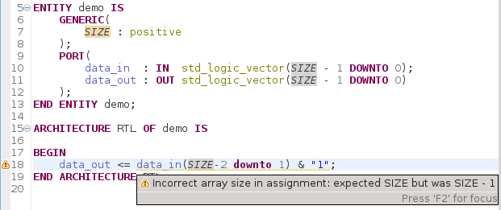

The Sigasi 2.28 release brings *external compiler* support for *mixed language* projects, a new linting *check* for *array sizes*, multiple *Verilog* improvements, and more.

## External compiler support for mixed language projects 
\[Sigasi Premium Desktop and Sigasi Premium Doc\]

The [/manual/tools#external-compilers] integration now supports [/manual/mixed]. Sigasi automatically computes the cross language dependencies and sends your design files incrementally, in the correct order, to your external compiler. 

The *dependencies view*: and the CSV [/manual/tools#export] feature now also take cross language dependencies into account. 

## Check size in array assignments 
\[VHDL; Sigasi Premium Desktop and Premium Doc\]

_There are *2* hard problems in computer science: *caching*, *naming*, and *off-by-1 errors*_ — [Twitter wisdom](https://twitter.com/codinghorror/status/506010907021828096)

Because it is so easy to get the size wrong in array assignments —especially when you are working with *generics*—, we developed a new VHDL design check to catch these mistakes as early as possible.  

Sigasi will only complain when it is sure the assignment is wrong. When the expressions are too complicated to evaluate at type time, it will gracefully give up.

## Verilog improvements

* Basic autocomplete support (templates, keywords, identifiers,...)
* Task tag preference page to configure custom tags
* Respect configured project dependencies
* Show verilog dependencies in the dependencies view

## Other new and noteworthy improvements

* We added an option to run an external simulator without UI, in the Sigasi console
* We improved the performance of the Sigasi builder

## Bugfixes

* ticket 3279 : Serious *performance issue* in *console view external compiler*
* ticket 3241 : Sigasi crash for *loops in use clauses* 
* ticket 3043 : *Autocomplete* template get confused by *uppercase keywords*
* ticket 3190 : Highlighting of *operators* (and, or, ...): highlight as *keyword*, not as function
* ticket 3269 : *Quick fix all* does not work if the project has external compiler problem markers
* ticket 3287 : better labels for physical and numeric types

## Download/Update

If you have Sigasi 2 installed, you can [update_sigasi]. You can also [download_latest].
