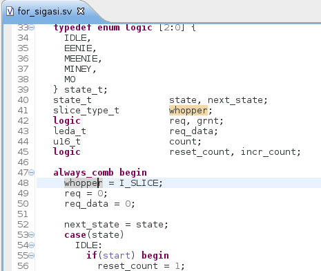
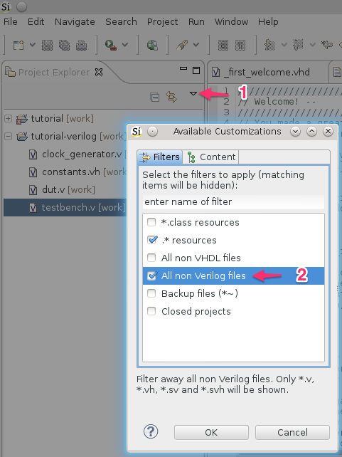

The Sigasi 2.29 release brings better *Verilog* parsing, *SystemVerilog* for Synthesis, Cadence Incisive (NCSim) as external compiler, and more. 

## Better Verilog support

We significantly improved our internal Verilog parser. Our parser is now able to give *type-time syntax errors* for Verilog (2005) code. This gives you instant feedback about Verilog syntax errors. So no more waiting for the compiler to find syntax issues.
Note that this feature is disabled by default. You can enable/disable it with the **Ctrl-3** keyboard shortcut, and next typing **Toggle Verilog problem markers**.

## SystemVerilog for synthesis

We added support for the synthesisable subset of SystemVerilog. This means that Sigasi can now cope with:
* Packages
* Typedefs
* Structs
* Unions
* Arrays of arrays
* Enums
* For loops
* ...

The *New Verilog file* wizard now allows you to create SystemVerilog files too (.sv, .svh).

## Cadence Incisive (NCSim) 
\[Sigasi Premium Desktop and Sigasi Premium Doc\]

You can now configure Cadence Incisive (NCSim) as [/manual/tools#save-time-compilation] for your HDL code. Once configured, Sigasi will automatically run `ncvhdl` and `ncvlog` to compile your code. All issues will get a problem marker in the editor and will appear in the problems view. 

 Toolchain Integration")

## Other new and noteworthy improvements

* We no longer include AHDL support
* Updated the Xtext dependency to [xtext_2_8_2]
* The Sigasi Premium Desktop formatter now converts keywords to lower case when the *Upper case keywords* formatting option is disabled. (Note that the Sigasi Pro formatter will not change the keyword casing).
* Expose _BlockConfiguration_ context in VHDL autocomplete templates
* We added a filter to project explorer to filter all non-Verilog files

## Bugfixes

* ticket 2840 : [Autocomplete for entity instantiations does not work well with upper case setting](http://www.sigasi.com/forum/bug-entity-instantiation-auto-complete)
* ticket 3305 : Too much whitespace in entity instantiation autocomplete
* ticket 3296 : Avoid empty lists errors when exporting PDF documentation
* ticket 3304 : Incorrect array size warning for vectors in generics
* ticket 3308 : Unexpected hover for physcial constants
* ticket 3314 : Resources from unrelated projects in dependencies graph
* ticket 3320 : 'Add declaration quickfix' adds declaration to wrong declarative part

## Download/Update

If you have Sigasi 2 installed, you can [update_sigasi]. You can also [download_latest].
