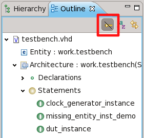
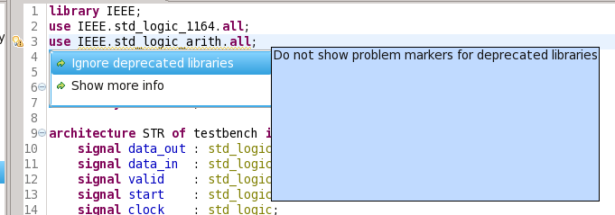

Sigasi 2.4 brings you a very easy way to check you code with an external
compiler. We added a option to automatically compile your code with an
external compiler as soon as you save your file. If there are any
errors, they will show up as red error markers inside your code, just
like the type-time error markers. Check out this short (2:40)
<a href="http://www.sigasi.com/screencast/introducing-vcom-integration-sigasi">demonstation
video</a> to get a feel of how it all works.

We also implemented usability and other improvements, and fixed reported
bugs.

Aldec VCOM integration
----------------------

Catching bugs early is cheaper than catching them late. Earlier versions
of Sigasi detect [**most errors** at **type time**](http://www.sigasi.com/faq#t133n861) but relied on a manual compile step with an external compiler to catch all errors. Sigasi 2.4 can now automate this step and intelligently call an external compiler
to find **all analysis errors** in your VHDL files as soon as you **save**.

At this time, Sigasi supports the vcom/vsim style compilers. These
compilers are available from [Aldec](http://www.aldec.com) (Active HDL
and Riviera Pro) or from other vendors. [documentation](http://www.sigasi.com/doc/2.4.0/integration_vcom)

Usability improvements
----------------------

-   Signal assignments can now be **filtered** in the **outline**
-   **Leaf nodes** in **outline** and **hierarchy** no longer have fold/unfold triangles
    
-   Improved **hover** for **record** types and subtypes
-   When you change the **library mapping of a folder**, you now have
    the option to map to a new library with the name of the folder
-   Deprecated library warnings now have a **quickfix** to show more
    info or to hide this type of warnings
    
-   The hierarchy instantiations filter now shows entity instantiations
    inside for-generates
-   Better support for *unresolved* nodes in the hierarchy:
    -   Unresolved instantiations are now visible when the
        instantiations filter is enabled in hierarchy view
    -   Double clicking unresolved instantiations moves your cursor to
        the instantiation location\
        
-   Error marker for “Port map is Incomplete” now underlines <code>port
    map</code> instead of the last port mapping
-   The declare signal **quickfix** of signals in **port maps** now uses
    the datatype of the corresponding port

Other new and noteworthy improvements
-------------------------------------

-   Sigasi now also supports node locked licenses
-   The bundled IEEE VHDL 93 library files are now the official IEEE versions

### Bugfixes

-   ticket 1967 : **Build problems** when file is changed outside of Sigasi (*ParallelResourceLoader: Resource load job didn’t return a result*) which resulted in all kinds of strange errors
-   ticket 1984 : Sigasi command line does not handle **relative paths** correctly
-   ticket 1983 : **QuickFix for unused signals** does not remove associated comments and remove empty line

Download/Update
---------------

If you have Sigasi 2 installed, you can [update_sigasi]. You can also [download_latest].
