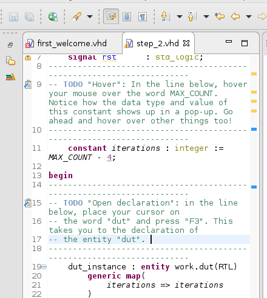
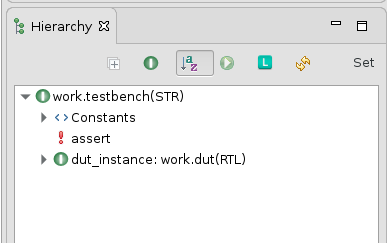
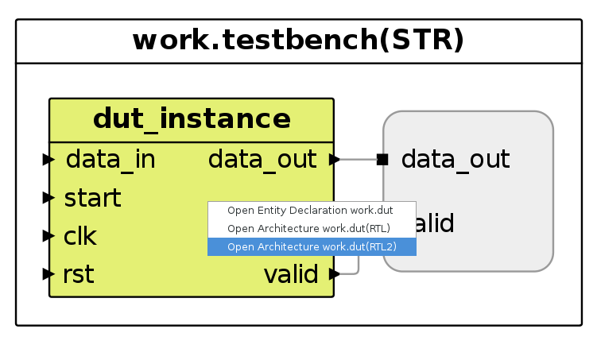
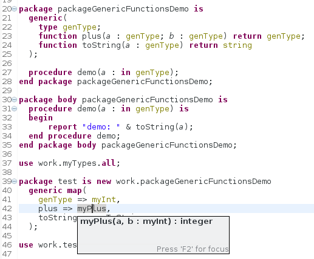

The summer holiday was very productive at Sigasi. We didn't only enjoy the weather and took some time off. We also prepared the Sigasi Studio 3.2 release.
Sigasi Studio 3.2 brings an **updated Eclipse platform**, fine grained **language version configuration**, **ALINT elaboration** checks, **SystemVerilog improvements** and much more.

## Eclipse Neon

Sigasi Studio 3.2 is build on top of the newly released [Eclipse Neon](https://eclipse.org/neon/) platform. This brings a number of nice enhancements:

- Resolution-based auto-scaling: Sigasi Studio will now be rendered correctly on **high-DPI** monitors. Everything will now be scaled correctly
- **Word wrap** in text editors: The workbench toolbar now contains a Toggle Word Wrap button  (Shortcut: Alt+Shift+Y).  
       
- Easy **zoom in text editors**: You can now use _Zoom In_ (**Ctrl++** or **Ctrl+=**) and _Zoom Out_ (**Ctrl+-**) commands to increase and decrease the font size.
- **Automatic Save of dirty editors**: Sigasi Studio now has an option to automatically save your editors when there is _no activity_ for a certain amount of time. This option is disabled by default, but can be enabled on the new _autosave preference page_ (**Preferences > General > Editors > Autosave**). The autosave interval can also be configured on this page.
- **Hide the window toolbars**: You can use the "Toggle visibility of the window toolbars" command (via Quick Access: Ctrl+3) to hide all currently visible toolbars of the current window. Executing the command again reveals these toolbars again. This allows you to maximize the space available for editors and views.
- **Full Screen Mode**: You can toggle the full Screen mode via the shortcut **Alt+F11** or menu **Window > Appearance > Toggle Full Screen**.
- If you now open a file type in Sigasi Studio that has no associated file type yet, a dialog will ask you which editor to choose. Note that you can also select an external program.
- [More enhancements](https://www.eclipse.org/eclipse/news/4.6/platform.php)

## Configure language version per file/project/workspace

You can now configure the language version on a more fine grained level than one version for the entire workpace. You can now override the language version per project, folder or file. \[[documentation][/manual/config#configure-version]\]

This makes it a lot easier to use a VHDL 2008 library in a VHDL 93 design. Note that your project needs the IEEE libraries for the most recent VHDL version you use. Verilog does not have this limitation. 

## Aldec ALINT elaboration checks
[xl_only]

We added elaboration support for Aldec's ALINT integration. If you select ALINT as external compiler (**Preferences > Sigasi > Toolchains**) and select a top-level in the [Hierarchy View][/manual/views#hierarchy], a new ALINT button  will be enabled. Clicking this button will run a headless ALINT elaboration check. All ALINT elaboration problems will appear as markers in the problems view and in the associated editors.   

## SystemVerilog improvements

We further extended our SystemVerilog support:

- Fixed some corner cases with the Preprocessor
- Skip encrypted regions in SystemVerilog
- The external compiler integration now reuses the configured Project's include paths and language version
- Verilog modules can now be set as toplevel: this enables you to launch an [external simulation][/manual/tools#launch-simulator] from Sigasi Studio
- We add more Verilog autocomplete templates
- Syntax support for more SystemVerilog expressions
- Syntax support for SystemVerilog Assertions
- Allow Verilog hovers in the Sigasi Studio Starter Edition (without license)

## Other new and noteworthy improvements

- ticket 3636 : Open architectures in Block diagram view
  
- ticket 3546 : Support Generic Functions in packages (VHDL 2008)
  
- ticket 3644 : Add New VHLD File Wizard template for FSMs
  
- ticket 3534 : Add missing port/generic quickfix now respects the original uppercase letters of the declaration.
- ticket 3637 : The library no longer monitors the workspace to update its configuration when files are deleted. The library configuration file is now only 'sanitized' and written when the library mapping is changed because of a user action.
- ticket 3633 : The 'Sigasi Solarized' theme is not longer the default theme. It is still available and can be selected via **Preferences > General > Appearance > Theme**.
- ticket 3618 : We updated the Xtext `2.10.0`

## Bug fixes

- ticket 3555 : Improve syntax highlighting for numbers in VHDL. Numbers with an exponent are now colored correctly.  
  
- ticket 3605 : Quartus project importer does not add SystemVerilog files
- ticket 3602 : Autocomplete does not correctly replace existing text when `Anywhere` context is used on Windows
- ticket 3611 : Incorrect Verilog syntax error

## How to update?

If you have Sigasi Studio 3 installed, you can [update][update_sigasi] or [download a fresh install of the latest version][download_latest].
