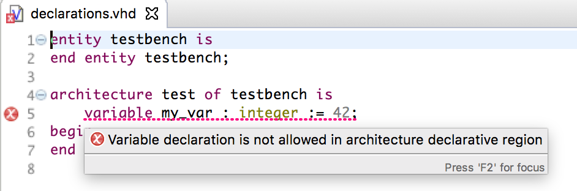
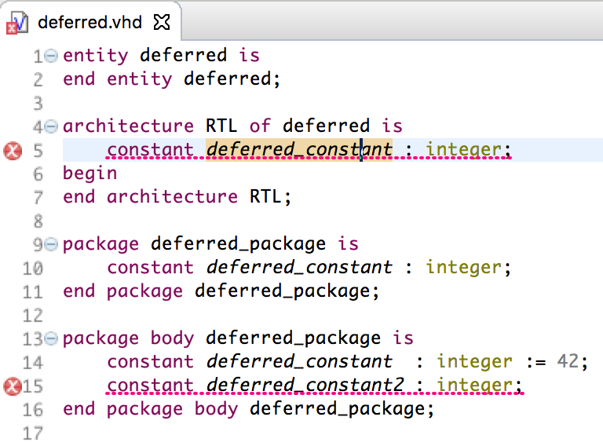
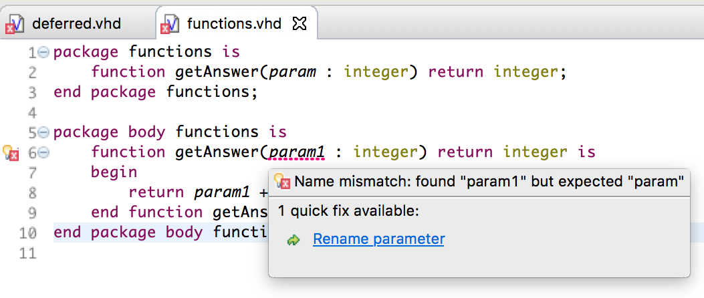
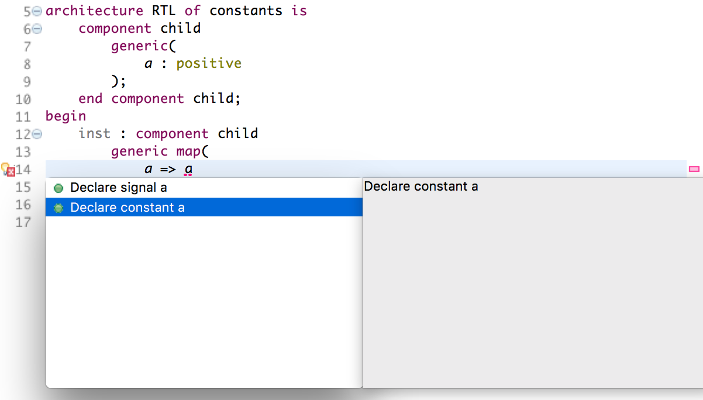
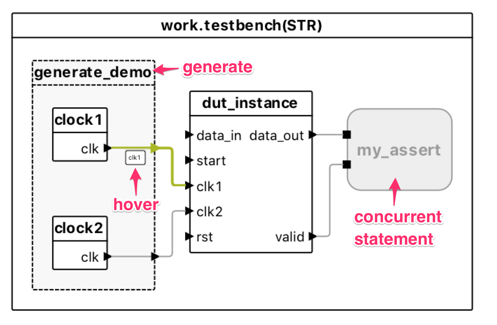
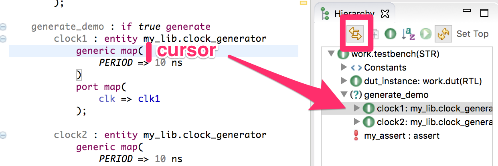

The Sigasi Studio 3.3 release brings a lot improvements. We added a lot of extra **syntax checks** and **quick fixes** ([starter], [creator], [xl]). We improved the **block diagram view** ([xl_doc]) and added numerous other noteworthy improvements.

We are also working hard on **SystemVerilog** improvements, but we didn't make the 3.3 release deadline. You can expect improvements in the [preview version][/faq#can-i-use-the-features-of-the-upcoming-release] soon.

## Improved VHDL analysis: Syntax, Linting and Quick Fixes

- New [starter] checks:

    - Not all declarative regions allow all types of declarations
    
    - Deferred constant declarations are only allowed in a package declaration
    
    - Linting checks for function specifications
    
    - Linting: signature of subprogram body and subprogram declaration have to match
    - Protected type body is not allowed in a package (only in a package body)

- New [creator] checks

    - Give warning when the project VHDL version > project IEEE libraries version

- New [xl] checks

    - Respect the declaration order of port/generic associations in port/generic maps
    
    - Flag illegal output/input port connections

- New Quick Fixes

    - Declare constant declaration
    
    - Fix associations order when order does not match the order of port/generic declarations
    - Fix argument names in function specification 
    - QuickFix to reset common libraries when project contains files with a newer VHDL version.

## Improved Block Diagram view

- Visualize generate statements in Block Diagram
- Avoid overlapping labels in the block diagram
- Add hover to block diagram
- "Show in Block Diagram" now centers the view on the new selection

## Other new and noteworthy improvements

- Property page to configure automatic export of a csv file with the compilation order of the project or current top level [creator].
  
- Semantic highlighting for labels
- Added option to automically format VHDL files when they are saved
  
- Link editor with Hiearchyview
  
- Added hyperlink to open matching declaration in protected type body
- Added autocomplete template for `case generate` statements
- Components are now foldable
- When toplevel is set, the csv export of toplevel is now automatically updated
- Stuttering support in Verilog Editor

## Bug fixes

- \[VHDL] Fixed startup issues
- \[VHDL] Caching problem when VHDL version of files is changed
- \[VHDL]FSM view is not updated when "Show in" is used the first time
- \[VHDL] Scoping error with Arrays of unconstraint records (ticket 3712)
- \[Verilog] Warnings on wrong location when file has preprocessor macros.
- \[Verilog] Open declaration does not work for ports and parameters in module instantiations
- \[VHDL,Verilog] External compiler markers not removed after unmapping

## How to update?

If you have Sigasi Studio 3 installed, you can [update][update_sigasi] or [download a fresh install of the latest version][download_latest].
