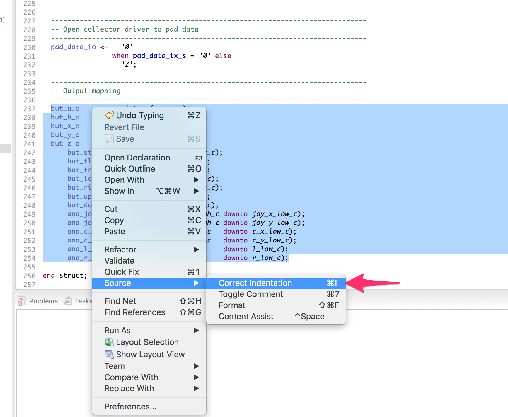
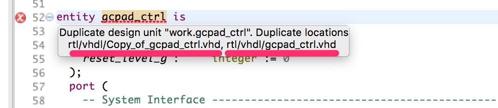

The major improvement in Sigasi Studio 3.4 is a new formatting engine. This enabled us to close most of the reported formatting issues and offer some new features. Read more below:

# New VHDL formatting engine

Code formatting is a delicate matter. Everybody has his own taste and style.
The VHDL formatter in Sigasi Studio 1, 2 and 3 evolved a lot to try to support the many requested styles. Alas, the approach was reaching its limits and we could not fix some reported bugs.

Therefor we decided to rewrite the VHDL formatting engine in Sigasi Studio 3.4. In addition to some popular bug fixes, this enabled us to add some extra features too:

## New Formatting features:

* Skip formatting in defined regions:  
  The code formatter now detects **off** (`-- @formatter:off`) and **on** (`-- @formatter:on`) tags. This allows you to disable the Sigasi formatter in defined regions in your code.
  
* Optionally disable vertical alignment  
  You can now disable vertical alignment in the formatter: **Windows > Preferences > Sigasi > VHDL > Formatting > Use Vertical Alignment**
  
* New action to correct indentation only  
  Inside a VHDL editor, you can now correct the indentation only via the context menu **Source > Correct Indentation**, or via **Ctrl+I**. This only changes whitespace at the start of you lines.
  If you select code first, only the code in the selection will be indented.
  

## Formatting bug fixes:
- ticket 3771 : Align case statements
- ticket 3204 : [Block formatting if there are real structural syntax errors](https://twitter.com/geschema/status/549550717393178624)
- ticket 3622 : Tweak vertical alignment in formatter
- ticket 3468 : Formatting issue in record constants
- ticket 3271 : Formatting selection increases indentation level when preserve newlines option is enabled
- ticket 3724 : Formatting matching case statements (case?) introduces syntax errors
- ticket 3667 : Add option to disable vertical alignment in the formatter

# More improvements to the Block Diagram view

We further improved the layout, looks and interaction of the Block Diagram View.
We changed the looks of `assignment` and `assert` statements. We made them smaller to improve the clarity of most diagrams. We also improve hover and the selection behavior. 

  

We also added a **Pin View** feature. This allows you to 'pin', or lock, the Block Diagram view to the current diagram. If you pin a view, the diagram will remain unchanged if you navigate to other VHDL files. Note that changes in your VHDL code will still result in updates of the Block Diagram View.

Note: In Sigasi Studio 3.3 we accidentally released a prototype feature. Depending on your license key, you may have noticed "..." buttons in the block diagram view toolbar. These buttons filtered certain blocks and connections from the Block Diagram. In Sigasi 3.4, we have removed these buttons. An improved version of these buttons will be re-introduced in a later version.

# SystemVerilog

See the Preview Builds to track our SystemVerilog progress.

# Other new and noteworthy improvements

- We now require at least Java 8 to run Sigasi Studio (plugins)
- We updated the Eclipse Xtext dependency to `2.11.0`
- We improved the message for "Duplicate design unit" problems. We now mention the path of conflicting design files.
  
- We added three extra name conventions checks:
    - Labels of instantiation statements
    - Labels of generate statements
    - Labels of process statements
    

# Bug fixes

- ticket 3779 : \[VHDL 2008\] protected type issue with incomplete type declarations
- ticket 3743 : \[VHDL 2008\] Incorrect error for unconstrained nested arrays
- ticket 3753 : ModelSim compilation fails (silently) when project contains encrypted files
- ticket 3725 : Incorrect error for aggregates as return types for subprograms
- ticket 3795 : exception running the external compiler for project with certain library/VHDL version setups
- ticket 3792 : Two temp folders created for external compilation
- ticket 3769 : Improved message in popup when Sigasi warns about its age.
- ticket 3767 : Only open port 4444 when Sigasi Studio is started with `com.sigasi.runner.open application` (default)
- ticket 3783 : Block diagram incorrectly displays `generate` statements without instantiations as "unknown"
- ticket 3794 : Improve error handling of Quartus integration
- ticket 3768 : Allow to run external compiler if only the VHDL plugins are installed (and no Verilog)

## How to update?

If you have Sigasi Studio 3 installed, you can [update][update_sigasi] or [download a fresh install of the latest version][download_latest].
