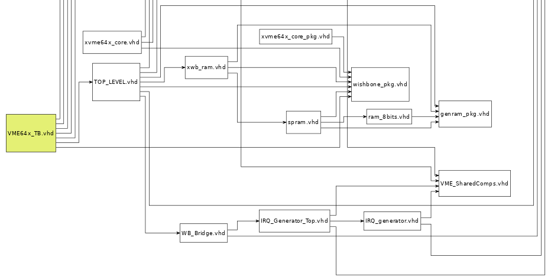
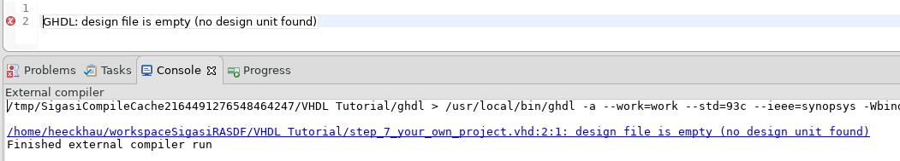
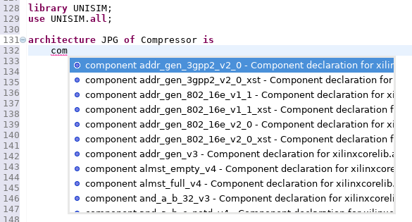
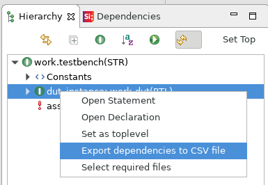
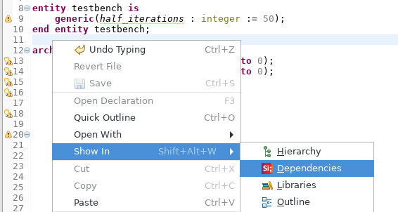

Sigasi Studio 3.7 brings type-time component/entity mismatch checking with associated Quick Fix,
SystemVerilog improvements, GHDL support and many more new features and bug fixes.

# Check for component/entity mismatch + Quick Fix

Sigasi Studio now warns you if a component declaration and its matching entity get out of sync.
This is a common annoyance in HDL design that is typically discovered late in the design flow.
Sigasi Studio now reports mismatches immediately at **type time**.

You can easily update a component declaration to match its entity declaration by applying the Quick Fix.

# SystemVerilog improvements

We significantly improved and optimized the way Sigasi Studio analyzes include files.
We also reduced the memory footprint and improved the project analysis time.
Because now all includer/included-relationships are tracked project-wide,
Sigasi Studio can provide very accurate navigation without any extra configuration effort on your part.
This allows you to focus on the code instead of having to track which parts of your design are in scope.

For example, to add UVM support to your project, you now only have to:

1. Drag and drop the source folder in your project
2. Add the UVM source folder to your project's include path

Next, Sigasi Studio figures out all relations automatically, allowing you to easily follow declarations, use autocomplete and preview preprocessor macro expansions.
For more information, you should read the updated [UVM example post][/tech/systemverilog-uvm-demo].

# Dependencies Viewer (Mixed language)

The *Dependencies Viewer* can now display the dependencies of your entire project.
This makes it very easy to recognize *top levels* and *orphaned files*.

# GHDL support (VHDL)

Especially for our educational users using Apple MacBooks, we added support for the open-source GHDL simulator.

Make sure to [download the latest version of ghdl from GitHub](https://github.com/tgingold/ghdl/releases).
Do not download the outdated version that [http://ghdl.free.fr](http://ghdl.free.fr) links to.

# Autocomplete performance (Mixed language)

We did a thorough performance analysis of the SystemVerilog and VHDL autocomplete feature.
This way we could vastly reduce the autocomplete latency, especially for larger projects.

# Other new and noteworthy improvements

* Because some of our users did not realize Sigasi Studio is more powerful when you use it on projects, we made some UI changes to clarify this. The **Sigasi Starter** perspective is no longer the default perspective. In addition, when an external file is opened, we now show a warning bar at the top of editor to clearly indicate you are missing out on a lot of features.  

* Add "Export CSV file with dependencies" feature available as action in the hierarchy view  

* You can now open the **Dependencies View** via the "Show in" menu in the editor  

* The Riviera-Pro toolchain now has `-dbg` as default option.
* \[VHDL] Allow to simulate a `configuration` as toplevel
* \[VHDL] Improved constant evaluation in hovers  

* \[VHDL] Renaming of procedure arguments in package or package body now correctly renames arguments everywhere  

* \[VHDL] Support VHDL 2008 tool directives (`)  

* \[VHDL] Add autocomplete template for formatter tags  

* \[VHDL] The Quick Fix for the **Vivado Unisim** library now uses the real Vivado library, and not the legacy ISE compatibility version.
* \[Graphics configuration] You can now also reference labeled assignments
* The **Sigasi Starter** perspective is no longer the default perspective
* The **FlexNet** floating license key checkout now **times out faster**
* We updated the Eclipse Xtext dependency to `2.13.0`

# Bug fixes

- ticket 3765,3999 : \[SystemVerilog] autocomplete: respect 'replace tabs with spaces' setting
- ticket 3789 : \[VHDL] Scoping issue in configurations
- ticket 4016 : \[SystemVerilog] Incorrect syntax error report in assertion variable declarations (Used in Tidal library)
- ticket 3993 : \[SystemVerilog] Formatting issue in case generate statements
- ticket 4004,4007,4027 : \[VHDL] "Sort associations" Quick Fix generates wrong VHDL code
- ticket 4088 : Project > Export generating bogus diagrams when Sigasi Studio is installed as Eclipse plugin
- ticket 4071 : Rename issue in component, when matching entity is defined in a different library
- ticket 4084 : "Format on save" puts the cursor on line 1 after save
- ticket 4095 : "Unused declaration" should not consider a component end name as a 'usage' of the component.
- ticket 4030 : \[VHDL Formatting] Comments before (generate) elsif/else are not indented correctly
- ticket 4030 : \[VHDL Formatting] The formatter now stops formatting your HDL code when it encounters unrecoverable syntax errors (such as missing parenthesis, braces and `end` keywords)
- ticket 4069 : \[VHDL Formatting] Preserve newlines fails when line breaks are different from OS-line breaks
- ticket 4107 : \[Graphics configuration] Collapse wires in block diagram generates wrong identifier names

# How to update?

If you have Sigasi Studio 3 installed, you can [update][/manual/setup#Software Updates] or [download a fresh install of the latest version][download_latest].
 
