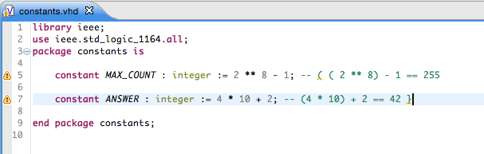

Sometimes, you want to check some simple properties in your projects. For example, you might want to check for a standard company copyright header, or you might check for the use of lower-case keywords in your files. While Sigasi offers a lot or VHDL code rule checks out of the box, there is a way to implement your own rules very easily.

In this article, I will explain how to create your own custom code checker in Sigasi. As an example, we will build a code checker that matches the braces in VHDL comments. In other words, you will get a warning if you have unbalanced parentheses in your comment lines.

In this example, all comments in VHDL (`*.vhd`) files in the project are scanned for matching brackets. 
The script takes into account parentheses, curly brackets and square brackets: `() {} []`
If brackets are not matched correctly, the checker will raise a warning at the correct location so 
that the user can fix the brackets.

## How to use:

Make sure you have the current version of the Marker Manager (we are using the version 20150430). 
Download and installation instructions are at: "http://www.markermanager.com":http://www.markermanager.com.

Download the example project from GitHub: "https://github.com/sigasi/eclipse_custom_code_checker":https://github.com/sigasi/eclipse_custom_code_checker

If you want to apply a custom code checker to your own project:

1. Create a new builder that generates the `markers.rpt` file:
	* **Project > Properties > Builders > New > Program**
	* Set the options of this new builder like I have configured "Check brackets in VHDL comments" in this example project
2. Activate the Marker builder to your project: Right-click on the project, *Configure > Add Marker Builder*
3. Make sure that your custom builder is listed **before** the "Marker Project Builder". Check this in **Project > Properties > Builders**

## Suggestions for improvement and customisation

You can extend the checker.py script to check for matching HTML tags or matching LaTeX tags in comments.

You can modify the comment symbol in the script so that only comments that start with `--!` are considered.

## Contribute

If you have improvements for the checker script or for the documentation, feel free to send a pull request through GitHub.