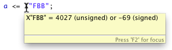

If you place your mouse over an identifier in a VHDL file, a yellow pop-up with extra information will will appear. This is called _hovering_.
Depending on the object that the identifier represents, the hover pop-up can show different information:

* Declaration
* Data type, vector size
* Value of a constant, even if it defined as an expression
* The decimal value of a hex literal


# Some examples:

Hover to see the value of constants, even if that constant is declared as an expression of other constants.


Hover to see the decimal value of binary or hexadecimal values.



If the declaration has comments attached to it, the hover pop-up shows those comments. A comment is considered to belong to a declaration if it is on the preceding line, or if it follows on the same line of the declaration.

```vhdl
constant PERIOD : time := 50 ns; -- Half the clock period. The frequency will be 1/(2*PERIOD) = 100 MHz
```

