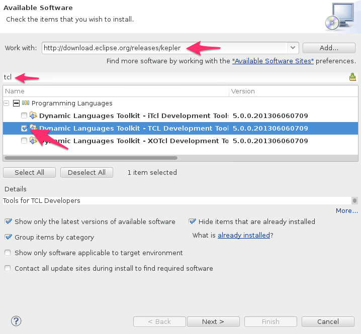

[Tcl](http://en.wikipedia.org/wiki/Tcl) is the de facto standard for scripting in EDA software. So every hardware designer has to deal with Tcl. Luckily for us there is an Eclipse Tcl plugin available that can help us read and write Tcl code. This plugin offers open declaration, (quick) outline,autocomplete, debugging and other features that will make you more productive.

## Install

To install the Tcl plugin in Sigasi:

1. Click **Help > Install New Software…**
2. Enter `http://download.eclipse.org/releases/mars` as update site in the **Work with:** field
3. When the index of the update is downloaded (this can take a while) enter **tcl** in the _type filter_ text box
4. Select the **Dynamic Languages Toolkit – Tcl Development Tools**
5. Click through the straightforward, subsequent steps



## Configure

After the Tcl plugin is installed you need to configure at least one Tcl interpreter.

Select **Window > Preferences > TCL > Interpreters**. You can add an interpreter manually with the **Add** button or you can try automatic detection with the **Search** button.


## Explore

To verify that the interpreter is working, you can open an interactive Tcl console by clicking the **Open console** icon in the toolbar and next selecting the interpreter you want to use.


The next thing you should try is opening a Tcl file and play around. You can test _autocomplete, outline, open declaration,…_


To enable all Tcl support features (e.g. run, debug) you need to create a _Tcl project_ (**File > New > Project… > Tcl Project**).
To convert an existing project to a Tcl project you need to edit the `.project` file.
You need to add
```
<buildCommand>
	<name>org.eclipse.dltk.core.scriptbuilder</name>
	<arguments/>
</buildCommand>
```
to the `<buildSpec></buildSpec>` element and 
```
<nature>org.eclipse.dltk.tcl.core.nature</nature>
```
to the `<natures></natures>` element.

## More

You can find more information in the bundled help pages:  **Help > Help Contens > TCL Development User Guide**.
The help pages also contain a **tutorial** that guides you through all Tcl features.
