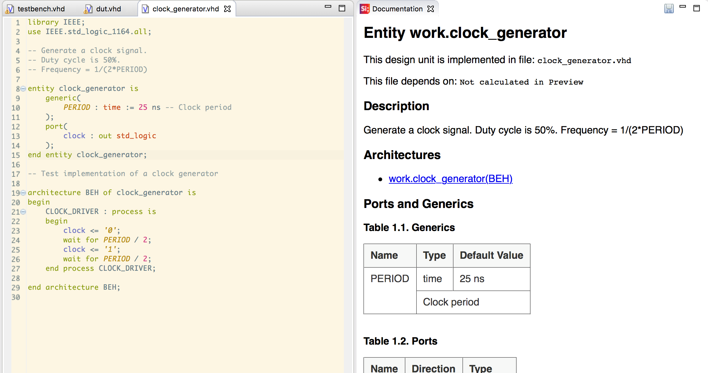
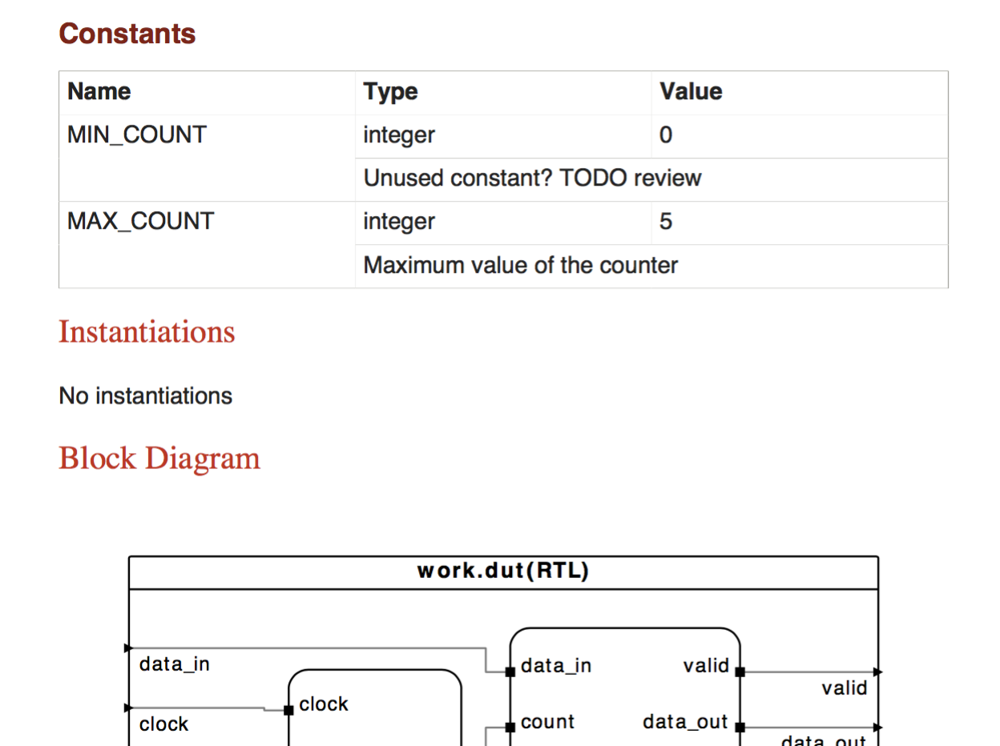

In a previous post "[generate-vhdl-doxygen-documentation-sigasi]", I wrote about how you can use Doxygen in Sigasi to document your VHDL designs.

Doxygen tries to make the documentation process easier by extracting information from your VHDL source files. The biggest advantage is that there is only a single source for both your design and your documentation. While this gives no guarantee for the design staying in sync with the documentation, it certainly makes it easier.

But although I like the base idea of Doxygen, it has some annoying disadvantages:

* You need to add **special comments** to your VHDL code before any useful documentation can be generated
* Doxygen does not use a real **VHDL compiler**. So not all VHDL code is supported (e.g. VHDL 2008 features)
* A lot of work to set up: To create PDFs with basic diagrams, you do no only need to install Doxygen, but also DOT and LaTeX. Especially LaTeX can be a real challenge...
* The output can be confusing: *"Inheritance diagram"*? *"The output for this **class** was generated ..."*? This terminology makes sense for C++ projects, but not for HDLs.
* **Long feedback loop**: the documentation for the entire projects needs to generated before you can inspect the result.

## Sigasi documentation Generator

For these reasons, we developed an alternative, based on Sigasi Studio's internal VHDL analyzer. We stuck with the base idea, but followed a different approach to overcome the disadvantages.

The new Sigasi documentation generator has following advantages:

* **No special coding requirements**: the plain comments in your code are extracted for the documentation, no need for special annotations. Sigasi uses the same code/comment association as the hover provider (See "[/manual/editor#Comment Association]"). So to document a `port`, you append a comment to a port declaration. To document an `architecture`, you put the comment just on top of the architecture.
* **All included**. All documentation processing is done in Sigasi/Eclipse. So you do *not* need to install extra tools.
* **Fully hyperlinked PDF**. If you export the documentation, you get a fully hyperlinked PDF.
* **Live preview**: you can see what the documentation will look like while you type your code and comments.

[][/manual/views#documentation]

To get an idea of the output, I generated a [pdf](resources/documentation.pdf) for a [simple example project](resources/DocumentationExample.zip):

## How does it work?

Sigasi creates a pdf with your project's documentation in multiple steps:

1. Extract all relevant information (content, comments,...) into an intermediate model
2. Generate all diagrams
3. Use templates to convert the result of steps 1. and 2. into a DocBook source file. ([DocBook](https://en.wikipedia.org/wiki/DocBook) is a standard for writing technical documentation.)
4. Convert the DocBook file to a pdf.
 

If you have a full [xl_doc] license, Sigasi also makes the intermediate DocBook file available. This allows you to fully customize the pdf generation. With a custom DocBook→pdf-flow, you could for example apply your company's colors, add your and logo or append extra sections, etc.

## Future work

* Although Sigasi already uses templates internally, these templates are not really user-configurable. In a future release we want to make these templates customizable. This way the exact content of the documentation can be easily tweaked.
* Add [state machine diagrams][/manual/views#fsm] to the documentation
* Add Markup support. The VHDL comments are currently copied verbatim to the output. In a future release, we need to come up with a way to add markup (e.g. paragraphs, bold, italic, lists, ...)
* Some users reported they actually prefer special comments (e.g. Doxygen's `!--`) to mark documentation. They like to explicitly indicate what text gets into the documentation (and what not). So in a future release, we may add the option to require special comments for documentation.
* In the current version, we generate documentation for the entire project. Some customers indicated, that they'd prefer to document only the hierarchy of the active toplevel.

## Conclusion

We developed an easy but powerful alternative for DoxyGen. It is very easy to get started with, and encourages good practices.
So I invite you to **try this out yourself**. Even with a [starter] license, you can open the [Documenation Preview View][/manual/views#documentation]. You can also export a pdf. But this pdf will have a watermark, and the diagrams will be missing.