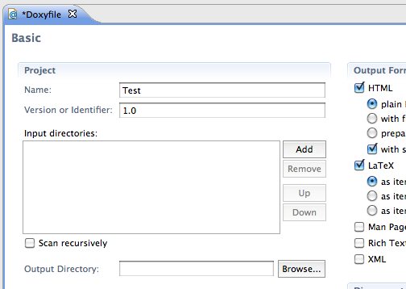
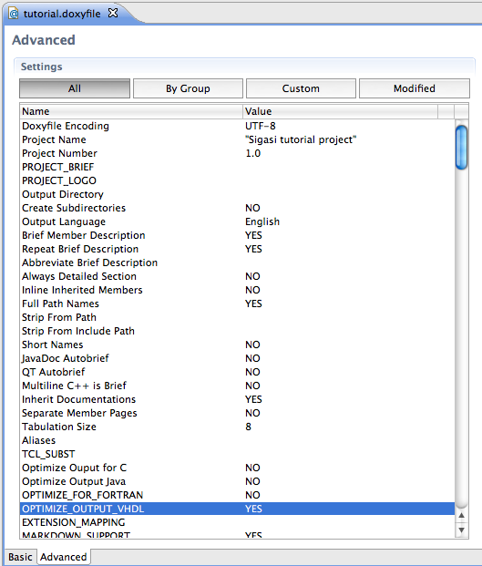

*I don't know any hardware developer who likes to document her design,
but as far as I know everybody has to write documentation. Writing
documentation is cumbersome. It often happens near then end of the
project when stress and workload are already high. It easily gets out of
sync with the design...*

**Doxygen** tries to make the documentation process easier. It extracts
information from your VHDL source files to generate documentation. If
you annotate your source files with [special comments](http://www.stack.nl/~dimitri/doxygen/docblocks.html#vhdlblocks),
this documentation can give a nice extra view on your code. A large
advantage is that there is only a **single source** for both your design
and your documentation. While this gives no guarantee for the design
staying in sync with the documentation, it certainly makes it easier.

Although I am personally not that fond of Doxygen (but that is for
another blog post). It is the only usable VHDL documentation system I
have encountered so far.

Sigasi/Eclipse offers an easy way to get started and work with Doxygen.
As a small example I generated
<a href="resources/doxygen-example/index.html" target="_blank">Doxygen documentation for the tutorial project</a> that is shipped with Sigasi.

# Install Doxygen and the Doxygen Eclipse plugin

Before you can use the Doxygen plugin. You need to install Doxygen
itself on your system.

## Doxygen

To install Doxygen on your system, visit <http://www.doxygen.org> and
[download the distribution for your system](http://www.stack.nl/~dimitri/doxygen/download.html#latestsrc) or
install it with your favorite package manager. You should also install
[dot](http://www.graphviz.org/) if you want nice looking graphs.

## Doxygen Eclipse plugin

[Eclox](http://home.gna.org/eclox) is a simple Doxygen plug-in for
Eclipse. It provides an graphical user interface to configure and run
Doxygen. Eclox is available under the GNU General Public Licence (GPL).

Note that this plugin is no longer actively maintained. But I did not
encounter any problems so it looks good enough to be useful.

To install the doxygen plugin:

1. Click **Help &gt; Install New Software...**
2. Enter **http://download.gna.org/eclox/update/** in the **Work with**
field
3. Select **Eclox**
4. **Finish** and **Restart**

# Configuring Doxygen for your VHDL project

Before you can generate documentation with Doxygen, you need to create a
Doxygen configuration file first. Once this file is properly configured,
you are ready to generate nicely rendered documentation of your code.

### Create a Doxygen configuration file

Once the plugin is installed, Sigasi has an extra @-button in the
toolbar (If this button does not show up, click **Window &gt; Reset
perspective...**).

Click this button to generate a Doxygen configuration file. You can
choose any filename you like, but the convention is to use `Doxyfile`.
If you use this name, Sigasi will open this file with a rich editor.
Although this editor is mainly targeted to C developers, it is also
useful for VHDL designers.

The basic settings, such as the project name,... you can configure in
the basic tab. But most VHDL settings are only available in the advanced
tab.

I made following changes to the default settings:

-   `PROJECT_NAME = "Eclipse tutorial project"` to configure the project name
-   `PROJECT_NUMBER = 1.0`
-   `OPTIMIZE_OUTPUT_VHDL = YES` Configure Doxygen to tailor its output for VHDL
-   `EXTRACT_ALL = YES` Force Doxygen to create documentation for all your design files, even if the source files contain no special doxygen comments.

*Once you get to know Doxygen, it is easier to configure these settings
in a regular text editor. You can do this by right-clicking the
`Doxyfile` and selecting **Open with &gt; Text Editor**.*

## Run doxygen

To run Doxygen, simply press the @-button again. The generated files are
written to the `doxygen-example` folder by default. Double-click the
index.html file to see the results. The result will not have a lot of
content in it. To add more content, you need to add special doxygen
comments.

## Add doxygen comments to your design files

To really document your source with Doxygen you need to add special
[code comments](http://www.stack.nl/~dimitri/doxygen/docblocks.html#vhdlblocks).
Instead of regular VHDL comments (`-- ...`), you have to use
doxygen VHDL comments (`--! ...`). You have to place your
comments in front of the item that you want to document. The only
exception are ports and generics. You can document these with a a
one-line description on the same line.

You can [download the VHDL source of an example Sigasi here](resources/doxygen-sigasi.zip). For more details consult the [Doxygen manual](http://www.stack.nl/~dimitri/doxygen/manual.html)

# Useful links

-   [Doxygen](http://www.doxygen.org)
-   [Doxygen manual](http://www.doxygen.org/manual.html)
-   [Eclox](http://home.gna.org/eclox) : a simple doxygen frontend plug-in for eclipse
-   update site: <http://download.gna.org/eclox/update>
-   [VHDL sources for the example](resources/doxygen-sigasi.zip)
