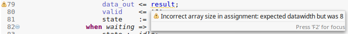
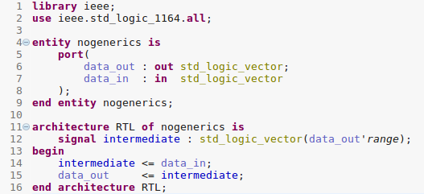

## Customer question
On a regular basis we receive questions from customers about *Incorrect array size* warnings or errors.

This linting message tells that array sizes in an assignment do not match.
Typically, one side of the assignment is a port and the other side an internal signal.
A generic defines the width of the port while the signal width is defined by a constant value.

The core question asked is
*Why does Sigasi Studio not take into account the value of the generic when calculating the array sizes?
After all, in the instantiation the value of the generic was set to match the constant value.*

## Improving reusabiliy
The *intention* of this warning is explicitly _not_ to resolve the generic value.
Instead the goal is to help hdl designers *improve code reusability*.

Because the array size is fixed to 8, the example above will only be valid if the value
of the generic is set to 8 in any instantiation. For any other value assigned to the generic,
the code will break.

In order to resolve the warning above, the array size should be written in terms of datawidth
so that the code remains valid for other values of the generic.

## One step further
Taking this a step further, the warning could be interpreted more bluntly:
*stop using the generic since it only gives a false sense of re-usability*.

Why would generics be needed to define port or signal widths?
VHDL allows to write code without using generics or fixed port widths like in the code example below.

The actual port and signal widths are only defined once this design unit is instantiated.
No constants or generics are involved, allowing to write less and cleaner code.

We're happy to hear your feedback on [this linting rule][/manual/linting#vector-width] and on
how Sigasi Studio can help you to write cleaner code.
