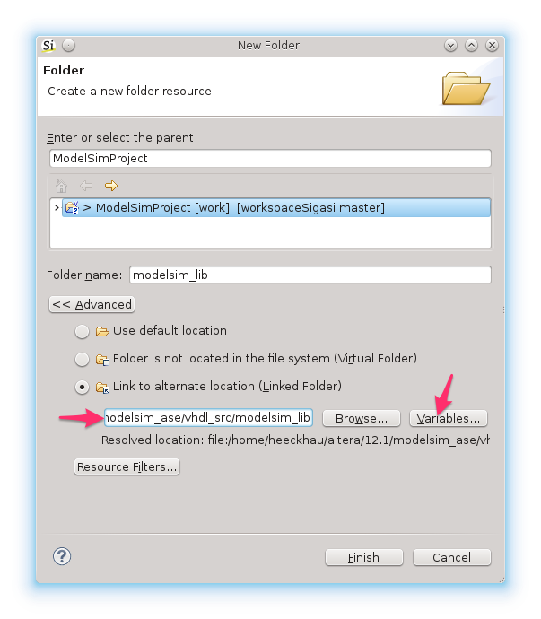
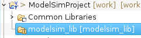
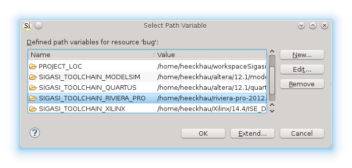

In this blog post, I will describe how you can use *path variables* to
avoid system dependent, absolute paths in your project files.

The default way to add a third party library (e.g. `modelsim_lib`) to
your project is as follows:

1.  Add files to project
    -   **File &gt; New &gt; Folder**
    -   **Advanced**
    -   **Link to alternate location (Linked Folder)**
    -   Enter location. In my case this is
        `/home/heeckhau/altera/12.1/modelsim_ase/vhdl_src/modelsim_lib`

2.  Map library
    -   **right-click**
    -   **Library Mapping &gt; Library modelsim\_lib**

The disadvantage of this procedure is that this leads to an absolute
path in the project file
(`/home/heeckhau/altera/12.1/modelsim_ase/vhdl_src/modelsim_lib`). This
is particularly annoying if you collaborate with a team on the same
project. If the library has a different install location on different
computers, everybody will have to change this path. This again, will
lead to conflicts when you commit your changes to the shared code
repository.

To deal with this situation elegantly, Sigasi/Eclipse offers the concept
of [**Path Variables**](http://help.eclipse.org/indigo/index.jsp?topic=%2Forg.eclipse.platform.doc.user%2Fconcepts%2Fcpathvars.htm).
Path Variables allow you to specify a location of your file system, as a
variable. And such a variable can be used to *specify the location of
**linked resources** relative to these paths*.

Defining a path variable is straightforward:

-   **Preferences &gt; General &gt; Workspace &gt; Linked Resources**.
-   At the bottom of this page you can add a new Path Variable with the
    **New...** button.
    -   Enter a name: `modelsim_ase`
    -   Define the location: `/home/heeckhau/altera/12.1/modelsim_ase/`
    -   Confirm with **OK**

Once you have defined the path variable, you can use it to specify the
location of the linked library folder:

-   **File &gt; New &gt; Folder**
-   **Advanced**
-   **Link to alternate location (Linked Folder)**
-   Instead of entering the absolute path, do the following:
    -   click the **Variables...** button.
    -   select our variable `modelsim_ase`
    -   press **Extend...** and select `vhdl_src/modelsim_lib`

This way the project no longer contains an absolute path to the modelsim
library, but instead a path relative to the Path Variable.

When you now share this design with a colleague. Your colleague will see
an unresolved annotation on the modelsim_lib folder.

They can configure the `modelsim_ase` variable via **Preferences &gt; General &gt; Workspace &gt; Linked Resources**. Alternatively, you can use Workspace Mechanic ([/tech/sharing_preferences]) to automate this task and share Sigasi/Eclipse settings across your entire team.

# Sigasi 2.21

In Sigasi 2.21 we added *path variables* for accessing *toolchain paths*  and *environment variables*.

## Toolchains

Following path variables are available for **toolchain paths**:

* `SIGASI_TOOLCHAIN_QUARTUS`
* `SIGASI_TOOLCHAIN_XILINX`
* `SIGASI_TOOLCHAIN_ALINT`
* `SIGASI_TOOLCHAIN_RIVIERA_PRO`
* `SIGASI_TOOLCHAIN_MODELSIM`
* `SIGASI_TOOLCHAIN_ACTIVE_HDL`

Note that the variables are only available when a valid path is configured in the corresponding toolchain preference page: **Window > Preferences > Sigasi > Toolchains > Toolchain Name**

## Environment variables

To access *environment variables*, you have to prefix the environment variable with `ENV-`.
For example: to refer to the home directory you can use `ENV-HOME`

Since Sigasi 2.21, the quickfixes for Altera, Xilinx and Modelsim libraries, automatically use these path variables.
