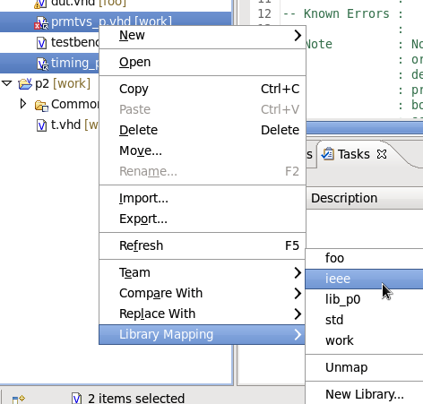

Some projects use the IEEE VITAL packages:

```vhdl
use ieee.vital_timing.all;
use ieee.vital_primitives.all;
```

Sigasi does not ship these libraries. In order to use the VITAL packages:

1. Find a copy of those packages. Your FPGA software or your simulator may come with a copy. Look for files called `prmtvs_p.vhd` and `timing_p.vhd`
2. Drag those files from your file browser (*Windows Explorer, Finder, Nautilus*) to your Sigasi Project Explorer. If Sigasi asks: you want to **Link to files**, with absolute paths.

3. Now, map the two files to the IEEE library: select both files in the Project Explorer, right click **Library Mapping > ieee** 


Read more about setting up [/manual/libraries] in Sigasi Pro.

## Speed

In order to keep Sigasi Pro fast, we recommend you **avoid working with back-annotated or post-synthesis code**. This code gets very big very fast and is not the main focus of Sigasi. 
Do not map the package bodies of the IEEE VITAL libraries.