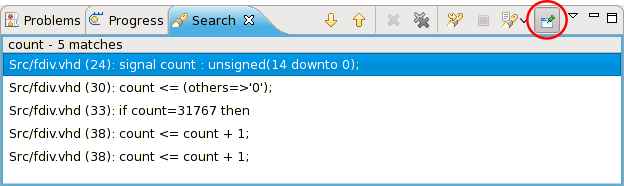

Sigasi HDT (and Eclipse) allow to perform <strong>multiple, simultaneous searches</strong>. The user interface is a bit hidden —this is considered advanced usage— therefore this short HOWTO:

If you do not want the search view to change and start a new search in a new Search view, you should <em>pin</em> the Search view. You can toggle the <em>pinned</em> state of the Search view in with the <emp>pin</em> button on the right side of the Search view's toolbar.

When you <em>pin</em> the search view, the pinned search view will remain unchanged and subsequent searches will be shown in a second Search view.

This works for all search actions (VHDL, text, file, ...)
