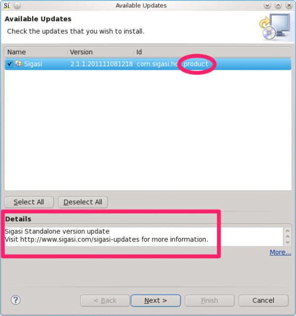

Thanks to Ian Bull on <a href="http://www.eclipsecon.org/" class="elf-external elf-icon">Eclipse Con Europe</a> last week, I finally found out how to set the update description for an RCP product update. This was a tiny annoyance that has been itching since the first release of Sigasi. For the Eclipse plugin version of Sigasi, this never was a problem. The feature description is shown in the update dialog. But for the standalone version (RCP), there was always an empty description&#8230;
	
So on my way home, I delved into it again and finally solved this issue.
	
<strong>Product description in update dialog</strong>
	
Ian told the original plan was to add a field to the Product Configuration Editor, but nobody ever came around to implement it. But the good news is that you can easily set the description via a  <a href="http://wiki.eclipse.org/Equinox/p2/Customizing_Metadata" class="elf-external elf-icon">p2 advice file</a>. This file (<code>p2.inf</code>) can be added next to the product definition and is used to tweak p2 operations. Note that if you build with <a href="http://www.eclipse.org/tycho/" class="elf-external elf-icon">Maven Tycho</a>, this p2.inf needs to be prefixed with the product configuration file name. In our case the product configuration file is <code>sigasi.product</code>, so the p2 advice file must be named <code>sigasi.p2.inf</code> (<a href="http://wiki.eclipse.org/Tycho/Packaging_Types#eclipse-repository" class="elf-external elf-icon">more details</a>).
	
To set the product update description add following lines to your p2 advise file: 

<pre class="java geshifilter-java" style="font-family:monospace;">properties.0.name = org.eclipse.equinox.p2.description properties.0.value = Sigasi Standalone version update\nVisit http://www.sigasi.com/sigasi-updates for more information.</pre>
	
That looks a lot better. Hendrik. 
  

