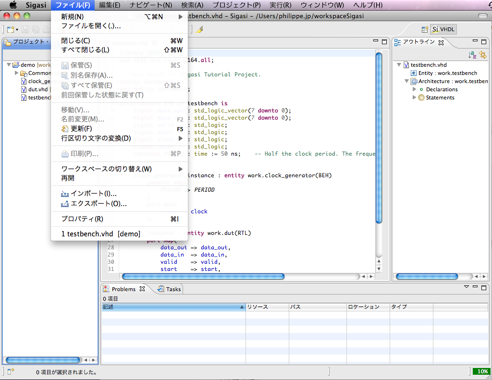

Even though Sigasi does not have internationalisation (it is not translated to any languages other than English), much of Eclipse is in fact translated. If your native language is not English, you might consider installing the [Babel language packs](http://eclipse.org/babel/downloads.php). For example, you can install the language pack for French, German, Japanese or dozens of other languages.

Just select **Help > Install new Software**, then enter the correct update location for your Eclipse distribution. For Sigasi 2.x and for Eclipse Indigio (3.7), the update location is: `http://download.eclipse.org/technology/babel/update-site/R0.10.1/indigo` It may take a few minutes to load the entire list of translations from the update server. Now select the language you want to support.

If the language settings in your operating system are set correctly, Eclipse will display the new language when you restart it. Here is a screenshot of the Sigasi Eclipse VHDL plugin, with Japanese translations. **Again, only the general Eclipse text is translated. The Sigasi VHDL plugin itself does not provide localisation at this time.**

Note that Sigasi and all of its VHDL-specific components are not translated. If you require translation for your language, please [send-email].
