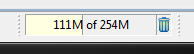

Recent versions of Sigasi include a number of improvements that reduce the memory usage with 20 to 30% and a number of potential memory leaks have been fixed. If you think you are still experiencing memory issues with Sigasi, here are a few tips that may help you diagnose the problem.

## Measuring the memory usage of eclipse

Sigasi runs on the Eclipse platform that runs on the Java Virtual Machine. Because of the Java garbage collector it is not possible to measure the memory usage using the task manager of your operating system. Instead you have to use the build-in utilities of eclipse.

* Goto **Window > Preferences > General** and enable **Show heap status** and click **OK**.
* In the status bar of eclipse (bottom of the screen) a new UI element will appear.
  
* We can see 3 things:

   * The amount of used memory by the application (including garbage that has not been collected), in the example 111MB.
   * The total amount of allocated memory for the application, in the example 254MB.
   * A garbage bin icon, if you click it, it will trigger a garbage collection.
   
So if you want to know how much memory is really being used, you should enable this UI element, trigger a garbage collection and look at the amount of memory used by the application.

For big projects, the memory use can approach 1GB. If you want efficient garbage collection there should be a buffer of about 200-300 MB to prevent the garbage collector to be triggered continuously. By default, Sigasi HDT has capped the maximum allocated memory to 1GB, however this limit can be raised.

## Configuring the Java virtual machine

If you use the standalone Sigasi Studio build, open the file named `sigasi.ini` in the installation directory. If you use Sigasi Studio as a plugin, open the file named `eclipse.ini`. In this file we’re only interested in the part that comes after the option `-vmargs`.

Here we can set the **maximum memory usage** using the `-Xmx` option, for example if you want to increase the memory usage to `1.5 GB`, you replace the existing entry with `-Xmx1512m`.

It may also be interesting to add the line `-XX:+UseConcMarkSweepGC`, this option enables a different garbage collector that runs concurrently with the program, it reduces the pause times when a garbage collection is performed.

## Choosing the 32-bit or 64-bit version

If you raise the maximal memory allocation too high on a 32-bit eclipse, it will refuse to start. On Windows systems this limit lies around 1.5 GB, on Linux systems it’s higher.

If you want to use Sigasi HDT in 64-bit mode, you will have to add it as a plugin to a 64-bit version of eclipse. Notice that if you use the 64-bit version, eclipse needs more memory than in 32-bit mode because pointer sizes have doubled.

If you have a 64-bit processor and operating system and you work on a big project it is recommended that you use our product in 64-bit mode. Although it uses a bit more memory, the 64-bit version is substantially faster.

## Releasing memory back to the operating system

You can configure the Java Virtual Machine to give memory back to the operating system by adding these lines to `sigasi.ini` (standalone version) or `eclipse.ini` (Eclipse plugin):

```
-XX:+UseParNewGC
-XX:MinHeapFreeRatio=5
-XX:MaxHeapFreeRatio=10
```

These options force the java virtual machine to aggressively give back memory to the operating system. While compiling your entire project, memory usage can still spike to ~1 GB, but afterwards it should be reduced to 200 (up to 300) MB, depending on the size of the project & the size of the files your are editing.

These options do cause some slowdown (I'm guessing ~30%), you can reduce the slowdown by removing the `-XX:MinHeapFreeRatio` and `-XX:MaxHeapFreeRatio` options, but then less memory will be returned to the OS. We don't use these options by default because these garbage collectors are so called *"stop the world"* garbage collectors, while the garbage collector runs, the application may become unresponsive (for a few 100 ms in the worst case).
