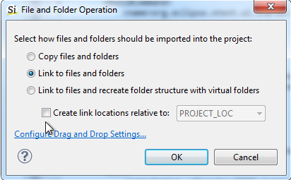

As discussed in [how-do-you-organize-source-code-your-hardware-project], you
can organize your VHDL files in many ways in Sigasi. The three *recommended ways* are:

1. [no-organization]
2. One design in one folder (described in this article)
3. [one-ip-block-project]

This article deals with the "one design – one folder" way of organizing
a project. The basic idea is that all of the files for your new hardware
design are in one folder on your hard drive. In addition to your own
files, there might be some third party libraries that you need for your
project, like the `XilinxCoreLib` or `Altera_MF` files.

Let's assume your file list looks something like this. You have a bunch of files in `c:\my_home\project_dir` and you are using the `altera_mf` library files that come with Altera Quartus.

```
+C:
  + my_home
    + project_dir
      + file1.vhd
      + file2.vhd
      + more_files_here.vhd
      + subfolder
        + more_files_here.vhd
  + altera
    + 11.0sp1
      + quartus
        + libraries
          + vhdl
            + altera_mf
              + altera_mf_components.vhd
              + stratixgx_mf_components.vhd
```

Setting it up
-------------

First, we will **create a Sigasi project** that lives in the directory
where you have your files.

1.  **File &gt; Empty VHDL Project**
2.  **Un**-tick **Use default location**
3.  Browse to your folder: `c:\my_home\project_dir`.
4.  Fill in a name for your project
5.  Click **Finish**.

You now have a project with your own VHDL files, and the a folder with
Common Libraries. This folder contains the IEEE and STD libraries needed
to compile your project.

Next, we will **add the directory** with vendor VHDL code.

1.  Open your windows explorer (or another file browser) and find the
    `altera_mf` folder.
2.  Drag this folder to your Sigasi project explorer, into your
    project folder.
3.  In the pop up dialog, select **Link to files and folders** and
    uncheck **Create link locations relative to:**.
4.  confirm with **OK**.



Finally, we have to **map** the vendor directory **to the correct
library name**. Right-click the altera\_mf directory in your Sigasi
project explorer and select **Library Mapping &gt; New Library ...**.
Now give the correct library name, in this case: `altera_mf`.

Building your project
---------------------

Make sure your project is set to build automatically: **Project &gt; Build Automatically**.
If you have VHDL files in the project folder that are not really a part
of the folder, you should unmap them from your VHDL libraries. Read more
about [/faq#junk-files]. Your project should not have any
errors (red markers). If it does, try to figure out what went wrong: Is
it a legacy junk file? Is there a bug in your VHDL code? Did you forget
to add a library?

Extra tips
----------

Sigasi creates a few hidden files in your project directory. If you use
a revision control system, we recommend you check in these files:

-   `.project`
-   `.library_mapping.xml`
-   `.settings` (This directory is only created when you have configured extra options.)

Pros and Cons
-------------

This is a relatively easy way of organizing your project. There is some
extra effort in setting up a project, but that should only take a few
minutes. If your files are not neatly organized in a single folder, or
if you have a bunch of junk files in your folder,

When to use
-----------

If you are just learning to use Sigasi, or if you are studying VHDL, we
strongly recommend the **one design – one folder** approach.
We also recommended it for small and moderate sized projects:

-   If you have up to 100 files
-   You are using a small number of vendor libraries (up to 5 libraries),
    such as the FPGA vendor libraries.

If you have a six or more separate libraries and IP cores, or if your
files are stored in locations across your hard drives or network drives,
we recommend you use [one-ip-block-project].
